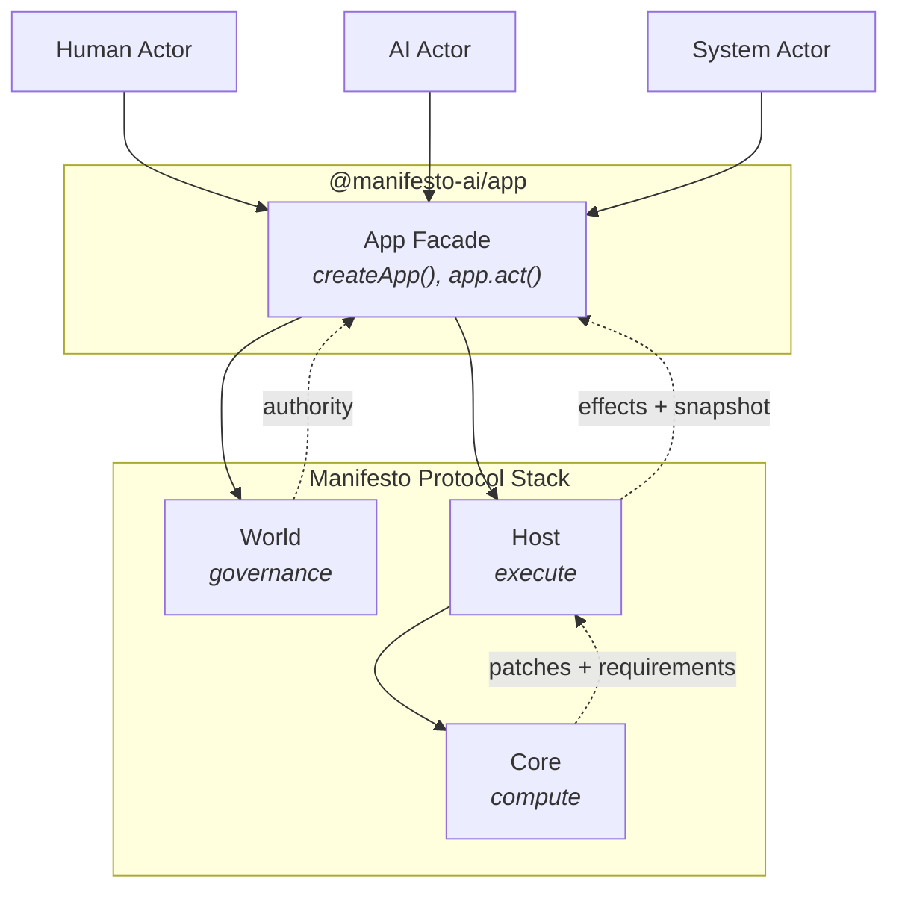

# Manifesto

**Deterministic state management with built-in history, approval, and traceability.**

Manifesto provides primitives for building systems where multiple actors—humans, AI agents, or automated processes—collaborate on shared state, with every transition deterministic, traceable, and verifiable.

[](https://www.npmjs.com/package/@manifesto-ai/core)
[](LICENSE)

## Quick Start

```bash
npm install @manifesto-ai/app
```

```typescript
import { createApp } from "@manifesto-ai/app";

const app = createApp({
  schema: `
    domain Counter {
      state { count: number = 0 }
      action increment() {
        onceIntent { patch count = add(count, 1) }
      }
    }
  `,
  effects: {},
});

await app.ready();

await app.act("increment").done();
console.log(app.getState().data.count); // 1

await app.act("increment").done();
console.log(app.getState().data.count); // 2
```

> See [examples/](./packages/app/examples/) for more: todos, effects, subscriptions.

## Core Equation

All state transitions in Manifesto follow one conceptual equation:

```
compute(schema, snapshot, intent) -> (snapshot', requirements, trace)
```

> **Note:** The actual implementation signature is `compute(schema, snapshot, intent, context) -> ComputeResult`, where `context` provides deterministic time and random seeds. See [`packages/core`](./packages/core) for details.

This guarantees:

- **Determinism** — Same inputs always produce same outputs
- **Accountability** — Every change traced to Actor + Authority + Intent
- **Explainability** — Complete trace answers "why" for every value
- **Evolvability** — Schema itself can be modified through the same mechanism

## Why Manifesto?

When multiple actors modify shared state, we need answers:

- **What happened?** — Which changes occurred, and in what order?
- **Why?** — What intent triggered each change?
- **Can we trust it?** — Will the same input always produce the same output?
- **Who authorized it?** — Which actor, with what authority?

These questions become critical when AI enters the picture. Manifesto was born from a simple idea: **humans and AI should look at the same world model.** When an AI agent modifies application state, we need the same guarantees we'd demand from any actor—determinism, traceability, and governance. Manifesto makes these guarantees structural, not by wrapping existing tools, but by providing new primitives designed from the ground up.

## What Manifesto Is (and Isn't)

Manifesto is **not** a state management library like Redux or Zustand.
Manifesto is **not** an AI framework like LangChain or AutoGen.

Manifesto is a **deterministic state protocol** that provides:

| Primitive | Purpose |
|-----------|---------|
| **Actor** | Who performs actions (human, AI, or system) |
| **Authority** | What permissions govern the action |
| **Intent** | What the actor wants to achieve |
| **Schema** | Domain structure (itself a first-class, evolvable object) |
| **Snapshot** | Immutable state at a point in time |
| **Patch** | Atomic state transition |
| **Trace** | Complete audit trail |
| **Compute** | Pure, deterministic evaluation |
| **Effect** | Controlled interaction with the outside world |

## Actor Model

Manifesto is **actor-agnostic**. Every actor—human, AI, or automated process—participates through the same interface:

- **Shared World Model** — Humans and AI look at the same Snapshot, reason about the same state
- **Uniform Interface** — All actors submit intents the same way via `app.act()`
- **Authority-governed** — Every action is subject to the same governance rules
- **Verifiable** — Every actor's behavior is traceable and reproducible

AI is the reason Manifesto exists, but not the only reason to use it. The same protocol that makes AI actions trustworthy also makes any multi-actor system auditable.

```mel
// MEL: designed for both humans and AI to read/write
domain TaskBoard {
  state { tasks: Task[] = [] }

  action addTask(title: string) {
    once(id) {
      patch id = $meta.intentId
      patch tasks = append(tasks, { id, title, done: false })
    }
  }
}
```

## Architecture



| Layer | Responsibility |
|-------|----------------|
| **@manifesto-ai/app** | User-facing facade. Provides `createApp()`, `app.act()`, subscriptions. Orchestrates all layers. |
| **World** | Governance. Manages actors, authorities, and audit lineage. |
| **Core** | Pure computation. Evaluates expressions, interprets flows, generates patches. Zero IO. |
| **Host** | Effect execution. Runs the compute-effect-apply loop, handles IO. |

## When to Use Manifesto

| Scenario | Manifesto? |
|----------|------------|
| AI agents that modify application state | Yes |
| Systems requiring audit trails | Yes |
| Multi-actor collaboration (human + AI + system) | Yes |
| Collaborative editing with traceability | Yes |
| Event-sourced backends with governance | Yes |
| Schema evolution driven by actors | Yes |
| Formal verification of state transitions | Yes |
| Simple UI state | No (use Zustand) |
| LLM orchestration / prompt chaining | No (use LangChain) |

## Packages

| Package | Description |
|---------|-------------|
| [@manifesto-ai/app](./packages/app) | High-level application facade |
| [@manifesto-ai/core](./packages/core) | Pure computation engine |
| [@manifesto-ai/host](./packages/host) | Effect execution runtime |
| [@manifesto-ai/world](./packages/world) | Governance layer |
| [@manifesto-ai/compiler](./packages/compiler) | MEL to DomainSchema compiler |
| [@manifesto-ai/intent-ir](./packages/intent-ir) | Intent intermediate representation |

## Documentation

- [Quickstart](https://docs.manifesto-ai.dev/quickstart) — Get running in 5 minutes
- [Core Concepts](https://docs.manifesto-ai.dev/concepts/) — Snapshot, Intent, Flow, Effect
- [MEL Language](https://docs.manifesto-ai.dev/mel/) — Domain definition syntax
- [API Reference](https://docs.manifesto-ai.dev/api/) — Package APIs
- [Live Demo](https://taskflow.manifesto-ai.dev) — TaskFlow example

## Research

Manifesto draws from formal linguistics, programming language theory, and AI safety research. The computation model provides formal guarantees suitable for verification, while the Intent IR layer offers semantic representations grounded in linguistic theory.

**Related areas:** AI Safety · Explainable AI · Programming Language Theory · Cognitive Science · Neuro-Symbolic AI

**Research documentation:**

- [Intent IR Theory](./docs/internals/research/intent-ir/theory.md) — Linguistic foundations
- [Formal Properties](./docs/internals/research/intent-ir/formal.md) — Mathematical definitions
- [Comparison](./docs/internals/research/intent-ir/comparison.md) — vs AMR, FrameNet, PropBank

## Development

```bash
git clone https://github.com/manifesto-ai/core.git
cd core && pnpm install
pnpm build   # Build all packages
pnpm test    # Run tests
```

## Contributing

See [CONTRIBUTING.md](./CONTRIBUTING.md) for guidelines.

## License

[MIT](./LICENSE) © 2025-2026 Manifesto AI
