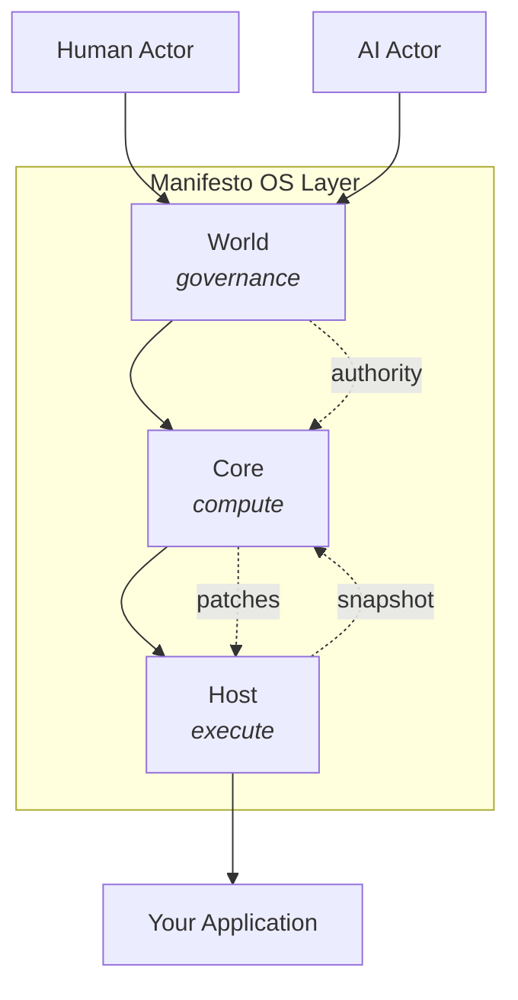

# Manifesto

**An OS layer for AI-native applications.**

Manifesto provides the primitives for building systems where AI agents and humans collaborate as first-class actors—with every state change deterministic, traceable, and verifiable.

[](https://www.npmjs.com/package/@manifesto-ai/core)
[](LICENSE)

## Why Manifesto?

When AI agents modify application state, we need answers:

- **What happened?** — Which changes occurred, and in what order?
- **Why?** — What intent triggered each change?
- **Can we trust it?** — Will the same input always produce the same output?
- **Who authorized it?** — Which actor, with what authority?

Manifesto makes these guarantees possible through a formal semantic layer—not by wrapping existing tools, but by providing new primitives designed for AI-native computation.

## What Manifesto Is (and Isn't)

Manifesto is **not** a state management library like Redux or Zustand.
Manifesto is **not** an AI framework like LangChain or AutoGen.

Manifesto is an **OS layer** that provides:

| Primitive | Purpose |
|-----------|---------|
| **Actor** | Who performs actions (human or AI) |
| **Authority** | What permissions govern the action |
| **Intent** | What the actor wants to achieve |
| **Schema** | Domain structure (itself a first-class, evolvable object) |
| **Snapshot** | Immutable state at a point in time |
| **Patch** | Atomic state transition |
| **Trace** | Complete audit trail |
| **Compute** | Pure, deterministic evaluation |
| **Effect** | Controlled interaction with the outside world |

## Core Equation

All state transitions in Manifesto follow one equation:

```
compute(schema, snapshot, intent) → (snapshot', requirements, trace)
```

This guarantees:

- **Determinism** — Same inputs always produce same outputs
- **Accountability** — Every change traced to Actor + Authority + Intent
- **Explainability** — Complete trace answers "why" for every value
- **Evolvability** — Schema itself can be modified through the same mechanism

## AI-Native by Design

Manifesto treats AI as a first-class participant:

- **AI as Actor** — AI agents submit intents just like humans
- **AI-evolvable Schema** — AI can propose and execute schema migrations
- **AI-friendly DSL** — MEL (Manifesto Expression Language) is designed for AI generation
- **Verifiable AI behavior** — Every AI action is traceable and reproducible

```mel
// MEL: designed for both humans and AI to read/write
domain TaskBoard {
  state { tasks: Task[] = [] }

  action addTask(title: string) {
    once(id) {
      patch id = $meta.intentId
      patch tasks = append(tasks, { id, title, done: false })
    }
  }
}
```

## Architecture



| Layer | Responsibility |
|-------|----------------|
| **World** | Governance. Manages actors, authorities, and audit lineage. |
| **Core** | Pure computation. Evaluates expressions, interprets flows, generates patches. |
| **Host** | Effect execution. Handles IO, applies patches to external state. |

## Quick Start

```bash
npm install @manifesto-ai/app @manifesto-ai/compiler
```

```typescript
import { createApp } from "@manifesto-ai/app";
import TaskBoardMel from "./taskboard.mel";

const app = createApp(TaskBoardMel);
await app.ready();

// Human or AI — same interface
await app.act("addTask", { title: "Review PR" }).done();

// Full trace available
console.log(app.getTrace()); // Who, what, when, why
```

> **Note:** MEL imports require a bundler plugin. See [Quickstart](https://docs.manifesto-ai.dev/quickstart) for setup.

## Research

Manifesto draws from formal linguistics, programming language theory, and AI safety research. The computation model provides formal guarantees suitable for verification, while the Intent IR layer offers semantic representations grounded in linguistic theory.

**Related areas:** AI Safety · Explainable AI · Programming Language Theory · Cognitive Science · Neuro-Symbolic AI

**Research documentation:**

- [Intent IR Theory](./docs/internals/research/intent-ir/theory.md) — Linguistic foundations
- [Formal Properties](./docs/internals/research/intent-ir/formal.md) — Mathematical definitions
- [Comparison](./docs/internals/research/intent-ir/comparison.md) — vs AMR, FrameNet, PropBank

## When to Use Manifesto

| Scenario | Manifesto? |
|----------|------------|
| AI agents that modify application state | Yes |
| Systems requiring audit trails for AI actions | Yes |
| Multi-actor collaboration (human + AI) | Yes |
| Schema evolution driven by AI | Yes |
| Formal verification of state transitions | Yes |
| Simple UI state | No (use Zustand) |
| LLM orchestration / prompt chaining | No (use LangChain) |

## Packages

| Package | Description |
|---------|-------------|
| [@manifesto-ai/app](./packages/app) | High-level application facade |
| [@manifesto-ai/core](./packages/core) | Pure computation engine |
| [@manifesto-ai/host](./packages/host) | Effect execution runtime |
| [@manifesto-ai/world](./packages/world) | Governance layer |
| [@manifesto-ai/compiler](./packages/compiler) | MEL to DomainSchema compiler |
| [@manifesto-ai/builder](./packages/builder) | Type-safe domain definition DSL |
| [@manifesto-ai/intent-ir](./packages/intent-ir) | Intent intermediate representation |

## Documentation

- [Quickstart](https://docs.manifesto-ai.dev/quickstart) — Get running in 5 minutes
- [Core Concepts](https://docs.manifesto-ai.dev/concepts/) — Snapshot, Intent, Flow, Effect
- [MEL Language](https://docs.manifesto-ai.dev/mel/) — Domain definition syntax
- [API Reference](https://docs.manifesto-ai.dev/api/) — Package APIs
- [Live Demo](https://taskflow.manifesto-ai.dev) — TaskFlow example

## Development

```bash
git clone https://github.com/manifesto-ai/core.git
cd core && pnpm install
pnpm build   # Build all packages
pnpm test    # Run tests
```

## Contributing

See [CONTRIBUTING.md](./CONTRIBUTING.md) for guidelines.

## License

[MIT](./LICENSE) © 2025-2026 Manifesto AI
