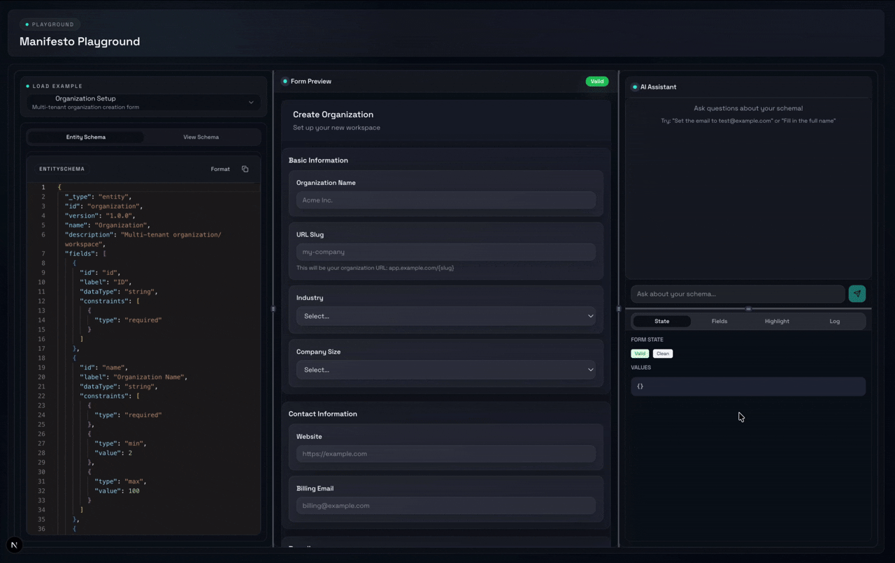

# Manifesto AI


**AI-Native Semantic UI State Layer**

> The only UI framework where AI agents can truly understand, reason about, and interact with your interface—not just see pixels.
>
> **Turn any form into a machine-readable interface for LLM agents.**

<div align="center">



*AI understands your form's semantic context and can fill fields intelligently*

**[🎮 Try the Playground](https://playground.manifesto-ai.dev)** • **[📖 Docs](#documentation)**

</div>

---

## Why Manifesto?

Most form libraries generate UI from schemas. **Manifesto does that too—but that's not what makes it special.**

The real question: *Can your AI agent understand what your form is doing right now?*

| Traditional UI | With Manifesto |
|----------------|----------------|
| AI sees DOM/pixels | AI gets semantic state |
| "There's an input field" | "This is 'email', it's required, currently invalid, depends on 'accountType'" |
| AI guesses what to do | AI knows exactly what's valid |

**Manifesto exports the complete semantic context**—values, rules, dependencies, validation state, available transitions—in a structure AI can reason about.

---

## Key Features

- 🧠 **Semantic State Export** — AI agents get full context, not just rendered output
- 📝 **Schema-First** — Define forms as data. Perfect for AI to generate and modify
- 🔌 **Framework Agnostic** — React, Vue, or bring your own
- ⚡ **Reactive** — Automatic dependency tracking and conditional updates
- 🔒 **Secure DSL** — Expression language with whitelisted operators, no `eval()`
- 📘 **Type-Safe** — Full TypeScript support

---

## 🧠 AI Interoperability

**This is what makes Manifesto different from every other form library.**

### The Problem

Traditional UIs are opaque to AI. An agent looking at a form sees:
- DOM elements or pixels
- No understanding of business rules
- No knowledge of what actions are valid
- No way to predict consequences

### The Solution: Semantic Snapshot

```typescript
import { createFormRuntime } from '@manifesto-ai/engine'
import { createInteroperabilitySession } from '@manifesto-ai/ai-util'

const runtime = createFormRuntime(productView, { entitySchema: productEntity })
const session = createInteroperabilitySession({ runtime, viewSchema: productView, entitySchema: productEntity })

// Export complete semantic state
const snapshot = session.snapshot()
```

**What the AI receives:**

```json
{
  "fields": {
    "email": {
      "value": "",
      "type": "string",
      "required": true,
      "visible": true,
      "disabled": false,
      "validation": { "valid": false, "errors": ["Required field"] },
      "constraints": { "pattern": "^[a-zA-Z0-9._%+-]+@..." }
    },
    "country": {
      "value": "US",
      "dependents": ["state", "zipCode"],
      "options": [...]
    }
  },
  "availableActions": ["submit", "reset", "setValue"],
  "formState": { "dirty": false, "valid": false, "submitting": false }
}
```

### Generate LLM Tool Definitions

```typescript
import { toToolDefinitions } from '@manifesto-ai/ai-util'

// Auto-generate OpenAI/Claude function calling schemas
const tools = toToolDefinitions(snapshot, { omitUnavailable: true })

// AI can now call: setValue({ field: "email", value: "user@example.com" })
```

### Use Cases

| Scenario | How Manifesto Helps |
|----------|---------------------|
| **Auto-fill forms** | AI reads field semantics, fills with contextually appropriate values |
| **Form validation assistance** | AI understands constraints, suggests fixes for invalid inputs |
| **Guided workflows** | AI knows current step, available transitions, required fields |
| **Accessibility agents** | AI navigates forms semantically, not by pixel coordinates |
| **Testing automation** | Generate test cases from semantic structure |
| **Schema generation** | AI creates new form schemas from natural language |

### Example: AI Agent Filling a Form

```typescript
// 1. AI receives semantic snapshot
const snapshot = session.snapshot()

// 2. AI reasons about the form
// "I see 'shippingAddress' is required and empty.
//  'productType' is 'PHYSICAL', so shipping fields are visible.
//  I should fill the address fields."

// 3. AI dispatches validated actions
session.dispatch({ type: 'setValue', field: 'shippingAddress', value: '123 Main St' })

// 4. Session validates before applying
// If action is invalid, it's rejected with explanation
```

→ [AI Utility Package](./packages/ai-util) | [Full Documentation](./docs/guides/ai-interoperability.md)

---

## Quick Start

### 1. Install

```bash
# Core
pnpm add @manifesto-ai/schema @manifesto-ai/engine

# Choose your framework
pnpm add @manifesto-ai/react   # or @manifesto-ai/vue
```

### 2. Define Schema

```typescript
import { entity, field, view, section, viewField, layout } from '@manifesto-ai/schema'

// Data model
const productEntity = entity('product', 'Product', '1.0.0')
  .field(field.string('name').label('Product Name').required())
  .field(field.number('price').label('Price').min(0))
  .field(field.enum('category', [
    { value: 'electronics', label: 'Electronics' },
    { value: 'clothing', label: 'Clothing' },
  ]).label('Category'))
  .build()

// UI layout
const productView = view('product-form', 'Create Product', '1.0.0')
  .entityRef('product')
  .layout(layout.form())
  .section(
    section('basic')
      .title('Basic Info')
      .field(viewField.textInput('name', 'name'))
      .field(viewField.numberInput('price', 'price'))
      .field(viewField.select('category', 'category'))
  )
  .build()
```

### 3. Render

**React:**
```tsx
import { FormRenderer } from '@manifesto-ai/react'
import '@manifesto-ai/react/styles'

<FormRenderer
  schema={productView}
  entitySchema={productEntity}
  onSubmit={(data) => console.log(data)}
/>
```

**Vue:**
```vue
<script setup>
import { FormRenderer } from '@manifesto-ai/vue'
import '@manifesto-ai/vue/styles'
</script>

<template>
  <FormRenderer
    :schema="productView"
    :entity-schema="productEntity"
    @submit="console.log"
  />
</template>
```

### 4. Explore More

→ [Full Getting Started Guide](./docs/getting-started.md)

---

## Expression DSL

Safe, array-based expressions for dynamic behavior:

```typescript
// Conditional visibility
{ hidden: ['==', '$state.productType', 'DIGITAL'] }

// Complex conditions
{ disabled: ['AND',
    ['==', '$state.status', 'PUBLISHED'],
    ['!=', '$user.role', 'ADMIN']
  ]
}

// Reactive field updates
viewField.select('city', 'city')
  .dependsOn(['country'])
  .reaction(
    on.change().do(
      actions.setOptions('city', dataSource.api({
        endpoint: '/api/cities',
        params: { country: '$state.country' }
      }))
    )
  )
```

→ [Expression DSL Reference](./docs/schema-reference/expression-dsl.md)

---

## Architecture

```
┌─────────────────────────────────────────────────────────────────┐
│                      Schema Definition                          │
│   Entity Schema        View Schema          Action Schema       │
│   (Data Model)         (UI Layout)          (Workflows)         │
└──────────────────────────────┬──────────────────────────────────┘
                               ▼
┌─────────────────────────────────────────────────────────────────┐
│                     @manifesto-ai/engine                        │
│   Evaluator ─── Tracker ─── Runtime ─── Loader                  │
│   (Expressions)  (Dependencies)  (State)    (Schema)            │
└──────────────────────────────┬──────────────────────────────────┘
                               │
         ┌─────────────────────┼─────────────────────┐
         ▼                     ▼                     ▼
┌─────────────────┐  ┌─────────────────┐  ┌─────────────────────┐
│ @manifesto-ai/  │  │ @manifesto-ai/  │  │ @manifesto-ai/      │
│     react       │  │      vue        │  │     ai-util         │
│ ─────────────── │  │ ─────────────── │  │ ─────────────────── │
│ useFormRuntime  │  │ useFormRuntime  │  │ Semantic Snapshot   │
│ FormRenderer    │  │ FormRenderer    │  │ Tool Definitions    │
└─────────────────┘  └─────────────────┘  └─────────────────────┘
```

→ [Architecture Deep Dive](./docs/architecture.md)

---

## Packages

| Package | Description |
|---------|-------------|
| [`@manifesto-ai/schema`](./packages/schema) | Schema types, builders, validators |
| [`@manifesto-ai/engine`](./packages/engine) | Core runtime engine |
| [`@manifesto-ai/ai-util`](./packages/ai-util) | AI interoperability utilities |
| [`@manifesto-ai/react`](./packages/react) | React bindings |
| [`@manifesto-ai/vue`](./packages/vue) | Vue bindings |

---

## Documentation

**Getting Started**
- [Quick Start Guide](./docs/getting-started.md)
- [Philosophy](./docs/philosophy.md)

**Schema Reference**
- [Entity Schema](./docs/schema-reference/entity-schema.md)
- [View Schema](./docs/schema-reference/view-schema.md)
- [Expression DSL](./docs/schema-reference/expression-dsl.md)
- [Reaction DSL](./docs/schema-reference/reaction-dsl.md)

**Guides**
- [Basic CRUD Form](./docs/guides/basic-crud-form.md)
- [Dynamic Conditions](./docs/guides/dynamic-conditions.md)
- [Cascade Select](./docs/guides/cascade-select.md)
- [Validation Patterns](./docs/guides/validation.md)

---

## Live Examples

| | |
|---|---|
| 🎮 **[Playground](https://playground.manifesto-ai.dev)** | Edit schemas, preview forms, chat with AI |

**Local:**
```bash
pnpm playground        # Interactive playground
pnpm storybook:react   # React components
pnpm storybook:vue     # Vue components
```

---

## Development

```bash
pnpm install    # Install dependencies
pnpm build      # Build all packages
pnpm test       # Run tests
```

**Requirements:** Node.js ≥ 20, pnpm ≥ 9

---

## Contributing

See [CONTRIBUTING.md](./CONTRIBUTING.md)

## License

MIT
