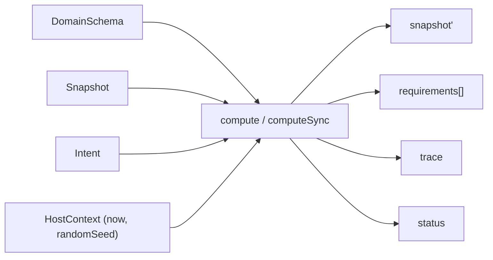

# @manifesto-ai/core

> Pure, deterministic computation engine for Manifesto

---

## Overview

`@manifesto-ai/core` is the semantic compute layer.

- Same input -> same output
- No IO or side effects
- Host-provided context only (`now`, `randomSeed`)

---

## Architecture Role

Core is responsible only for semantic computation.

- Input: `schema + snapshot + intent + hostContext`
- Output: `snapshot + requirements + trace + status`
- It never executes effects and never performs IO



---

## Main Exports

### createCore()

```typescript
import { createCore } from "@manifesto-ai/core";

const core = createCore();
```

### ManifestoCore Interface

```typescript
interface ManifestoCore {
  compute(
    schema: DomainSchema,
    snapshot: Snapshot,
    intent: Intent,
    context: HostContext
  ): Promise<ComputeResult>;

  computeSync(
    schema: DomainSchema,
    snapshot: Snapshot,
    intent: Intent,
    context: HostContext
  ): ComputeResult;

  apply(
    schema: DomainSchema,
    snapshot: Snapshot,
    patches: readonly Patch[],
    context: HostContext
  ): Snapshot;

  validate(schema: unknown): ValidationResult;

  explain(
    schema: DomainSchema,
    snapshot: Snapshot,
    path: SemanticPath
  ): ExplainResult;
}
```

### Direct Function Exports

```typescript
import {
  compute,
  computeSync,
  apply,
  validate,
  explain,
} from "@manifesto-ai/core";
```

---

## Key Types

### ComputeResult

```typescript
interface ComputeResult {
  snapshot: Snapshot;
  requirements: readonly Requirement[];
  trace: TraceGraph;
  status: "complete" | "pending" | "halted" | "error";
}
```

### HostContext

```typescript
interface HostContext {
  now: number;
  randomSeed: string;
  env?: Record<string, unknown>;
  durationMs?: number;
}
```

---

## Basic Usage

```typescript
import {
  createCore,
  createSnapshot,
  createIntent,
} from "@manifesto-ai/core";

const core = createCore();

const context = {
  now: Date.now(),
  randomSeed: "seed-001",
};

const snapshot = createSnapshot(
  { count: 0 },
  "counter-v1",
  context
);

const intent = createIntent("increment", { by: 1 }, "intent_001");

const result = core.computeSync(schema, snapshot, intent, context);
console.log(result.status);
console.log(result.snapshot.data);
```

---

## Additional Public Modules

`@manifesto-ai/core` also re-exports:

- `./schema/*` (schema and core domain types)
- `./utils/*` (hash, canonicalization, helpers)
- `./evaluator/*` (advanced evaluator APIs)
- `./errors` (error helpers/types)
- `./factories` (`createSnapshot`, `createIntent`, etc.)

---

## Related Packages

| Package | Relationship |
|---------|--------------|
| [@manifesto-ai/host](./host) | Executes requirements/effects produced by Core |
| [@manifesto-ai/world](./world) | Governs proposal and world lineage |
| [@manifesto-ai/sdk](./sdk) | High-level facade using Core/Host/World |
