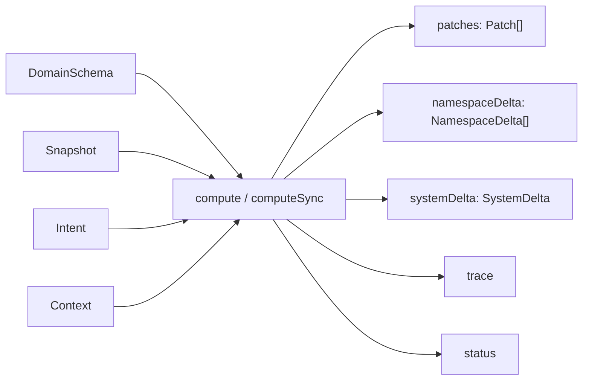

# @manifesto-ai/core

> Pure, deterministic computation engine for Manifesto

---

## Overview

`@manifesto-ai/core` is the semantic compute layer.

App and agent integrations normally start with the SDK:

```typescript
const app = createManifesto<TodoDomain>(TodoMel, effects).activate();
await app.action.addTodo.submit("Review docs");
console.log(app.snapshot().state.todos);
```

Use this page when you are writing runtime internals, low-level tests, or tools
that need the pure compute/apply boundary directly.

| Goal | Start Here |
|------|------------|
| Build an app, UI, backend route, or trusted agent | [Application](./application) and [Runtime Instance](./runtime) |
| Fulfill external work from MEL effects | [Effects](./effects) |
| Inspect or test pure compute/apply behavior | This Core page |

- Same input -> same output
- No IO or side effects
- Owner-neutral `Context` input for captured runtime/external facts
- Current v5 contract: structured patch paths, explicit namespace transition channel, explicit `Context`

> **Current Contract Note:** This page describes the current Core v5 surface. Domain patches are rooted at `snapshot.state`; platform/runtime/tooling writes use the namespace transition channel under `snapshot.namespaces`. Accumulated `system.errors` and `SystemDelta.appendErrors` are no longer part of the current contract. `available` remains the coarse action gate; `isIntentDispatchable()` adds the fine input-specific gate; and `state.fieldTypes` / `action.inputType` are now the normative runtime typing seam when present.

---

## Architecture Role

Core computes transitions only.

- Input: `schema + snapshot + intent + context`
- Output: `patches + namespaceDelta + systemDelta + trace + status`
- System fields are transitioned through `SystemDelta`, not patch paths


```mermaid
flowchart LR
  S["DomainSchema"] --> C["compute / computeSync"]
  SN["Snapshot"] --> C
  I["Intent"] --> C
  CTX["Context"] --> C

  C --> P["patches: Patch[]"]
  C --> NS["namespaceDelta: NamespaceDelta[]"]
  C --> SD["systemDelta: SystemDelta"]
  C --> T["trace"]
  C --> ST["status"]
```

---

## Main Exports

### createCore()

```typescript
import { createCore } from "@manifesto-ai/core";

const core = createCore();
```

### ManifestoCore Interface

```typescript
interface ManifestoCore {
  compute(
    schema: DomainSchema,
    snapshot: Snapshot,
    intent: Intent,
    context: Context
  ): Promise<ComputeResult>;

  computeSync(
    schema: DomainSchema,
    snapshot: Snapshot,
    intent: Intent,
    context: Context
  ): ComputeResult;

  apply(
    schema: DomainSchema,
    snapshot: Snapshot,
    patches: readonly Patch[]
  ): Snapshot;

  applyNamespaceDeltas(
    snapshot: Snapshot,
    deltas: readonly NamespaceDelta[]
  ): Snapshot;

  applySystemDelta(snapshot: Snapshot, delta: SystemDelta): Snapshot;

  validate(schema: unknown): ValidationResult;

  explain(
    schema: DomainSchema,
    snapshot: Snapshot,
    path: SemanticPath
  ): ExplainResult;

  isActionAvailable(
    schema: DomainSchema,
    snapshot: Snapshot,
    actionName: string
  ): boolean;

  getAvailableActions(
    schema: DomainSchema,
    snapshot: Snapshot
  ): readonly string[];

  isIntentDispatchable(
    schema: DomainSchema,
    snapshot: Snapshot,
    intent: Intent
  ): boolean;
}
```

---

## Key Types

### PatchPath / PatchSegment

```typescript
type PatchSegment =
  | { kind: "prop"; name: string }
  | { kind: "index"; index: number };

type PatchPath = readonly PatchSegment[];
```

### Patch

```typescript
type Patch =
  | { op: "set"; path: PatchPath; value: unknown }
  | { op: "unset"; path: PatchPath }
  | { op: "merge"; path: PatchPath; value: Record<string, unknown> };
```

### SystemDelta

```typescript
type SystemDelta = {
  status?: SystemState["status"];
  currentAction?: string | null;
  lastError?: ErrorValue | null;
  addRequirements?: readonly Requirement[];
  removeRequirementIds?: readonly string[];
};
```

### ComputeResult

```typescript
interface ComputeResult {
  patches: readonly Patch[];
  namespaceDelta?: readonly NamespaceDelta[];
  systemDelta: SystemDelta;
  trace: TraceGraph;
  status: "complete" | "pending" | "halted" | "error";
}
```

---

## Boundary Rules

- Domain patch paths are rooted at `snapshot.state`.
- Namespace transitions are rooted at `snapshot.namespaces[namespace]` and are not domain patches.
- `system/input/computed/meta` are not patch targets.
- Requirements are declared through `systemDelta.addRequirements`, then read from `snapshot.system.pendingRequirements` after materialization.
- Hosts apply transition channels in order: domain patches, namespace deltas, then system delta.

## Direct Compute Fixtures

Direct Core callers must provide an explicit ADR-027 `Context`:

```typescript
const context: Context = {
  runtime: {
    time: { timestamp: 1777564800000 },
    random: { seed: "intent-1" },
  },
  external: {},
};

const result = await core.compute(schema, snapshot, intent, context);
```

Application code normally uses the SDK runtime instead of calling Core
directly. SDK users provide only flat external context through
`createManifesto(..., { context })`, `injectContext()`, `updateContext()`, or
`with({ context })`; SDK/Host materializes `Context.runtime`.

Additional Core API rules:

- Use `applySystemDelta()` for all system transitions.
- `patchPathToDisplayString()` is display-only and must not be parsed for execution.
- `isActionAvailable()` and `getAvailableActions()` are read-only coarse availability queries over the current Snapshot.
- `isIntentDispatchable()` is the read-only fine intent-admission query over `schema + snapshot + intent`.

---

## Direct API Example

```typescript
const result = core.computeSync(schema, snapshot, intent, context);

let next = snapshot;

if (result.patches.length > 0) {
  next = core.apply(schema, next, result.patches);
}

if (result.namespaceDelta?.length) {
  next = core.applyNamespaceDeltas(next, result.namespaceDelta);
}

next = core.applySystemDelta(next, result.systemDelta);
```

---

## Related Packages

| Package | Relationship |
|---------|--------------|
| [@manifesto-ai/host](./host) | Executes requirements/effects produced by Core |
| [@manifesto-ai/sdk](./sdk) | Activation-first runtime built on Core + Host |
| [@manifesto-ai/lineage](./lineage) | Optional history and restore extension over the same snapshot model |
| [@manifesto-ai/governance](./governance) | Optional approval and proposal extension over the same snapshot model |
