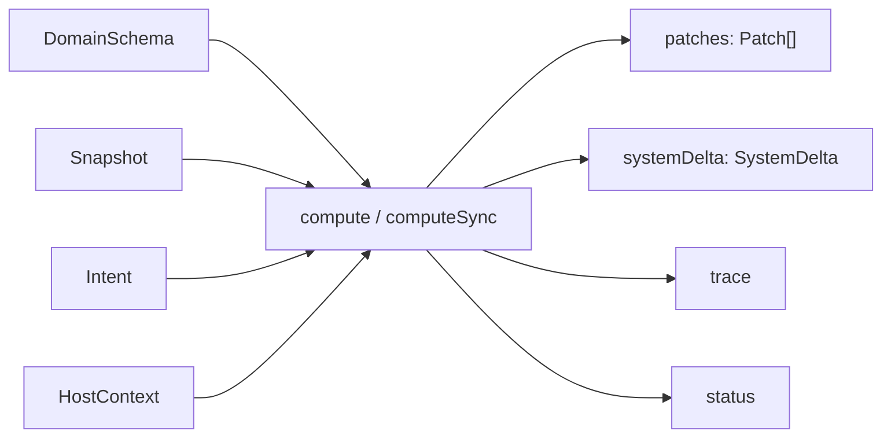

# @manifesto-ai/core

> Pure, deterministic computation engine for Manifesto

---

## Overview

`@manifesto-ai/core` is the semantic compute layer.

- Same input -> same output
- No IO or side effects
- Host-provided context only (`now`, `randomSeed`)
- ADR-009 hard cut: structured patch paths + explicit system transition channel

> **Current Contract Note:** This page describes the current Core v4.0.0 surface. Accumulated `system.errors` and `SystemDelta.appendErrors` are no longer part of the current contract.

---

## Architecture Role

Core computes transitions only.

- Input: `schema + snapshot + intent + hostContext`
- Output: `patches + systemDelta + trace + status`
- System fields are transitioned through `SystemDelta`, not patch paths


```mermaid
flowchart LR
  S["DomainSchema"] --> C["compute / computeSync"]
  SN["Snapshot"] --> C
  I["Intent"] --> C
  HC["HostContext"] --> C

  C --> P["patches: Patch[]"]
  C --> SD["systemDelta: SystemDelta"]
  C --> T["trace"]
  C --> ST["status"]
```

---

## Main Exports

### createCore()

```typescript
import { createCore } from "@manifesto-ai/core";

const core = createCore();
```

### ManifestoCore Interface

```typescript
interface ManifestoCore {
  compute(
    schema: DomainSchema,
    snapshot: Snapshot,
    intent: Intent,
    context: HostContext
  ): Promise<ComputeResult>;

  computeSync(
    schema: DomainSchema,
    snapshot: Snapshot,
    intent: Intent,
    context: HostContext
  ): ComputeResult;

  apply(
    schema: DomainSchema,
    snapshot: Snapshot,
    patches: readonly Patch[],
    context: HostContext
  ): Snapshot;

  applySystemDelta(snapshot: Snapshot, delta: SystemDelta): Snapshot;

  validate(schema: unknown): ValidationResult;

  explain(
    schema: DomainSchema,
    snapshot: Snapshot,
    path: SemanticPath
  ): ExplainResult;

  isActionAvailable(
    schema: DomainSchema,
    snapshot: Snapshot,
    actionName: string
  ): boolean;

  getAvailableActions(
    schema: DomainSchema,
    snapshot: Snapshot
  ): readonly string[];
}
```

---

## Key Types

### PatchPath / PatchSegment

```typescript
type PatchSegment =
  | { kind: "prop"; name: string }
  | { kind: "index"; index: number };

type PatchPath = readonly PatchSegment[];
```

### Patch

```typescript
type Patch =
  | { op: "set"; path: PatchPath; value: unknown }
  | { op: "unset"; path: PatchPath }
  | { op: "merge"; path: PatchPath; value: Record<string, unknown> };
```

### SystemDelta

```typescript
type SystemDelta = {
  status?: SystemState["status"];
  currentAction?: string | null;
  lastError?: ErrorValue | null;
  addRequirements?: readonly Requirement[];
  removeRequirementIds?: readonly string[];
};
```

### ComputeResult

```typescript
interface ComputeResult {
  patches: readonly Patch[];
  systemDelta: SystemDelta;
  trace: TraceGraph;
  status: "complete" | "pending" | "halted" | "error";
  requirements?: readonly Requirement[];
}
```

---

## Boundary Rules

- Patch paths are rooted at `snapshot.data`.
- `system/input/computed/meta` are not patch targets.
- Use `applySystemDelta()` for all system transitions.
- `patchPathToDisplayString()` is display-only and must not be parsed for execution.
- `isActionAvailable()` and `getAvailableActions()` are read-only availability queries over the current Snapshot.

---

## Basic Usage

```typescript
const result = core.computeSync(schema, snapshot, intent, context);

let next = snapshot;

if (result.patches.length > 0) {
  next = core.apply(schema, next, result.patches, context);
}

next = core.applySystemDelta(next, result.systemDelta);
```

---

## Related Packages

| Package | Relationship |
|---------|--------------|
| [@manifesto-ai/host](./host) | Executes requirements/effects produced by Core |
| [@manifesto-ai/world](./world) | Governs proposal and world lineage |
| [@manifesto-ai/sdk](./sdk) | Public facade using Core/Host/World |
