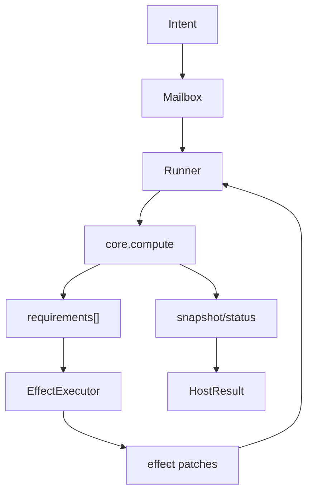

# @manifesto-ai/host

> Effect execution runtime and compute loop orchestrator

---

## Overview

`@manifesto-ai/host` executes intents against Core and fulfills effect requirements.

- Owns runtime orchestration (Mailbox + Runner + Job)
- Applies effect patches
- Produces terminal snapshot/status per dispatch

---

## Architecture

Host runs the compute-fulfill loop around Core.

- `dispatch(intent)` starts a job pipeline
- Core declares requirements
- Host executes handlers and feeds patches back into the loop
- Loop terminates with `HostResult`



---

## Main Exports

### createHost()

```typescript
import { createHost } from "@manifesto-ai/host";

const host = createHost(schema, {
  maxIterations: 100,
});
```

### ManifestoHost (primary methods)

```typescript
class ManifestoHost {
  registerEffect(type: string, handler: EffectHandler, options?: EffectHandlerOptions): void;
  unregisterEffect(type: string): boolean;
  hasEffect(type: string): boolean;
  getEffectTypes(): string[];

  dispatch(intent: Intent): Promise<HostResult>;
  getSnapshot(): Snapshot | null;
  reset(initialData: unknown): void;
}
```

### HostResult

```typescript
interface HostResult {
  status: "complete" | "pending" | "error";
  snapshot: Snapshot;
  traces: TraceGraph[];
  error?: HostError;
}
```

---

## Effect Handlers

```typescript
import { createEffectRegistry, createEffectExecutor } from "@manifesto-ai/host";

const registry = createEffectRegistry();

registry.register("api.fetch", async (_type, params, ctx) => {
  const response = await fetch(String(params.url));
  const data = await response.json();
  return [{ op: "set", path: "data.result", value: data }];
});

const executor = createEffectExecutor(registry);
```

### EffectHandler

```typescript
type EffectHandler = (
  type: string,
  params: Record<string, unknown>,
  context: {
    snapshot: Readonly<Snapshot>;
    requirement: Requirement;
  }
) => Promise<Patch[]>;
```

---

## Execution Model Exports

`@manifesto-ai/host` also exports lower-level runtime pieces:

- Mailbox: `createMailbox`, `MailboxManager`, `DefaultExecutionMailbox`
- Runner: `processMailbox`, `enqueueAndKick`, `kickRunner`, `createRunnerState`
- Jobs: `createStartIntentJob`, `createContinueComputeJob`, `createFulfillEffectJob`, `createApplyPatchesJob`
- Context: `createExecutionContext`, `createHostContextProvider`, `createTestHostContextProvider`

Use these directly when building custom orchestration/testing infrastructure.

---

## Related Packages

| Package | Relationship |
|---------|--------------|
| [@manifesto-ai/core](./core) | Pure semantic computation |
| [@manifesto-ai/world](./world) | Proposal governance and lineage |
| [@manifesto-ai/app](./app) | High-level facade over Host |
