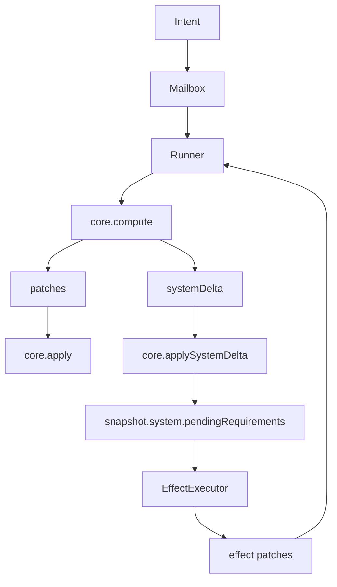

# @manifesto-ai/host

> Effect execution runtime and compute loop orchestrator

---

## Overview

`@manifesto-ai/host` executes intents against Core and fulfills effect requirements.

App and agent integrations normally use Host through the SDK:

```typescript
const app = createManifesto<TodoDomain>(TodoMel, effects).activate();
await app.action.addTodo.submit("Review docs");
console.log(app.snapshot().state.todos);
```

Use this page when you are writing a custom runtime, testing Host behavior, or
debugging the low-level compute/effect loop.

| Goal | Start Here |
|------|------------|
| Submit app actions and read app-facing Snapshots | [Application](./application) and [Runtime Instance](./runtime) |
| Fulfill API/database work in app code | [Effects](./effects) |
| Own or test the compute/effect loop directly | This Host page |

- Runtime orchestration (Mailbox + Runner + Jobs)
- Applies domain patches and system transitions in interlocked order
- Produces terminal snapshot/status per dispatch

> **Current Contract Note:** This page describes the current Host v5-aligned surface. Host-facing Snapshot references use the full Core/Host internal snapshot and no longer include accumulated `system.errors` or retired `data` roots. This is not the SDK `snapshot()` app read model.

---

## Architecture

Host runs the compute-fulfill loop around Core.


```mermaid
flowchart TD
  IN["Intent"] --> MB["Mailbox"]
  MB --> RN["Runner"]
  RN --> CC["core.compute"]
  CC --> P["patches"]
  CC --> SD["systemDelta"]
  P --> AP["core.apply"]
  SD --> ASD["core.applySystemDelta"]
  ASD --> REQ["snapshot.system.pendingRequirements"]
  REQ --> FX["EffectExecutor"]
  FX --> EP["effect patches"]
  EP --> RN
```

---

## Main Exports

### createHost()

```typescript
import { createHost } from "@manifesto-ai/host";

const host = createHost(schema, {
  maxIterations: 100,
});
```

### ManifestoHost (primary methods)

```typescript
class ManifestoHost {
  registerEffect(type: string, handler: EffectHandler, options?: EffectHandlerOptions): void;
  unregisterEffect(type: string): boolean;
  hasEffect(type: string): boolean;
  getEffectTypes(): string[];

  dispatch(intent: Intent): Promise<HostResult>;
  getSnapshot(): Snapshot | null;
  reset(initialData: unknown): void;
}
```

`ManifestoHost.getSnapshot()` returns the Host's full internal snapshot. If you
are working at the SDK layer, use the app-facing `app.snapshot()` read instead.

### HostResult

```typescript
interface HostResult {
  status: "complete" | "pending" | "error";
  snapshot: Snapshot;
  traces: TraceGraph[];
  error?: HostError;
}
```

`HostResult.snapshot` is likewise Host/Core internal state, not the SDK app
Snapshot.

---

## Effect Handlers

App effect handlers normally use the SDK `defineEffects()` helper shown in
[Effects](./effects). The raw Host registry below is for custom runtimes and
Host tests.

```typescript
import { createEffectRegistry, createEffectExecutor } from "@manifesto-ai/host";

const registry = createEffectRegistry();

registry.register("api.fetch", async (_type, params, ctx) => {
  const response = await fetch(String(params.url));
  const data = await response.json();
  return [
    {
      op: "set",
      path: [{ kind: "prop", name: "result" }],
      value: data,
    },
  ];
});

const executor = createEffectExecutor(registry);
```

### EffectHandler

```typescript
type EffectHandler = (
  type: string,
  params: Record<string, unknown>,
  context: {
    snapshot: Readonly<Snapshot>;
    requirement: Requirement;
  }
) => Promise<Patch[]>;
```

The Host effect-handler context carries the full internal snapshot. The SDK
wraps this separately and presents an app-facing `EffectContext.snapshot` to
application effect handlers.

---

## Interlock Requirements

- Apply order MUST be: `core.apply(patches)`, then `core.applyNamespaceDeltas(namespaceDelta)`, then `core.applySystemDelta(systemDelta)`.
- Effect dispatch list SHOULD be read from `snapshot.system.pendingRequirements` after all three apply stages.
- Fulfillment clear MUST use `applySystemDelta({ removeRequirementIds })`.
- Error patches MUST NOT target `system.*`.

---

## Related Packages

| Package | Relationship |
|---------|--------------|
| [@manifesto-ai/core](./core) | Pure semantic computation |
| [@manifesto-ai/sdk](./sdk) | Activation-first app runtime over Host |
| [@manifesto-ai/lineage](./lineage) | History decorator layered over SDK + Host |
| [@manifesto-ai/governance](./governance) | Proposal/approval decorator layered over Lineage + SDK + Host |
