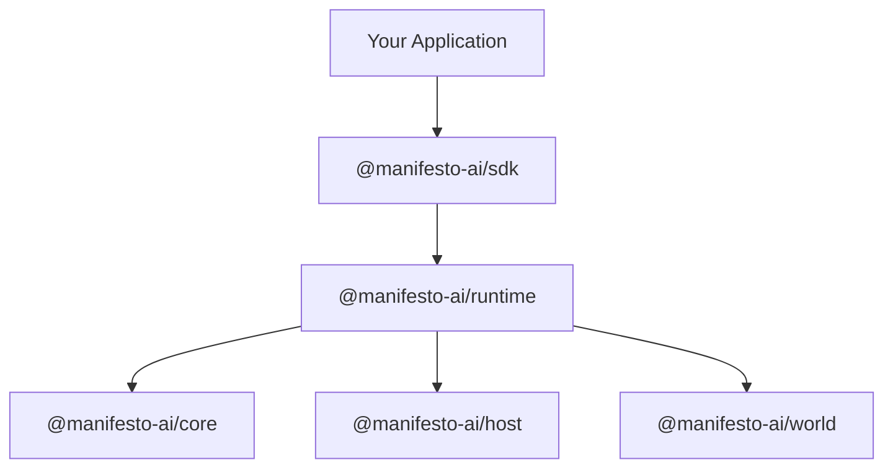

# API Reference

> Complete API documentation for Manifesto packages

---

## Primary Package

| Package | Description |
|---------|-------------|
| [@manifesto-ai/sdk](./sdk) | Public developer API. **Start here.** |

The `@manifesto-ai/sdk` package is the canonical public entry point for building Manifesto applications.

> Note: `@manifesto-ai/app` is a deprecated compatibility package in R1 and will be removed in R2. See [API: app](./app).

---

## Core Packages

| Package | Description |
|---------|-------------|
| [@manifesto-ai/core](./core) | Pure computation engine |
| [@manifesto-ai/host](./host) | Effect execution runtime |
| [@manifesto-ai/world](./world) | Governance layer |

These packages form the foundation of Manifesto's architecture. Most users interact with them through `@manifesto-ai/sdk`.

---

## Additional Packages

| Package | Description |
|---------|-------------|
| [@manifesto-ai/runtime](./runtime) | Internal orchestration engine used by SDK |
| [@manifesto-ai/compiler](./compiler) | MEL to DomainSchema compilation and `.mel` toolchain adapters |
| [@manifesto-ai/codegen](./codegen) | DomainSchema to TypeScript types + Zod schemas |
| [@manifesto-ai/intent-ir](./intent-ir) | Intent intermediate representation and key derivation |

See [Specifications](/internals/spec/) for detailed package specifications.

---

## Package Relationships



---

## Quick Start

```typescript
import { createApp } from "@manifesto-ai/sdk";

const app = createApp({
  schema: `
    domain Counter {
      state { count: number = 0 }
      action increment() {
        onceIntent { patch count = add(count, 1) }
      }
    }
  `,
  effects: {},
});

await app.ready();
await app.act("increment").done();
console.log(app.getState().data.count); // 1
```

---

## Related Documentation

- **[Core Concepts](/concepts/)** - Understand Manifesto fundamentals
- **[Specifications](/internals/spec/)** - Normative contracts for implementations
- **[Architecture](/architecture/)** - System design and component relationships
