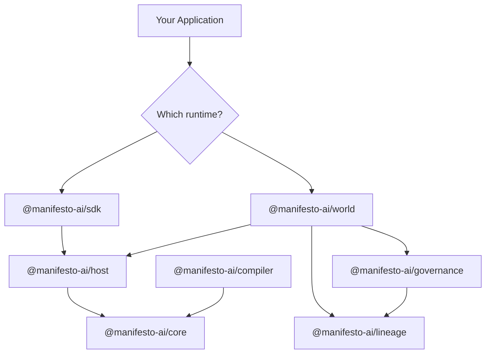

# API Reference

> Choose the package that matches the runtime you are actually building.

## Start Here

Manifesto now has two first-class public entry paths:

| Path | Package | Use When |
|------|---------|----------|
| **Direct dispatch** | [@manifesto-ai/sdk](./sdk) | You want the shortest application path with `createManifesto()` |
| **Governed composition** | [@manifesto-ai/world](./world) | You need governance, lineage, sealing, and explicit world assembly |

## Package Map

### Application Entry Packages

| Package | Responsibility |
|---------|----------------|
| [@manifesto-ai/sdk](./sdk) | Direct-dispatch runtime, thin public API, selected world re-exports |
| [@manifesto-ai/world](./world) | Canonical governed composition surface, plus full governance and lineage re-exports |

### Split Protocol Packages

| Package | Responsibility |
|---------|----------------|
| [@manifesto-ai/governance](./governance) | Proposal lifecycle, authority evaluation, decision records, governance events |
| [@manifesto-ai/lineage](./lineage) | World identity, branch/head state, sealing continuity, replay and queries |

### Core Runtime Packages

| Package | Responsibility |
|---------|----------------|
| [@manifesto-ai/core](./core) | Pure semantic computation |
| [@manifesto-ai/host](./host) | Effect execution and compute/apply loop |
| [@manifesto-ai/compiler](./compiler) | MEL compilation and lowering |
| [@manifesto-ai/codegen](./codegen) | Schema-driven TypeScript and Zod generation |

## Runtime Choice


```mermaid
flowchart TB
  APP["Your Application"] --> CHOICE{"Which runtime?"}
  CHOICE --> SDK["@manifesto-ai/sdk"]
  CHOICE --> WORLD["@manifesto-ai/world"]
  SDK --> HOST["@manifesto-ai/host"]
  WORLD --> GOV["@manifesto-ai/governance"]
  WORLD --> LIN["@manifesto-ai/lineage"]
  WORLD --> HOST
  HOST --> CORE["@manifesto-ai/core"]
  GOV --> LIN
  COMP["@manifesto-ai/compiler"] --> CORE
```

## Quick Orientation

### Direct Dispatch

```typescript
import { createIntent, createManifesto } from "@manifesto-ai/sdk";

const manifesto = createManifesto({
  schema: domainSchema,
  effects: {},
});

manifesto.dispatch(createIntent("increment", "intent-1"));
```

### Governed Composition

```typescript
import {
  createGovernanceEventDispatcher,
  createGovernanceService,
  createLineageService,
  createWorld,
} from "@manifesto-ai/world";
import { createSqliteWorldStore } from "@manifesto-ai/world/sqlite";

const store = createSqliteWorldStore({ filename: "./.manifesto/world.sqlite" });
const lineage = createLineageService(store);
const governance = createGovernanceService(store, { lineageService: lineage });
const world = createWorld({
  store,
  lineage,
  governance,
  eventDispatcher: createGovernanceEventDispatcher({ service: governance }),
});
```

## Related Docs

- [Concepts](/concepts/)
- [Governed Composition Guide](/guides/governed-composition)
- [Release Hardening Guide](/guides/release-hardening)
- [Next-Major Upgrade Guide](/guides/upgrade-next-major)
- [Specifications](/internals/spec/)
