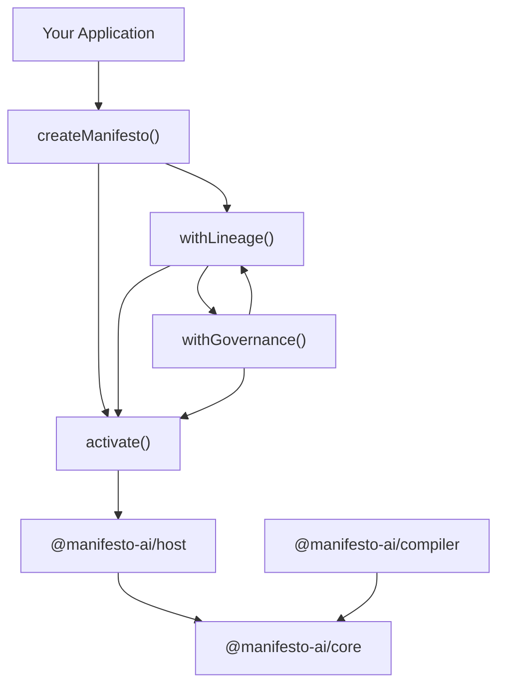

# API Reference

> Choose the package that matches the runtime you are actually building.

## Start Here

Manifesto now has one landed application entry path and one governed composition direction under ADR-017:

| Path | Package | Use When |
|------|---------|----------|
| **Base runtime** | [@manifesto-ai/sdk](./sdk) | You want the activation-first app path with `createManifesto()` and `activate()` |
| **Governed composition direction** | [@manifesto-ai/lineage](./lineage) + [@manifesto-ai/governance](./governance) | You are following the decorator path that adds continuity and legitimacy before activation |

## Package Map

### Application Entry Packages

| Package | Responsibility |
|---------|----------------|
| [@manifesto-ai/sdk](./sdk) | Activation-first base runtime entry, typed MEL surface, and present-only execution |

### Split Protocol Packages

| Package | Responsibility |
|---------|----------------|
| [@manifesto-ai/governance](./governance) | `withGovernance()` decorator runtime, proposal lifecycle, approval flow, decision records, governance events |
| [@manifesto-ai/lineage](./lineage) | `withLineage()` decorator runtime, world identity, branch/head state, sealing continuity, restore and queries |

### Core Runtime Packages

| Package | Responsibility |
|---------|----------------|
| [@manifesto-ai/core](./core) | Pure semantic computation |
| [@manifesto-ai/host](./host) | Effect execution and compute/apply loop |
| [@manifesto-ai/compiler](./compiler) | MEL compilation and lowering |
| [@manifesto-ai/codegen](./codegen) | Schema-driven TypeScript and Zod generation |

## Runtime Choice


```mermaid
flowchart TB
  APP["Your Application"] --> SDK["createManifesto()"]
  SDK --> ACT["activate()"]
  SDK --> LIN["withLineage()"]
  LIN --> GOV["withGovernance()"]
  LIN --> ACT
  GOV --> ACT
  ACT --> HOST["@manifesto-ai/host"]
  HOST --> CORE["@manifesto-ai/core"]
  GOV --> LIN
  COMP["@manifesto-ai/compiler"] --> CORE
```

## Quick Orientation

### Base Runtime

```typescript
import { createManifesto } from "@manifesto-ai/sdk";

const manifesto = createManifesto<CounterDomain>(domainSchema, {});
const world = manifesto.activate();

await world.dispatchAsync(
  world.createIntent(world.MEL.actions.increment),
);
```

### Governed Composition Direction

```typescript
// ADR-017 direction
// createManifesto(schema, effects)
//   -> withLineage(...)
//   -> withGovernance(...)
//   -> activate()
```

## Related Docs

- [Concepts](/concepts/)
- [Governed Composition Guide](/guides/governed-composition)
- [Release Hardening Guide](/guides/release-hardening)
- [Next-Major Upgrade Guide](/guides/upgrade-next-major)
- [Specifications](/internals/spec/)

Historical note: the old world facade was removed from the active workspace; see [@manifesto-ai/world](./world) only for the tombstone page.
