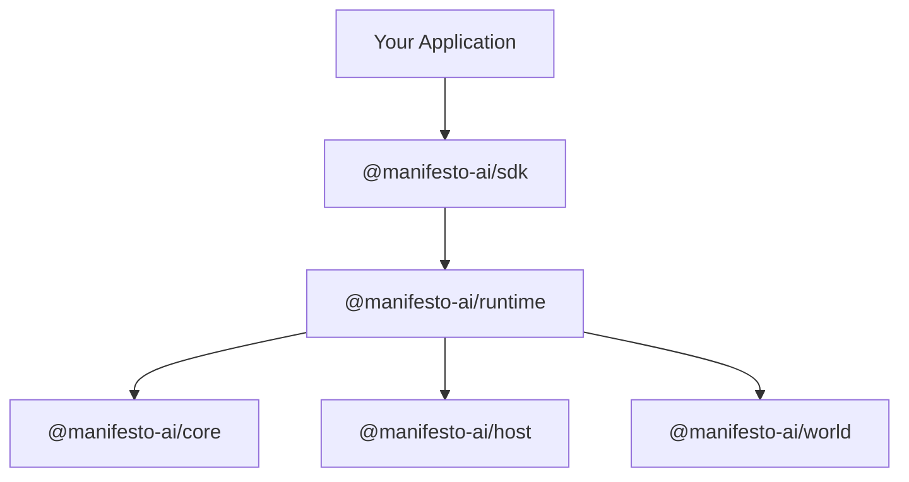

# API Reference

> Complete API documentation for Manifesto packages

---

## Primary Package

| Package | Description |
|---------|-------------|
| [@manifesto-ai/sdk](./sdk) | Public developer API. **Start here.** |

---

## Core Packages

| Package | Description |
|---------|-------------|
| [@manifesto-ai/core](./core) | Pure computation engine |
| [@manifesto-ai/host](./host) | Effect execution runtime |
| [@manifesto-ai/world](./world) | Governance layer |

---

## Additional Packages

| Package | Description |
|---------|-------------|
| [@manifesto-ai/runtime](./runtime) | Internal orchestration engine used by SDK |
| [@manifesto-ai/compiler](./compiler) | MEL compiler and patch IR lowering |
| [@manifesto-ai/codegen](./codegen) | DomainSchema to TypeScript + Zod codegen |
| [@manifesto-ai/intent-ir](./intent-ir) | Intent intermediate representation |

See [Specifications](/internals/spec/) for normative contracts.

---

## Package Relationships


```mermaid
flowchart TB
  APP["Your Application"] --> SDK["@manifesto-ai/sdk"]
  SDK --> RT["@manifesto-ai/runtime"]
  RT --> C["@manifesto-ai/core"]
  RT --> H["@manifesto-ai/host"]
  RT --> W["@manifesto-ai/world"]
```

---

## Quick Start

```typescript
import { createRuntime } from "@manifesto-ai/sdk";

const runtime = createRuntime({
  schema: domainSchema,
  effects: {
    "counter.save": async () => [
      { op: "set", path: [{ kind: "prop", name: "saved" }], value: true },
    ],
  },
});

await runtime.ready();
await runtime.dispatch({ type: "increment" });
console.log(runtime.snapshot().data.count);
```

---

## Related Documentation

- **[Core Concepts](/concepts/)** - Manifesto fundamentals
- **[Specifications](/internals/spec/)** - Normative contracts
- **[Architecture](/architecture/)** - System design and boundaries
