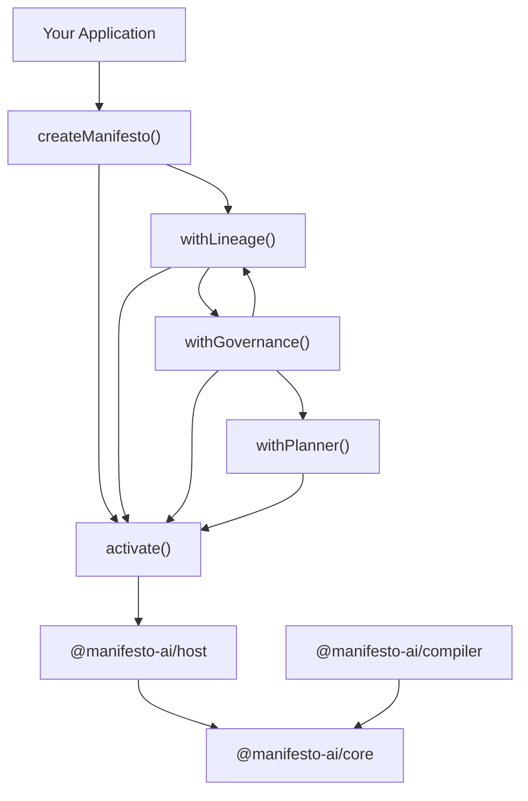

# API Reference

> Lookup surface for the package you already know you need.

If you are new, do not read this section front-to-back. Start with [Start Here](/start-here), then come back here when you know whether you need runtime, tooling, or Studio packages.

## Start Here

Start with the base runtime and treat the rest as lookup layers around it.

The public surface around that runtime also includes project bootstrapping, MEL editor tooling, explicit AI skill installation, Studio-based inspection packages, and an optional advanced runtime layer for approval and history.

| Path | Package | Use When |
|------|---------|----------|
| **Base runtime** | [@manifesto-ai/sdk](./sdk) | You want the activation-first app path with `createManifesto()` and `activate()` |
| **Advanced runtime** | [@manifesto-ai/lineage](./lineage) + [@manifesto-ai/governance](./governance) | You now need approval, sealing, or branch continuity on top of the base runtime |
| **Strategic runtime** | [@manifesto-ai/planner](./planner) | You already have a governed runtime and now need read-only `preview()` / `plan()` foresight |

## Package Map

### Base Runtime

| Package | Responsibility |
|---------|----------------|
| [@manifesto-ai/sdk](./sdk) | Activation-first base runtime entry, typed MEL surface, and present-only execution |

### Advanced Runtime

| Package | Responsibility |
|---------|----------------|
| [@manifesto-ai/lineage](./lineage) | `withLineage()` decorator runtime, world identity, branch/head state, sealing continuity, restore and queries |
| [@manifesto-ai/governance](./governance) | `withGovernance()` decorator runtime, proposal lifecycle, approval flow, decision records, governance events |
| [@manifesto-ai/planner](./planner) | `withPlanner()` decorator runtime, read-only planning over governed worlds, `preview()`, `plan()`, and separate strategy/enumerator seams |

### Core Runtime Packages

| Package | Responsibility |
|---------|----------------|
| [@manifesto-ai/core](./core) | Pure semantic computation |
| [@manifesto-ai/host](./host) | Effect execution and compute/apply loop |
| [@manifesto-ai/compiler](./compiler) | MEL compilation and lowering |
| [@manifesto-ai/codegen](./codegen) | Schema-driven TypeScript and Zod generation |

### DX Tooling Packages

| Package | Responsibility |
|---------|----------------|
| [@manifesto-ai/cli](./cli) | Project bootstrap, bundler integration, tooling setup, and drift checks |
| [@manifesto-ai/skills](./skills) | Explicit AI coding tool installers for Manifesto-specific guidance |
| [@manifesto-ai/mel-lsp](./mel-lsp) | MEL diagnostics, completion, navigation, rename, and schema introspection |

### Studio Inspection Packages

| Package | Responsibility |
|---------|----------------|
| [@manifesto-ai/studio-core](./studio-core) | Projection-first read-only analysis engine |
| [@manifesto-ai/studio-cli](./studio-cli) | Terminal inspection surface for findings, graph, snapshot, trace, lineage, governance, and transition graphs |
| [@manifesto-ai/studio-mcp](./studio-mcp) | MCP server surface for agent and remote tool integration |

## Runtime Choice


```mermaid
flowchart TB
  APP["Your Application"] --> SDK["createManifesto()"]
  SDK --> ACT["activate()"]
  SDK --> LIN["withLineage()"]
  LIN --> GOV["withGovernance()"]
  GOV --> PLAN["withPlanner()"]
  LIN --> ACT
  GOV --> ACT
  PLAN --> ACT
  ACT --> HOST["@manifesto-ai/host"]
  HOST --> CORE["@manifesto-ai/core"]
  GOV --> LIN
  COMP["@manifesto-ai/compiler"] --> CORE
```

## Quick Orientation

### Base Runtime

```typescript
import { createManifesto } from "@manifesto-ai/sdk";

const manifesto = createManifesto<CounterDomain>(domainSchema, {});
const instance = manifesto.activate();

await instance.dispatchAsync(
  instance.createIntent(instance.MEL.actions.increment),
);
```

### Advanced Runtime Direction

```typescript
// ADR-017 direction
// createManifesto(schema, effects)
//   -> withLineage(...)
//   -> withGovernance(...)
//   -> withPlanner(...) // optional strategic layer
//   -> activate()
```

### Common DX Stack

| Job | Start Here |
|-----|------------|
| Start a repo or patch an existing bundler setup | [@manifesto-ai/cli](./cli) |
| Write MEL with schema-aware tooling | [@manifesto-ai/mel-lsp](./mel-lsp) |
| Give Codex or other AI tools the current Manifesto seams | [@manifesto-ai/skills](./skills) |
| Inspect one schema, snapshot, trace, or governance export locally | [@manifesto-ai/studio-cli](./studio-cli) |
| Build a dashboard, analysis service, or MCP tool endpoint | [@manifesto-ai/studio-core](./studio-core), [@manifesto-ai/studio-mcp](./studio-mcp) |

## Related Docs

- [Concepts](/concepts/)
- [Developer Tooling Guide](/guides/developer-tooling)
- [When You Need Approval or History](/guides/approval-and-history)
- [Release Hardening Guide](/guides/release-hardening)
- [Next-Major Upgrade Guide](/guides/upgrade-next-major)
- [Specifications](/internals/spec/)
