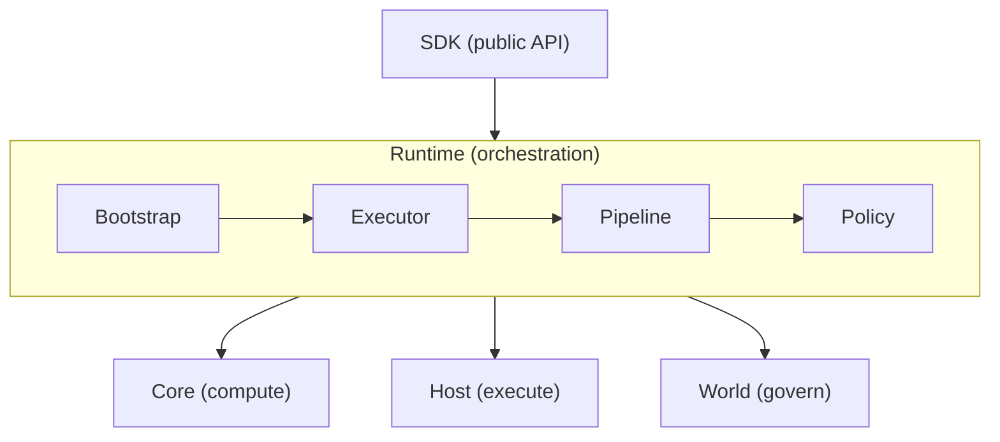

# @manifesto-ai/runtime

> Internal execution orchestration engine for the Manifesto protocol stack

> **Internal Package:** This package is not intended for direct consumption. Use `@manifesto-ai/sdk` instead.

---

## Overview

`@manifesto-ai/runtime` is the internal orchestration layer between SDK and protocol packages.

- 5-stage action execution pipeline
- All shared type definitions and error hierarchy
- Policy, memory, branch, and subscription management

---

## Architecture Role

Runtime orchestrates Core, Host, and World. It is consumed by SDK, never directly by end users.



---

## Main Components

### AppRuntime

Assembled runtime holding all dependencies after bootstrap. Created by `AppBootstrap.assemble()`.

### AppBootstrap

Handles the `created → ready` transition:
1. Validate actor policy
2. Compile domain (if MEL text)
3. Create initial state
4. Create BranchManager
5. Create HostExecutor and genesis World
6. Construct AppRuntime

### AppExecutor

Orchestrates the 5-stage action pipeline.

---

## Execution Pipeline

Every action passes through five stages:

| Stage | Responsibility |
|-------|---------------|
| **Prepare** | Validate action type, create Proposal |
| **Authorize** | Derive ExecutionKey, get Authority approval, validate scope |
| **Execute** | Restore snapshot, recall memory, freeze context, execute via Host |
| **Persist** | Seal World, store delta, advance branch head, notify subscribers |
| **Finalize** | Create ActionResult, emit hooks, clean up |

---

## Key Subsystems

### Policy Service

Configurable execution policies for governance.

| Policy | ExecutionKey | Behavior |
|--------|-------------|----------|
| `defaultPolicy` | `proposal:{id}` | Maximum parallelism |
| `actorSerialPolicy` | `actor:{actorId}` | Per-actor serialization |
| `globalSerialPolicy` | `global` | Full serialization |
| `branchSerialPolicy` | `branch:{branchId}` | Per-branch serialization |

### Memory Hub

External memory coordination with deterministic context freezing.

- Provider fan-out for ingest and recall
- Context freezing (RT-MEM-1) for deterministic replay
- Graceful degradation on memory failure

### Branch Manager

Branches as named pointers over World lineage.

- Branch creation and switching
- Schema-changing fork with compatibility validation
- Head advancement only on completed execution

### System Runtime

Separate runtime for `system.*` meta-operations with independent World lineage.

---

## Exported Types

Runtime defines all shared types used across the stack:

```typescript
// Core types
AppStatus, RuntimeKind, ActionPhase, ActionResult, AppState

// Action types
ActionHandle, ActionUpdate, ExecutionStats

// Configuration
AppConfig, Effects, AppEffectContext, EffectHandler

// Storage
WorldStore, WorldDelta, Branch, WorldId

// Policy
PolicyService, ExecutionKey, ApprovedScope, AuthorityDecision

// Memory
MemoryProvider, MemoryStore, RecallRequest, RecallResult

// Hooks
AppHooks, AppRef, HookContext
```

---

## Error Types

25 error classes extending `ManifestoAppError`:

| Category | Errors |
|----------|--------|
| Lifecycle | `AppNotReadyError`, `AppDisposedError` |
| Action | `ActionRejectedError`, `ActionFailedError`, `ActionTimeoutError`, `ActionNotFoundError` |
| Hook | `HookMutationError` |
| Effects | `ReservedEffectTypeError` |
| System | `SystemActionDisabledError`, `SystemActionRoutingError` |
| Memory | `MemoryDisabledError` |
| Branch/World | `BranchNotFoundError`, `WorldNotFoundError`, `WorldSchemaHashMismatchError` |
| Resume | `SchemaMismatchOnResumeError`, `BranchHeadNotFoundError` |

---

## WorldStore

Runtime provides `InMemoryWorldStore` as the default storage implementation.

```typescript
import { createInMemoryWorldStore } from "@manifesto-ai/runtime";

const store = createInMemoryWorldStore();
```

Custom implementations must satisfy the `WorldStore` interface.

---

## Related Packages

| Package | Relationship |
|---------|--------------|
| [@manifesto-ai/sdk](./sdk) | Public API layer (consumes Runtime) |
| [@manifesto-ai/core](./core) | Pure computation (called by Runtime) |
| [@manifesto-ai/host](./host) | Effect execution (called by Runtime) |
| [@manifesto-ai/world](./world) | Governance and lineage (called by Runtime) |
| [@manifesto-ai/compiler](./compiler) | MEL compilation (called by Runtime) |
