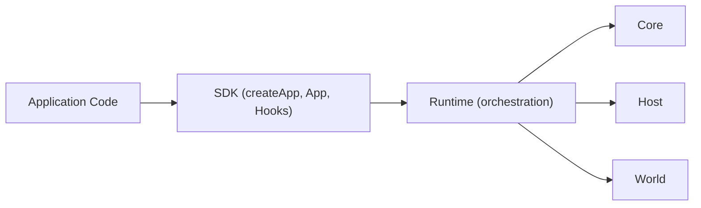

# @manifesto-ai/sdk

> Public developer API layer for the Manifesto protocol stack

> **Phase 1:** Most users should use `@manifesto-ai/app`, which re-exports all SDK APIs.

---

## Overview

`@manifesto-ai/sdk` is the public API surface for building Manifesto applications.

- `createApp()` — single entry point for app creation
- `ManifestoApp` — thin facade delegating to Runtime
- Hook system with re-entrancy guards and deferred execution

---

## Architecture Role

SDK presents the public contract. All orchestration is delegated to Runtime.



---

## Main Exports

### createApp()

Creates a new Manifesto App instance.

```typescript
import { createApp } from "@manifesto-ai/sdk";

const app = createApp({
  schema: domainSchema,
  effects: {
    "api.save": async (params, ctx) => [
      { op: "set", path: "data.savedAt", value: params.timestamp },
    ],
  },
});

await app.ready();
```

### AppConfig

```typescript
interface AppConfig {
  readonly schema: DomainSchema | string;
  readonly effects: Effects;

  readonly world?: ManifestoWorld;
  readonly policyService?: PolicyService;
  readonly executionKeyPolicy?: ExecutionKeyPolicy;

  readonly memoryStore?: MemoryStore;
  readonly memoryProvider?: MemoryProvider;
  readonly memory?: false | MemoryHubConfig;

  readonly plugins?: readonly AppPlugin[];
  readonly hooks?: Partial<AppHooks>;
  readonly initialData?: unknown;
  readonly actorPolicy?: ActorPolicyConfig;
  readonly systemActions?: SystemActionsConfig;
  readonly validation?: { readonly effects?: "strict" | "warn" | "off" };
}
```

### createTestApp()

Minimal app for testing with in-memory defaults.

```typescript
import { createTestApp } from "@manifesto-ai/sdk";

const app = createTestApp(schema, { effects: {} });
await app.ready();
```

---

## App Interface

### Lifecycle

```typescript
await app.ready();           // Initialize (created → ready)
await app.dispose();         // Shutdown (ready → disposed)
app.status;                  // 'created' | 'ready' | 'disposing' | 'disposed'
```

### Actions

```typescript
const handle = app.act("increment", { by: 1 });
await handle.completed();    // Wait for completion
handle.phase;                // 'queued' | 'executing' | 'completed' | 'rejected' | 'failed'
```

### State Access

```typescript
const state = app.getState<MyState>();
state.data.count;            // Type-safe access

const unsubscribe = app.subscribe(
  (s) => s.data.count,
  (count) => console.log("count changed:", count)
);
```

### Session

```typescript
const session = app.session("user-123");
session.act("increment");    // Actor-scoped action
```

### Branch Management

```typescript
const branch = app.currentBranch();
const branches = app.listBranches();
const forked = await app.fork({ name: "experiment" });
await app.switchBranch(forked.id);
```

---

## Hook System

SDK provides lifecycle hooks with re-entrancy guards.

```typescript
const app = createApp({
  schema,
  effects: {},
  hooks: {
    "app:ready": (ctx) => {
      console.log("App is ready");
    },
    "action:completed": (ctx, result) => {
      // Safe: read-only access via ctx.app
      const state = ctx.app.getState();

      // Safe: deferred execution (runs after hook completes)
      ctx.app.enqueueAction("log.action", { result });
    },
  },
});
```

### AppRef (Read-Only Facade)

Inside hooks, `ctx.app` is an `AppRef` — a read-only facade that prevents re-entrant mutations.

| AppRef Method | Description |
|---------------|-------------|
| `status` | Current app status |
| `getState()` | Read current state |
| `getDomainSchema()` | Read schema |
| `getCurrentHead()` | Read current world head |
| `currentBranch()` | Read current branch |
| `enqueueAction()` | Deferred action (runs after hook) |

---

## Error Types

SDK re-exports error types from Runtime. Key errors:

| Error | When |
|-------|------|
| `AppNotReadyError` | API called before `ready()` |
| `AppDisposedError` | API called after `dispose()` |
| `ReservedEffectTypeError` | User tried to override `system.get` |
| `HookMutationError` | Direct mutation attempted inside hook |

---

## Related Packages

| Package | Relationship |
|---------|--------------|
| [@manifesto-ai/app](./app) | Facade that re-exports SDK (canonical entry during Phase 1) |
| [@manifesto-ai/runtime](./runtime) | Internal orchestration engine (SDK delegates to Runtime) |
| [@manifesto-ai/core](./core) | Pure computation (used by Runtime) |
| [@manifesto-ai/host](./host) | Effect execution (used by Runtime) |
| [@manifesto-ai/world](./world) | Governance and lineage (used by Runtime) |
