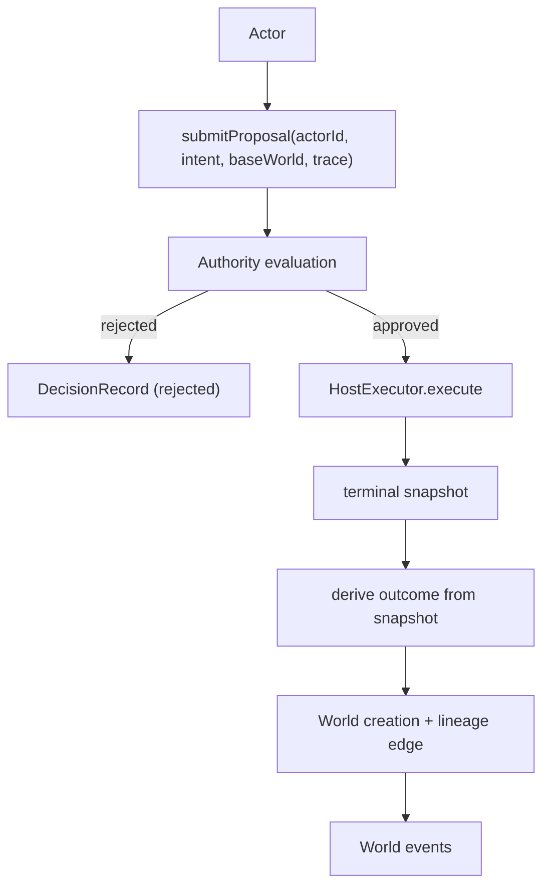

# @manifesto-ai/world

> Governance, authority, and lineage layer for Manifesto

---

## Overview

`@manifesto-ai/world` governs proposal legitimacy and records immutable world lineage.

- Actor registration + policy binding
- Proposal submission/evaluation
- Decision + world creation audit trail
- Branch epoch and lineage management

---

## Architecture

World sits above Host and Core as the governance layer.

- Accepts `IntentInstance` proposals
- Applies authority rules/HITL decisions
- Calls `HostExecutor` for approved proposals
- Derives outcome from terminal snapshot
- Records immutable world lineage and governance events



---

## Main Exports

### createManifestoWorld()

```typescript
import { createManifestoWorld } from "@manifesto-ai/world";

const world = createManifestoWorld({
  schemaHash: "schema-hash-v1",
  executor, // optional HostExecutor adapter
  store,    // optional custom store
});
```

### ManifestoWorldConfig

```typescript
interface ManifestoWorldConfig {
  schemaHash: string;
  executor?: HostExecutor;
  store?: WorldStore;
  onHITLRequired?: HITLNotificationCallback;
  customEvaluators?: Record<string, CustomConditionEvaluator>;
  eventSink?: WorldEventSink;
  executionKeyPolicy?: ExecutionKeyPolicy;
}
```

### ManifestoWorld (primary methods)

```typescript
class ManifestoWorld {
  registerActor(actor: ActorRef, policy: AuthorityPolicy): void;
  updateActorBinding(actorId: string, policy: AuthorityPolicy): void;

  createGenesis(initialSnapshot: Snapshot): Promise<World>;
  switchBranch(newBaseWorld: WorldId): Promise<void>;

  submitProposal(
    actorId: string,
    intent: IntentInstance,
    baseWorld: WorldId,
    trace: ProposalTrace
  ): Promise<ProposalResult>;

  processHITLDecision(
    proposalId: string,
    decision: "approved" | "rejected",
    reasoning: string,
    approvedScope: IntentScope | null
  ): Promise<ProposalResult>;
}
```

---

## Key Types

### Proposal

```typescript
interface Proposal {
  proposalId: string;
  actor: ActorRef;
  intent: IntentInstance;
  baseWorld: WorldId;
  status: ProposalStatus;
  executionKey: string;
}
```

### World

```typescript
interface World {
  worldId: WorldId;
  schemaHash: string;
  snapshotHash: string;
  createdAt: number;
  createdBy: string | null;
}
```

---

## Authority Handlers

```typescript
import {
  createAutoApproveHandler,
  createPolicyRulesHandler,
  createHITLHandler,
  createTribunalHandler,
} from "@manifesto-ai/world";

const autoApprove = createAutoApproveHandler();
const policy = createPolicyRulesHandler();
const hitl = createHITLHandler();
const tribunal = createTribunalHandler();
```

These handlers are typically wired through actor policy bindings in `ManifestoWorld`.

---

## Lineage

```typescript
import { createWorldLineage } from "@manifesto-ai/world";

const lineage = createWorldLineage();
```

`WorldLineage` provides DAG traversal and ancestry helpers over immutable world history.

---

## Additional Public Exports

`@manifesto-ai/world` additionally exports:

- factory helpers: `createProposal`, `createDecisionRecord`, `computeWorldId`, `computeSnapshotHash`
- key/port types: `ExecutionKey`, `HostExecutor`, `ExecutionKeyPolicy`
- persistence: `createMemoryWorldStore`, `WorldStore`, `StoreEvent*`
- governance events: `WorldEvent*`, `createNoopWorldEventSink`

---

## Related Packages

| Package | Relationship |
|---------|--------------|
| [@manifesto-ai/core](./core) | Pure computation |
| [@manifesto-ai/host](./host) | Executes approved intents |
| [@manifesto-ai/app](./app) | High-level facade using World |
