# Architecture

> **Purpose:** Structural understanding of Manifesto's design
> **Audience:** System designers, architects, implementers
> **Reading time:** 5 minutes (overview) + 1.5 hours (all pages)

---

## What is Covered Here?

The Architecture section explains **how Manifesto is structured** and **why it's structured that way**.

After reading this section, you'll understand:
- The four-layer architecture (App, World, Host, Core) + Compiler (MEL)
- How data flows through the system
- Why determinism is guaranteed
- How failures are handled
- How governance works

This is not API documentation. This is structural understanding.

---

## The Semantic Space Model

Before understanding the layers and components, grasp the foundational model that drives all of Manifesto's architecture:

**Manifesto treats domain state as coordinates in a semantic space.**

| Concept | In Manifesto |
|---------|--------------|
| **Schema** | Defines the semantic space — dimensions, valid regions, navigation rules |
| **Snapshot** | A coordinate — one point in that space |
| **Intent** | A navigation command — where to move in the space |
| **Computation** | Coordinate calculation — finding the next valid position |

```
compute(schema, snapshot, intent) → snapshot'
        ↓        ↓         ↓           ↓
      space   current   navigation    next
      defn    coord     command       coord
```

This model explains **why** Manifesto guarantees:

- **Determinism**: Same coordinate + same navigation = same destination. Always.
- **Accountability**: Every coordinate transition is recorded in the lineage DAG.
- **Explainability**: Every position can trace its derivation path through semantic space.

Traditional state management asks: *"How do I mutate this data?"*
Manifesto asks: *"What is the next valid position in semantic space?"*

This shift from data mutation to coordinate calculation is the foundational insight that enables all other guarantees.

---

## The Core Architectural Principles

### Principle 1: Separation of Concerns

**Core computes. Host executes. World governs.**

```
┌─────────────────────────────────────────────┐
│ Core: What should happen                    │
│   - Pure computation                        │
│   - No IO, no side effects                  │
│   - Same input → same output                │
└─────────────────────────────────────────────┘
                    ↓
         Declares requirements
                    ↓
┌─────────────────────────────────────────────┐
│ Host: How to make it happen                 │
│   - Executes effects                        │
│   - Applies patches                         │
│   - Reports results                         │
└─────────────────────────────────────────────┘
                    ↓
         Notifies World
                    ↓
┌─────────────────────────────────────────────┐
│ World: Who can do what                      │
│   - Evaluates authority                     │
│   - Records decisions                       │
│   - Maintains lineage                       │
└─────────────────────────────────────────────┘
```

**Why this matters:** Each concern can be tested, replaced, and reasoned about independently.

### Principle 2: Snapshot as Sole Medium

**All communication happens through Snapshot. There is no other channel.**

```
┌──────────┐         ┌──────────┐         ┌──────────┐
│  Core    │────────▶│ Snapshot │◀────────│   Host   │
└──────────┘         └──────────┘         └──────────┘
     ▲                     │                     │
     │                     ▼                     │
     │               ┌──────────┐                │
     └───────────────│  World   │◀───────────────┘
                     └──────────┘
```

**Why this matters:** No hidden state, no suspended context, complete visibility.

### Principle 3: Immutability

**Snapshots and Worlds are immutable after creation.**

```typescript
// FORBIDDEN
snapshot.data.count = 5;
snapshot.meta.version++;

// REQUIRED
const context = { now: 0, randomSeed: "seed" };
const newSnapshot = core.apply(schema, snapshot, [
  { op: 'set', path: 'count', value: 5 }
], context);
```

**Why this matters:** Time-travel debugging, safe concurrency, reproducible computation.

---

## Pages in This Section

### [Layers](/internals/architecture)

The four-layer architecture and their responsibilities.

**What you'll learn:**
- App layer (orchestration and UI integration)
- World layer (governance)
- Host layer (effect execution)
- Core layer (pure computation)
- Compiler (MEL) for domain definition
- Boundaries and contracts between layers

**When to read:** Start here to understand the big picture.

**Reading time:** 15 minutes

---

### [Data Flow](./data-flow)

How data moves through Manifesto's layers.

**What you'll learn:**
- Primary flow: Intent execution
- Secondary flow: Effect handling
- The Snapshot principle
- Computation cycle
- Component interactions

**When to read:** After Layers. Understand how layers work together.

**Reading time:** 20 minutes

---

### [Determinism](./determinism)

How Manifesto guarantees deterministic computation.

**What you'll learn:**
- What determinism means
- Why it matters
- How Core achieves it
- What breaks determinism
- Testing for determinism

**When to read:** After Data Flow. Understand the core guarantee.

**Reading time:** 25 minutes

---

### [Failure Model](./failure-model)

How Manifesto handles errors and failures.

**What you'll learn:**
- Errors as values (not exceptions)
- Effect failure handling
- Flow failure patterns
- Recovery strategies
- Audit trails for failures

**When to read:** After Determinism. Understand how things fail safely.

**Reading time:** 20 minutes

---

### Governance Model

How World Protocol manages authority and accountability.

**What you'll learn:**
- Proposal → Authority → Decision flow
- Authority registration and evaluation
- Multi-authority coordination
- Lineage DAG
- Audit trail generation

**When to read:** After Failure Model. Understand governance architecture.

**Reading time:** 25 minutes

**Note:** See [World Concept](/concepts/world) and [Specifications](/internals/spec/) for governance details.

---

## Reading Order

### For System Designers

**Goal:** Understand architectural decisions and trade-offs

1. **[Layers](/internals/architecture)** — See the structure
2. **[Data Flow](./data-flow)** — See how it works
3. **[Determinism](./determinism)** — Understand core guarantee
4. **[Specifications](/internals/spec/)** — Understand authority architecture

**Total time:** ~1 hour

### For Implementers

**Goal:** Build compliant implementations

1. **[Layers](/internals/architecture)** — Understand boundaries
2. **[Data Flow](./data-flow)** — Understand execution model
3. **[Failure Model](./failure-model)** — Handle errors correctly
4. **[Specifications](/internals/spec/)** — Read normative contracts

**Total time:** ~1.5 hours + specs

### For Evaluators

**Goal:** Decide if architecture fits your needs

1. **[Layers](/internals/architecture)** — See high-level structure
2. **[Determinism](./determinism)** — Understand key guarantee
3. **[Design Rationale](/internals/fdr/)** — Understand why

**Total time:** ~45 minutes

---

## Architecture Quick Reference

### The Four Layers + Compiler

| Layer | Package | Responsibility | Can Do | Cannot Do |
|-------|---------|----------------|--------|-----------|
| **App** | `@manifesto-ai/sdk` | Orchestrate lifecycle, integrate UI | Subscribe, dispatch, wire layers | Define logic, execute directly |
| **World** | `@manifesto-ai/world` | Govern proposals, evaluate authority | Approve/reject, record lineage | Execute, compute |
| **Host** | `@manifesto-ai/host` | Execute effects, apply patches | Run handlers, orchestrate | Decide, interpret meaning |
| **Core** | `@manifesto-ai/core` | Pure computation | Compute patches/effects | IO, execution, time-awareness |
| **Compiler** | `@manifesto-ai/compiler` | MEL → DomainSchema compilation | Parse, validate, generate schemas | Execute anything |

### Data Flow Summary

```
User Action
    ↓
React/UI Dispatch
    ↓
App Routing (app.act())
    ↓
World Authority
    ↓
Host Orchestration
    ↓
Core Computation
    ↓
New Snapshot
    ↓
App Notification (app.subscribe())
```

### Key Guarantees

| Guarantee | How It's Enforced |
|-----------|-------------------|
| **Determinism** | Core is pure (no IO, no time, no mutation) |
| **Accountability** | World records all decisions |
| **Immutability** | Snapshots/Worlds never mutate after creation |
| **Completeness** | Snapshot contains all state (no hidden channels) |
| **Termination** | Flows are not Turing-complete |

---

## Common Architectural Questions

### Why separate Core and Host?

**Question:** Why not just have Core execute effects directly?

**Answer:** Separation enables:
- **Deterministic testing**: Core is pure, testable without mocks
- **Time-travel debugging**: Replay Core computation exactly
- **Effect isolation**: Swap implementations (mock APIs, different databases)
- **Parallelization**: Host can execute effects in parallel

See [Determinism](./determinism) for details.

### Why is Snapshot the only medium?

**Question:** Why not pass values directly between layers?

**Answer:** Single medium ensures:
- **Complete state visibility**: No hidden state
- **Serialization**: Can save entire world
- **Reproducibility**: Can replay from Snapshot
- **Simplicity**: One place to look for state

See [Data Flow](./data-flow#the-snapshot-principle) for details.

### Why is Flow not Turing-complete?

**Question:** Why can't Flows have unbounded loops?

**Answer:** Guarantees:
- **Termination**: Flows always finish in finite steps
- **Static analysis**: Can analyze Flow without executing
- **Complete traces**: Finite execution means complete logs

For unbounded iteration, Host controls the loop.

See [Flow Concept](/concepts/flow) for details.

### Why is World required?

**Question:** Can I skip World for simple apps?

**Answer:** World provides:
- **Audit trails**: Who did what, when, why
- **Lineage tracking**: How we got to this state
- **Authority evaluation**: Even if it always approves
- **Decision records**: Compliance and debugging

Even "always approve" authority provides value. World is not optional.

See [World Concept](/concepts/world) and [Specifications](/internals/spec/) for details.

---

## Architecture Diagrams

### Layer Dependencies


### Execution Flow

```mermaid
sequenceDiagram
    participant User
    participant UI as React/UI
    participant App
    participant World
    participant Host
    participant Core

    User->>UI: Click button
    UI->>App: app.act('action')
    App->>World: Submit proposal
    World->>World: Evaluate authority
    alt Approved
        World->>Host: Execute intent
        Host->>Core: compute()
        Core-->>Host: (patches, requirements)
        Host->>Host: Execute effects
        Host->>Host: Apply patches
        Host->>Core: compute() again
        Core-->>Host: (new snapshot, [])
        Host->>World: Commit decision
        World->>App: Notify
        App->>UI: Trigger subscribers
        UI->>User: Render
    else Rejected
        World->>App: Notify rejection
        App->>UI: Trigger subscribers
        UI->>User: Show error
    end
```



---

## Next Steps

### After Reading Architecture

1. **Understand specifications:** Read [Specifications](/internals/spec/)
2. **Understand rationale:** Read [Design Rationale](/internals/fdr/)
3. **Build something:** Try [Getting Started](/quickstart)

### If You're Designing a System

1. **Map your domain:** Identify state, actions, effects
2. **Define authorities:** Determine who can do what
3. **Model failures:** Plan error handling
4. **Choose integration points:** Decide where Manifesto fits in your stack

### If You're Evaluating Manifesto

1. **Check fit:** Does your problem need determinism, accountability, or governance?
2. **Assess trade-offs:** More upfront structure, less imperative flexibility
3. **Review alternatives:** See [Manifesto vs. Others](/concepts/)

---

## Related Sections

- **[Core Concepts](/concepts/)** — Understand building blocks
- **[Specifications](/internals/spec/)** — Normative contracts
- **[Rationale](/internals/fdr/)** — Why decisions were made
- **[Guides](/guides/)** — Practical tutorials

---

**Start with [Layers](/internals/architecture) to understand Manifesto's structure.**
