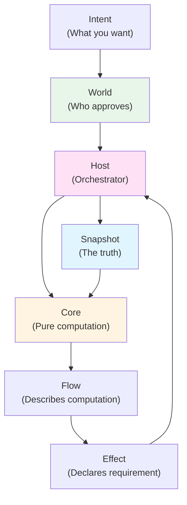

# Core Concepts

> **Purpose:** Mental model foundation for understanding Manifesto
> **Audience:** Anyone building with Manifesto
> **Reading time:** 5 minutes (overview) + 1 hour (all pages)

---

## What Are Core Concepts?

Core Concepts are the fundamental building blocks of Manifesto's mental model. Understanding these concepts is essential before diving into architecture, specifications, or advanced guides.

**These concepts are independent.** Each can be understood on its own, though they work together to form a complete system.

---

## The Six Core Concepts

### 1. [Snapshot](./snapshot)

**The complete state of a system at a point in time.**

Snapshot is the single source of truth and the only communication channel between all layers.

**Key principle:** If it's not in Snapshot, it doesn't exist.

```typescript
type Snapshot = {
  data: Record<string, unknown>;      // Domain state
  computed: Record<string, unknown>;  // Derived values
  system: SystemState;                // Runtime state
  input: unknown;                     // Transient input
  meta: SnapshotMeta;                 // Metadata
};
```

**When to read:** Start here. Snapshot is the foundation of everything else.

---

### 2. [Intent](./intent)

**A request to perform a domain action.**

Intents are proposals for state changes. They flow through World Protocol for authority evaluation before execution.

```typescript
type IntentBody = {
  type: string;      // Action name
  input?: unknown;   // Optional input data
};
```

**When to read:** After Snapshot. Intent is how changes are requested.

---

### 3. [Effect](./effect)

**A declaration of an external operation for Host to execute.**

Effects are **not executed by Core**. Core declares requirements, Host fulfills them.

```typescript
// Core declares
{ kind: 'effect', type: 'api:fetchUser', params: { id: '123' } }

// Host executes
async (type, params) => {
  const user = await fetch(`/api/users/${params.id}`).then(r => r.json());
  return [{ op: 'set', path: 'user', value: user }];  // Return patches
}
```

**When to read:** After Intent. Effects enable interaction with the outside world.

---

### 4. [Flow](./flow)

**Declarative computation expressed as data structures.**

Flows describe what should happen, not how to execute it. They are **not Turing-complete** — they always terminate.

```typescript
// This is DATA, not CODE
{
  kind: 'seq',
  steps: [
    { kind: 'patch', op: 'set', path: 'count', value: { kind: 'lit', value: 0 } },
    { kind: 'effect', type: 'api:log', params: {} }
  ]
}
```

**When to read:** After Effect. Flow is how you compose patches and effects.

---

### 5. [Host](./host)

**The execution engine that fulfills requirements and manages the compute loop.**

Host executes effects, applies patches, and orchestrates the compute-effect cycle. It is the **only** layer that performs IO.

```typescript
// Host responsibilities
- Execute effect handlers
- Apply patches to Snapshot
- Run compute loop until requirements are empty
- Persist snapshots (optional)
```

**When to read:** After Flow. Host is what makes things actually happen.

---

### 6. [World](./world)

**The governance layer managing authority, proposals, and lineage.**

World ensures that all intents are authorized before execution. It maintains a DAG of decisions and provides complete audit trails.

```typescript
// Submit intent through World
const proposal = await world.submitProposal(actor, intent);

// Authority evaluates
world.registerAuthority('todos:delete', async (proposal, context) => {
  if (context.actor.role !== 'admin') {
    return { approved: false, reason: 'Only admins can delete' };
  }
  return { approved: true };
});
```

**When to read:** After Host. World is how governance and accountability work.

---

## Reading Order

### Recommended for Beginners

1. **[Snapshot](./snapshot)** — Foundation (15 min)
2. **[Intent](./intent)** — How changes are requested (10 min)
3. **[Effect](./effect)** — How side effects work (10 min)
4. **[Flow](./flow)** — How computations are composed (15 min)
5. **[Host](./host)** — How execution works (10 min)
6. **[World](./world)** — How governance works (15 min)

**Total time:** ~1 hour

### Recommended for Experienced Developers

If you're familiar with state management:

1. **[Snapshot](./snapshot)** — See how it differs from Redux state
2. **[Flow](./flow)** — Understand declarative computation
3. **[Effect](./effect)** — See how effects are isolated
4. **[World](./world)** — Understand governance model

**Total time:** ~30 minutes

---

## Concept Relationships

Understanding how concepts relate:



**Flow:**
1. Actor submits **Intent**
2. **World** evaluates authority
3. **Host** orchestrates execution
4. **Core** computes using **Flow**
5. **Flow** declares **Effects**
6. **Host** executes effects
7. New **Snapshot** is produced

---

## Common Misconceptions

### "Snapshot is just state"

**Wrong:** Snapshot is Redux state.

**Right:** Snapshot includes:
- Domain state (`data`)
- Derived values (`computed`)
- Runtime state (`system`)
- Transient input (`input`)
- Metadata (`meta`)

It's the **complete picture**, not just business state.

### "Flow is code that executes"

**Wrong:** Flow is a function that runs.

**Right:** Flow is a **data structure** describing computation. Core interprets it.

### "Effects return values to Flows"

**Wrong:** Effect handlers return values that Flows can use.

**Right:** Effects return **patches**. The next `compute()` reads the result from Snapshot.

### "Host is just a runtime"

**Wrong:** Host only executes effects.

**Right:** Host also:
- Applies patches
- Orchestrates compute loop
- Manages snapshot persistence
- Handles failure recovery

### "World is optional for simple apps"

**Wrong:** You can skip World if you don't need governance.

**Right:** All intents go through World Protocol, even if authority always approves. World provides:
- Audit trails (who did what)
- Lineage tracking (how we got here)
- Decision records (why was this approved)

---

## Principle Summary

| Concept | Core Principle |
|---------|----------------|
| **Snapshot** | All communication happens through Snapshot. There is no other channel. |
| **Intent** | Intents are proposals, not commands. World decides whether to approve. |
| **Effect** | Effects are declarations, not executions. Host fulfills requirements. |
| **Flow** | Flows describe, they don't execute. Core interprets them. |
| **Host** | Host executes effects and reports results. It never interprets meaning. |
| **World** | World governs, it doesn't execute. Authority is separated from execution. |

---

## Quick Reference Table

| What You Want | Which Concept | Key Method |
|---------------|---------------|------------|
| Define domain state | Snapshot | `createSnapshot(data, schema.hash, context)` |
| Request state change | Intent | `createIntent('actionName', input, intentId)` |
| Perform IO (API, DB) | Effect | `flow.effect('type', params)` |
| Describe computation | Flow | `flow.seq([...])`, `flow.when(...)` |
| Execute effects | Host | `host.registerEffect(type, handler)` |
| Authorize actions | World | `world.registerAuthority(type, evaluator)` |

---

## Next Steps

### After Reading Core Concepts

1. **Build something:** Follow [Getting Started Guide](/guides/getting-started)
2. **Understand architecture:** Read [Architecture Overview](/architecture/)
3. **See examples:** Try [Todo Example](/guides/todo-example)

### If You're Stuck

1. Review [Common Debugging Patterns](/guides/debugging)
2. Check [Manifesto vs. Others](/what-is-manifesto/manifesto-vs-others) for comparisons
3. Join [Discord](https://discord.gg/manifesto)

---

## Related Sections

- **[Architecture](/architecture/)** — How concepts fit into layers
- **[Specifications](/specifications/)** — Normative definitions
- **[Guides](/guides/)** — Practical tutorials
- **[Rationale](/rationale/)** — Why concepts are designed this way

---

## Pages in This Section

### [Snapshot](./snapshot)

Complete state at a point in time. The single source of truth.

**Key topics:**
- Snapshot structure (data, computed, system, input, meta)
- Immutability guarantees
- Why Snapshot is the only medium
- Common misconceptions

**Reading time:** 15 minutes

---

### [Intent](./intent)

Request to perform a domain action.

**Key topics:**
- IntentBody vs IntentInstance
- How intents flow through World Protocol
- Projection from SourceEvents
- Intent validation

**Reading time:** 10 minutes

---

### [Effect](./effect)

Declaration of external operation for Host to execute.

**Key topics:**
- Effects as requirements, not executions
- Effect handlers return patches
- Effect failures and error handling
- Common effect patterns

**Reading time:** 10 minutes

---

### [Flow](./flow)

Declarative computation expressed as data.

**Key topics:**
- Flow is data, not code
- Flow composition (seq, par, when, etc.)
- Re-entry safety
- Flow termination guarantees

**Reading time:** 15 minutes

---

### [Host](./host)

Execution engine that fulfills requirements.

**Key topics:**
- Compute-effect loop
- Effect handler registration
- Patch application
- Snapshot persistence

**Reading time:** 10 minutes

---

### [World](./world)

Governance layer managing authority and lineage.

**Key topics:**
- Proposal → Authority → Decision flow
- Authority registration and evaluation
- Lineage DAG
- Audit trails and decision records

**Reading time:** 15 minutes

---

**Start with [Snapshot](./snapshot) to build your mental model.**
