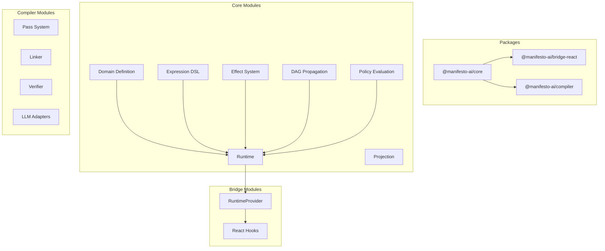
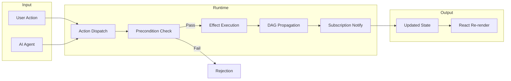
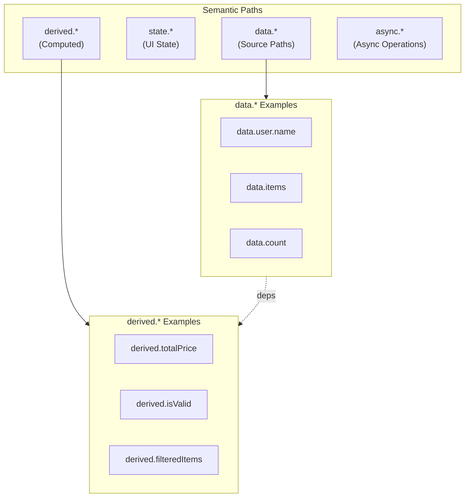
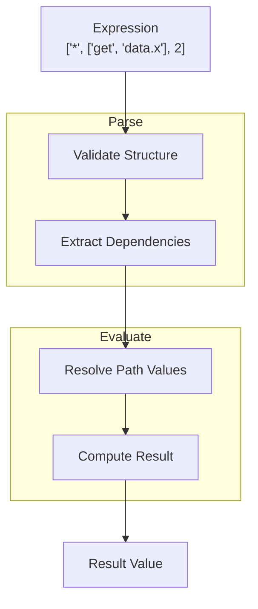
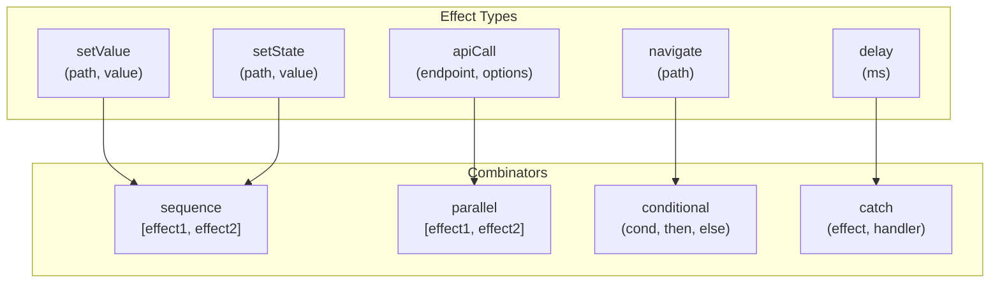
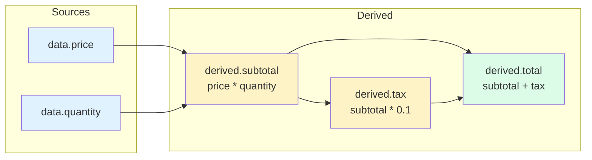
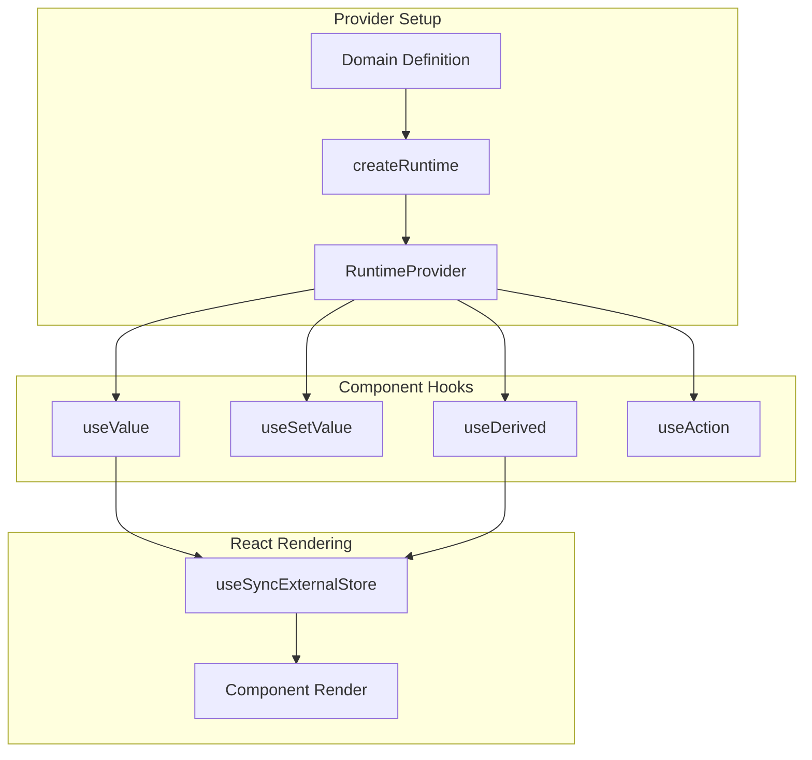
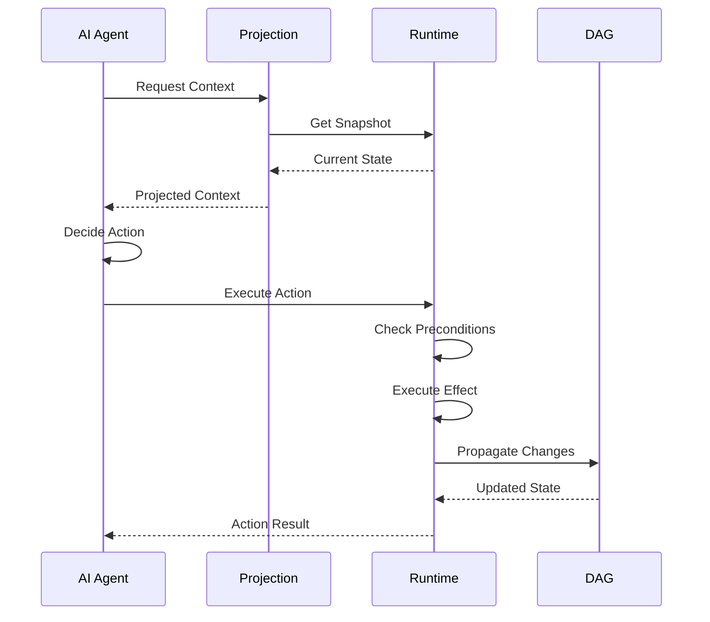
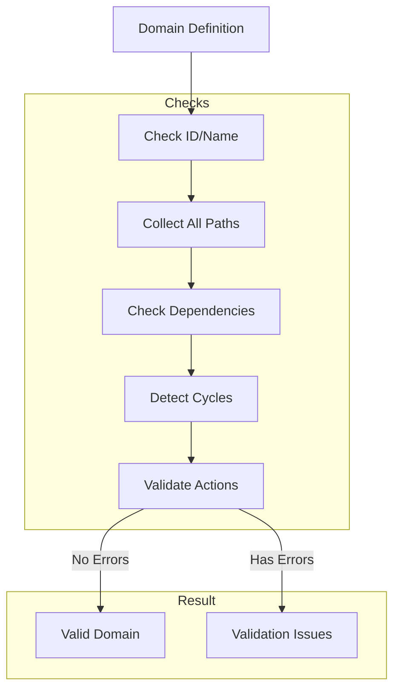

# Architecture Diagrams

Visual diagrams explaining Manifesto's architecture and data flow.

## Package Overview

## Core Data Flow

## Semantic Path Structure

## Expression Evaluation

## Effect System

## DAG Propagation

## Compiler Pipeline

```mermaid
flowchart LR
    subgraph Input
        TS[TypeScript Code]
        Design[Design Spec]
    end

    subgraph "Compilation"
        Parse[Parse]
        Pass1[SchemaPass]
        Pass2[DerivedPass]
        Pass3[ActionPass]
        Pass4[AsyncPass]
        Pass5[PolicyPass]
        Pass6[MetadataPass]
        Pass7[FragmentPass]
    end

    subgraph "Linking"
        Merge[Fragment Merge]
        Conflict[Conflict Detection]
        Build[Domain Build]
    end

    subgraph "Verification"
        Validate[Validate Domain]
        Report[Issue Report]
    end

    TS --> Parse
    Design --> Parse
    Parse --> Pass1 --> Pass2 --> Pass3 --> Pass4 --> Pass5 --> Pass6 --> Pass7
    Pass7 --> Merge
    Merge --> Conflict
    Conflict --> Build
    Build --> Validate
    Validate --> Report
```

## React Integration

## AI Agent Integration

## Domain Validation Flow

