# Understand Manifesto in 10 Minutes

## What is Manifesto?

**Manifesto is a semantic state layer for building AI-governed applications with deterministic computation and full accountability.**

It solves the fundamental problem: **How do we build applications where AI agents can safely read, reason about, and modify application state?**

Traditional state management scatters logic across components, middleware, and callbacks. Manifesto takes a radically different approach:

```
Core computes what the world should become.
Host makes it so.
World governs who can do what.
```

The fundamental equation:

```typescript
compute(schema, snapshot, intent, context) → (snapshot', requirements, trace)
```

This equation is:
- **Pure**: Same inputs MUST always produce same outputs
- **Total**: MUST always return a result (never throws)
- **Traceable**: Every step MUST be recorded
- **Complete**: Snapshot MUST be the whole truth

## Quick Example

Here's a complete counter application in Manifesto:

```typescript
import { z } from "zod";
import { defineDomain } from "@manifesto-ai/builder";

// Define domain with Zod schema
const CounterDomain = defineDomain(
  z.object({
    count: z.number().default(0),
  }),
  ({ state, actions, expr, flow }) => {
    const { increment, decrement } = actions.define({
      increment: {
        flow: flow.patch(state.count).set(expr.add(state.count, 1)),
      },
      decrement: {
        flow: flow.patch(state.count).set(expr.sub(state.count, 1)),
      },
    });

    return { actions: { increment, decrement } };
  }
);
```

MEL equivalent:

```mel
domain Counter {
  state {
    count: number = 0
  }

  action increment() {
    when true {
      patch count = add(count, 1)
    }
  }

  action decrement() {
    when true {
      patch count = sub(count, 1)
    }
  }
}
```

That's it. Five lines of actual logic. No reducers, no middleware, no thunks.

**What just happened?**

- State schema defined with Zod (type-safe)
- Actions declared as pure flows (deterministic)
- No execution code (Host handles that)
- Zero string paths (TypeScript autocomplete works)
- Fully serializable (AI can generate this)

## Key Concepts (5-Minute Overview)

### 1. Snapshot: The Single Source of Truth

```typescript
type Snapshot = {
  data: { count: 0 };              // Domain state
  computed: { doubled: 0 };        // Derived values
  system: { status: 'idle' };      // Runtime state
  input: unknown;                  // Transient input
  meta: { version: 1 };            // Metadata
};
```

**Critical principle:** All communication happens through Snapshot. There is no other channel.

If it's not in Snapshot, it doesn't exist.

### 2. Intent: What You Want to Happen

```typescript
type IntentBody = {
  type: "increment";    // Action name
  input?: unknown;      // Optional data
};
```

Intents are requests to perform actions. They trigger Flow execution.

### 3. Flow: Declarative Computation

Flows are **data structures** that describe computations:

```typescript
{
  kind: "seq",
  steps: [
    { kind: "patch", op: "set", path: "count", value: { kind: "lit", value: 0 } }
  ]
}
```

Flows:
- Do NOT execute; they describe
- Do NOT return values; they modify Snapshot
- Are NOT Turing-complete; they always terminate
- Have no memory between executions

### 4. Effect: External Operations

```typescript
// Declare effect (Core)
flow.effect("api:fetchUser", { userId: "123" });

// Execute effect (Host)
host.registerEffect("api:fetchUser", async (type, params) => {
  const user = await fetch(`/api/users/${params.userId}`).then(r => r.json());
  return [{ op: "set", path: "user", value: user }]; // Return patches
});
```

Effects are declarations of IO. Core declares them. Host executes them.

### 5. World: Governance Layer

```typescript
// Submit intent through World
const proposal = await world.submitProposal(actor, intent);

// Authority evaluates
world.registerAuthority("todos:delete", async (proposal, context) => {
  if (context.actor.role !== "admin") {
    return { approved: false, reason: "Only admins can delete" };
  }
  return { approved: true };
});
```

World manages who can do what, and records every decision.

## Why Manifesto?

### The Problem Manifesto Solves

Modern applications have three fundamental problems:

#### 1. Unpredictability

Traditional state management:
- Side effects mixed with logic
- Hidden execution context
- Non-deterministic behavior
- "Works on my machine" bugs

**Manifesto solution:** Pure computation. Same input → same output, always.

#### 2. Unaccountability

Traditional systems:
- Who changed this value?
- Why did this happen?
- Can't replay production bugs
- No audit trail

**Manifesto solution:** Full lineage. Every change traceable to Actor + Authority + Intent.

#### 3. Untestability

Traditional testing:
- Mock everything
- Brittle tests
- Integration tests required
- Can't test determinism

**Manifesto solution:** Test Core without mocks. It's pure.

### What Makes Manifesto Different?

| Traditional State Management | Manifesto |
|------------------------------|-----------|
| Logic scattered across components | Logic in declarative schemas |
| Side effects mixed with logic | Effects as pure declarations |
| Non-deterministic execution | Guaranteed determinism |
| No built-in governance | World Protocol for authority |
| Exceptions for errors | Errors as values in Snapshot |
| Testing requires mocks | Core testable without mocks |
| Hard to explain "why" | Every value can answer "why?" |

### Manifesto is NOT

Before you dive deeper, understand what Manifesto is **NOT**:

```
Manifesto IS:
  ✓ A semantic calculator for domain state
  ✓ Schema-first and JSON-serializable
  ✓ Deterministic and reproducible
  ✓ Explainable at every step
  ✓ Pure (no side effects in Core)

Manifesto IS NOT:
  ✗ An AI agent framework
  ✗ A workflow orchestrator
  ✗ A database or ORM
  ✗ A replacement for React/Redux
  ✗ A Turing-complete runtime
```

See [Manifesto vs. Others](/what-is-manifesto/manifesto-vs-others) for detailed comparisons.

## Architecture at a Glance

Manifesto is structured as **six distinct layers**, each with a single responsibility:

```mermaid
graph TD
    React["React / UI<br/>Present state, capture events"]
    Bridge["Bridge<br/>Route events ↔ intents"]
    World["World<br/>Govern proposals, evaluate authority"]
    Host["Host<br/>Execute effects, apply patches"]
    Core["Core<br/>Pure computation"]
    Builder["Builder<br/>Define domains (DSL)"]

    React --> Bridge
    Bridge --> World
    World --> Host
    Host --> Core
    Builder -.generates.-> Core

    style Core fill:#e1f5ff
    style Host fill:#fff4e1
    style World fill:#ffe1f5
    style Bridge fill:#f0f0f0
    style React fill:#e8f5e9
    style Builder fill:#fff9c4
```



**Key separations:**

- **Core** computes semantic meaning (pure)
- **Host** executes effects and applies patches (impure)
- **World** governs who can do what (authority)
- **Bridge** connects external events to intents (routing)
- **Builder** provides type-safe DSL (developer experience)
- **React** (or any UI) presents state (view)

See [Architecture Overview](/architecture/) for complete details.

## Data Flow

Understanding how data flows through Manifesto is critical:


**Critical principle:** Information flows ONLY through Snapshot. No hidden channels.

See [Data Flow](/architecture/data-flow) for step-by-step explanation.

## Get Started

Ready to build with Manifesto?

### Installation

```bash
npm install @manifesto-ai/builder @manifesto-ai/core @manifesto-ai/host zod
# or
pnpm add @manifesto-ai/builder @manifesto-ai/core @manifesto-ai/host zod
```

### Next Steps

| Path | For Whom | Start Here |
|------|----------|------------|
| **Quick Start** | Developers new to Manifesto | [Getting Started](/guides/getting-started) |
| **Deep Dive** | Understanding the architecture | [Core Concepts](/core-concepts/) |
| **Examples** | Learning by doing | [Todo App Example](/guides/todo-example) |
| **Specifications** | Implementers & reviewers | [Specifications](/specifications/) |

### Learn More

- **Core Concepts**: [Snapshot](/core-concepts/snapshot), [Intent](/core-concepts/intent), [Effect](/core-concepts/effect), [Flow](/core-concepts/flow)
- **Architecture**: [Layers](/architecture/layers), [Data Flow](/architecture/data-flow), [Determinism](/architecture/determinism)
- **Guides**: [Re-entry Safe Flows](/guides/reentry-safe-flows), [Effect Handlers](/guides/effect-handlers), [Debugging](/guides/debugging)

## Who Should Use Manifesto?

### Perfect Fit ✅

Use Manifesto if you need:
- Deterministic computation (same input → same output)
- AI agent governance (LLMs proposing actions)
- Full accountability (audit trails, compliance)
- Explainability (every value can answer "why?")
- Testability without mocks (pure computation)
- Schema-first design (AI-generated logic)

### Good Fit ✔️

Use Manifesto if you have:
- Complex domain logic with side effects
- Multi-actor systems with authorization
- Need for time-travel debugging
- Reproducible computation requirements

### Poor Fit ❌

Don't use Manifesto if you only need:
- Simple local UI state (use `useState` or Zustand)
- Rapid prototyping without governance (use Redux)
- Workflow orchestration (use Temporal)
- Event-driven architecture (use Event Sourcing)

See [When to Use Manifesto](/what-is-manifesto/problem#who-should-use-manifesto) for detailed decision tree.

## Community

- **GitHub**: [manifesto-ai/core](https://github.com/manifesto-ai/core)
- **Discord**: [Join our community](https://discord.gg/manifesto-ai)
- **Twitter**: [@manifesto_ai](https://x.com/manifesto__ai)

## Contributing

We welcome contributions! See our [Contributing Guide](https://github.com/manifesto-ai/core/blob/main/CONTRIBUTING.md).

## License

MIT © 2025 Manifesto AI

---

**Ready to build deterministic, AI-governed applications?**

[Get Started →](/guides/getting-started)
