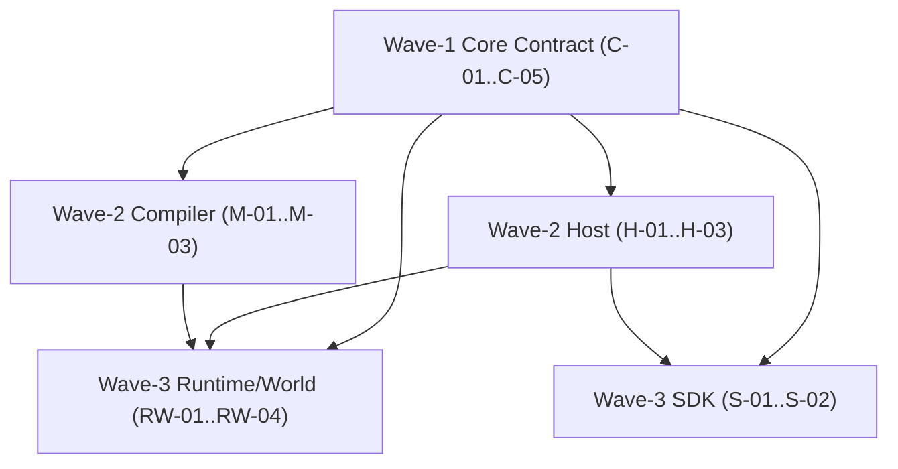

# ADR-009 Week 1 Convergence Pack

> **Status:** Working guidance (non-normative)  
> **Window:** 2026-03-02 ~ 2026-03-06 (KST)  
> **Normative source:** [ADR-009](./009-structured-patch-path), Core/Host/World/Compiler/Runtime/SDK latest SPEC  
> **Scope:** Gap freeze + ticket freeze only (no code mutation in Week 1)

This pack locks the Week 1 deliverables required to start Week 2 implementation immediately.

## 1. Baseline Freeze

### 1.1 Governance Baseline

- Docs hard-cut baseline commit: `00fa09b`  
- ADR-009 status: `Accepted`  
- Normative doc line: implementation convergence remains pending by design

### 1.2 Runtime Baseline (Planning-time observation)

| Check | Result | Note |
|------|--------|------|
| `pnpm --filter @manifesto-ai/core test` | Pass | Core tests currently green on planning baseline |
| `pnpm --filter @manifesto-ai/host test` | Fail | `@manifesto-ai/core` entry resolve failure |
| `pnpm --filter @manifesto-ai/compiler test` | Fail | `@manifesto-ai/core` entry resolve failure |
| Node engine | Warning | Required `>=22.12.0`, observed `22.11.0` |

## 2. ADR-009 항목(1~7) 패키지 영향 관계표

Legend: `C` = Critical, `H` = High, `M` = Medium, `-` = N/A

| ADR-009 Contract | Core | Host | Compiler | Runtime | World | SDK |
|---|---:|---:|---:|---:|---:|---:|
| 1. `Patch.path -> PatchPath` | C | C | C | C | M | C |
| 2. `PatchSegment` kind 제한 | C | H | C | H | M | H |
| 3. Patch root = `snapshot.data` only | C | C | H | C | M | C |
| 4. `SystemDelta` + `applySystemDelta()` only | C | C | - | H | M | H |
| 5. `ComputeResult = patches + systemDelta + trace + status` | C | C | - | H | - | M |
| 6. Compiler `IRPatchPath -> PatchPath` resolution | M | H | C | H | - | M |
| 7. Persistence `_patchFormat:2` + legacy hard reject + genesis reset | - | M | - | C | C | H |

## 3. 패키지별 갭-ID 목록 (Frozen)

| Gap ID | Requirement | Evidence | Severity | Target Ticket |
|---|---|---|---|---|
| `C-G01` | Core Patch 타입이 string path 사용 중 | `packages/core/src/schema/patch.ts:11` | Critical | `ADR009-C-01` |
| `C-G02` | `core.apply()`가 `system/input/computed/meta` patch 경로를 분기 처리 | `packages/core/src/core/apply.ts:134`, `:196` | Critical | `ADR009-C-02` |
| `C-G03` | `SystemDelta/applySystemDelta` API 부재 | `packages/core/src/index.ts:54` | Critical | `ADR009-C-03` |
| `C-G04` | `ComputeResult`가 snapshot/requirements 중심 계약 | `packages/core/src/schema/result.ts:24`, `packages/core/src/core/compute.ts:198` | Critical | `ADR009-C-04` |
| `H-G01` | Start/Continue interlock가 문서상 2단계 apply를 구조적으로 보장하지 않음 | `packages/host/src/job-handlers/start-intent.ts:88`, `continue-compute.ts:71` | High | `ADR009-H-01` |
| `H-G02` | requirement clear가 `system.pendingRequirements` 직접 patch | `packages/host/src/execution-context.ts:231` | Critical | `ADR009-H-02` |
| `H-G03` | Host trace/HCTS에 `core:applySystemDelta` 타입 이벤트 부재 | `packages/host/src/types/trace.ts:39`, `packages/host/src/__tests__/compliance/hcts-types.ts:38` | High | `ADR009-H-03` |
| `M-G01` | Runtime conditional patch path가 string | `packages/compiler/src/lowering/lower-runtime-patch.ts:83` | Critical | `ADR009-M-01` |
| `M-G02` | lowering에서 path flatten(string) 의존 | `packages/compiler/src/api/compile-mel-patch-collector.ts:495` | Critical | `ADR009-M-02` |
| `M-G03` | evaluate가 string path 기반, TOTAL `resolveIRPath` 규칙 부재 | `packages/compiler/src/evaluation/evaluate-runtime-patch.ts:225` | High | `ADR009-M-03` |
| `RW-G01` | Runtime/World persistence에 `_patchFormat:2` envelope 미강제 | `packages/runtime/src/storage/world-store/in-memory.ts:342`, `packages/world/src/persistence/memory.ts:548` | Critical | `ADR009-RW-01` |
| `RW-G02` | restore ingress에서 legacy/missing format hard reject 부재 | `packages/runtime/src/storage/world-store/in-memory.ts:152`, `packages/world/src/persistence/memory.ts:574` | Critical | `ADR009-RW-02` |
| `RW-G03` | reject 시 genesis reset 정책 미구현 | `packages/runtime/src/execution/pipeline/execute.ts:43` | Critical | `ADR009-RW-03` |
| `RW-G04` | delta generator가 string path + `system.*` patch 생성 | `packages/runtime/src/storage/world-store/delta-generator.ts:74`, `:341` | Critical | `ADR009-RW-04` |
| `S-G01` | SDK typed ops가 string path API 중심 | `packages/sdk/src/typed-ops.ts:221` | High | `ADR009-S-01` |
| `S-G02` | SDK `system.lastError` convenience 제공 | `packages/sdk/src/typed-ops.ts:241` | High | `ADR009-S-02` |

## 4. Week 1 일정 잠금 (Decision Complete)

| Date (KST) | Goal | Output |
|---|---|---|
| 2026-03-02 | Gap 동결 | 본 문서 §2~§3 기준선 잠금 |
| 2026-03-03 | Core 선행 티켓 세분화 | `ADR009-C-01..06` 상세 DoD/의존성 잠금 |
| 2026-03-04 | Host/Compiler 병렬 설계 | `ADR009-H-01..03`, `ADR009-M-01..03` 잠금 |
| 2026-03-05 | Runtime/World + SDK 설계 | `ADR009-RW-01..04`, `ADR009-S-01..02` 잠금 |
| 2026-03-06 | Week2 착수 패키지 조합 | PR Wave 계획(`Wave-1/2/3`) 잠금 |

## 5. Ticket Set (Implementation Ready)

### 5.1 Core (Critical Path)

| Ticket | Scope (대표 파일) | Depends On | Done Criteria |
|---|---|---|---|
| `ADR009-C-01` | `packages/core/src/schema/patch.ts`, `schema/flow.ts`, `schema/index.ts` | - | `PatchSegment/PatchPath` 도입, public export 정렬, public API에서 string patch path 제거 |
| `ADR009-C-02` | `packages/core/src/core/apply.ts`, `utils/path.ts` | `C-01` | `core.apply()`가 `snapshot.data` 루트만 patch 적용, `system/input/computed/meta` 구조적 거부 |
| `ADR009-C-03` | `packages/core/src/schema/result.ts`, `core/system-delta.ts`(신규), `index.ts` | `C-01` | `SystemDelta` 타입 + `applySystemDelta()` 순수함수/total/deterministic 구현 |
| `ADR009-C-04` | `packages/core/src/core/compute.ts`, `schema/result.ts`, `index.ts` | `C-01`,`C-03` | `ComputeResult`를 `patches + systemDelta + trace + status`로 변경, snapshot 직접 반환 제거 |
| `ADR009-C-05` | `packages/core/src/utils/patch-path.ts`(신규), `index.ts` | `C-01` | `patchPathToDisplayString()` 추가, parse 역변환 금지 규약 테스트 포함 |
| `ADR009-C-06` | `packages/core/src/__tests__/*` | `C-01..05` | ADR §9.1, §9.5, §9.6, §9.7 시나리오 테스트 통과 |

### 5.2 Host

| Ticket | Scope (대표 파일) | Depends On | Done Criteria |
|---|---|---|---|
| `ADR009-H-01` | `job-handlers/start-intent.ts`, `continue-compute.ts`, `execution-context.ts` | `C-03`,`C-04` | interlock를 `apply(patches) -> applySystemDelta -> dispatch`로 고정 |
| `ADR009-H-02` | `execution-context.ts`, `job-handlers/fulfill-effect.ts` | `C-03` | requirement clear를 `removeRequirementIds` 기반으로 전환, `system.*` patch 제거 |
| `ADR009-H-03` | `types/trace.ts`, `__tests__/compliance/hcts-types.ts`, `suite/interlock.spec.ts` | `H-01`,`H-02` | `core:applySystemDelta` 이벤트 추가, 순서 검증 테스트 강화 |

### 5.3 Compiler

| Ticket | Scope (대표 파일) | Depends On | Done Criteria |
|---|---|---|---|
| `ADR009-M-01` | `lowering/lower-runtime-patch.ts`, `api/compile-mel.ts` | `C-01` | `RuntimeConditionalPatchOp.path`를 `IRPatchPath`로 변경 |
| `ADR009-M-02` | `api/compile-mel-patch-collector.ts`, `lowering/*` | `M-01` | lowering에서 string flatten 제거 (`PathNode -> IRPathSegment[]`) |
| `ADR009-M-03` | `evaluation/evaluate-runtime-patch.ts`, `evaluation/context.ts` | `M-01`,`M-02`,`C-01` | `resolveIRPath()` TOTAL 구현, invalid expr segment는 op skip + warning |

### 5.4 Runtime / World

| Ticket | Scope (대표 파일) | Depends On | Done Criteria |
|---|---|---|---|
| `ADR009-RW-01` | `runtime/src/types/world-store.ts`, `runtime/src/storage/world-store/*`, `world/src/persistence/memory.ts` | `C-01` | persisted delta envelope에 `_patchFormat:2` 반영 |
| `ADR009-RW-02` | `runtime/src/storage/world-store/in-memory.ts`, `world/src/persistence/memory.ts` | `RW-01` | restore ingress에서 `_patchFormat:1`/missing hard reject |
| `ADR009-RW-03` | `runtime/src/bootstrap/*`, `runtime/src/execution/*` | `RW-02` | reject 시 genesis re-init(epoch reset) 정책 적용 |
| `ADR009-RW-04` | `runtime/src/storage/world-store/delta-generator.ts`, `execution/state-converter.ts` | `C-01`,`C-03` | delta generator segment path 전환, `system.*` patch 생성 제거 |

### 5.5 SDK

| Ticket | Scope (대표 파일) | Depends On | Done Criteria |
|---|---|---|---|
| `ADR009-S-01` | `packages/sdk/src/typed-ops.ts`, `src/index.ts` | `C-01` | typed ops를 segment path 기준으로 재설계 |
| `ADR009-S-02` | `packages/sdk/src/typed-ops.ts`, `src/__tests__/typed-ops*.test.ts` | `S-01`,`C-03` | `system.lastError` convenience 제거, 대체 가이드/API 반영 |

## 6. Week 2 PR Wave Plan (2026-03-09 start)

### 6.1 Dependency DAG

### 6.2 PR Waves

| Wave | Branch (prefix `codex/`) | Tickets | Merge Gate |
|---|---|---|---|
| Wave-1 | `codex/adr009-wave1-core-contract` | `C-01..C-05` | Core build/test green, public type export review 완료 |
| Wave-2A | `codex/adr009-wave2-host-interlock` | `H-01..H-03` | Host compliance(interlock/fulfill) 통과 |
| Wave-2B | `codex/adr009-wave2-compiler-irpath` | `M-01..M-03` | Compiler eval/IR path tests 통과 |
| Wave-3A | `codex/adr009-wave3-runtime-world-persistence` | `RW-01..RW-04` | restore reject/genesis reset tests 통과 |
| Wave-3B | `codex/adr009-wave3-sdk-typed-ops` | `S-01..S-02` | SDK typed ops tests 및 API review 통과 |

## 7. Week 2 Entry Gates (Locked)

1. Core unit: ADR §9.1, §9.5, §9.6, §9.7 시나리오 통과  
2. Compiler eval: ADR §9.8 (invalid expr segment skip+warning) 통과  
3. Host compliance: `core:apply` + `core:applySystemDelta` 순서 검증 통과  
4. Runtime/World restore: `_patchFormat:1`/missing hard reject 테스트 통과  
5. SDK typed ops: string-path API 제거 후 타입 테스트 통과  
6. Docs re-check: `pnpm docs:governance-check` and `pnpm docs:build` 통과

## 8. 운영 리스크와 기본 대응

| Risk | Impact | Default Mitigation |
|---|---|---|
| Host/Compiler test가 core entry resolve 실패 | Week2 PR 검증 지연 | `pnpm --filter @manifesto-ai/core build`를 선행 공통 게이트로 고정 |
| Node 엔진 버전 불일치 (`>=22.12.0`) | 로컬/CI 결과 불일치 | CI 기준 Node 고정 또는 로컬 Node 업그레이드 |
| Cross-package breaking 변경 동시 발생 | 병렬 작업 충돌 | Wave 단위 branch 격리 + Wave gate 엄수 |

## 9. Assumptions and Defaults

1. 기준 규범은 `Accepted ADR-009`이며 현행 `src`는 수렴 대상이다.  
2. `archive/` 문서는 수정 범위에서 제외한다.  
3. Week 1은 문서화/분해/우선순위 확정만 수행하며 코드 변경은 수행하지 않는다.  
4. 우선순위는 `Core > Host/Compiler > Runtime/World > SDK`로 고정한다.  
5. Week 2 기본 시작일은 `2026-03-09 (KST)`로 둔다.

