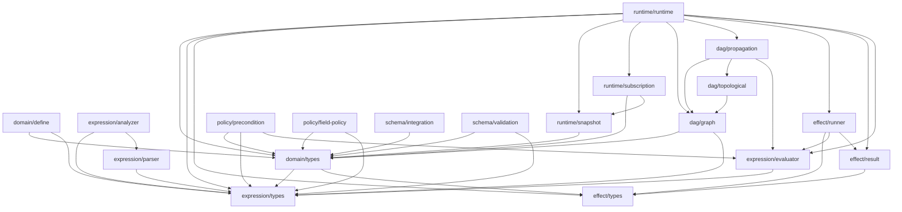

# Manifesto-Core Reverse Engineering Report

**목적**: Rust 재개발을 위한 패키지 구조 및 Public API 100% 동일성 유지를 위한 마이그레이션 설계 입력자료

**분석 일자**: 2025-12-12
**분석 대상**: `packages/core` (manifesto-core)

---

## 1. Executive Summary

1. **패키지 구조**: 7개 서브모듈 (`domain`, `expression`, `dag`, `runtime`, `effect`, `policy`, `schema`)로 구성된 도메인 중심 상태 관리 라이브러리
2. **핵심 기능**: Semantic Path 기반 상태 관리, DAG 기반 의존성 전파, Expression DSL 평가, Effect 시스템
3. **외부 의존성**: `zod` (스키마 검증)가 유일한 런타임 의존성 - Rust 포팅 시 자체 구현 또는 대체 필요
4. **결정론 위험 요소**: `Date.now()` (expression/evaluator), `Object.keys()` 순서, `Map` iteration 순서 - Rust 포팅 시 명시적 정렬 필요
5. **API Surface**: 47개 exported 심볼 (함수 28개, 타입/인터페이스 19개)
6. **테스트 커버리지**: 5개 테스트 파일, 약 150개 테스트 케이스 - Golden test 후보 다수 존재
7. **포팅 우선순위**: (1) Expression Evaluator → (2) DAG Propagation → (3) Effect Runner → (4) Runtime
8. **권장 포팅 방식**: WASM (브라우저 호환성), 경계 타입은 JSON 직렬화로 처리
9. **리스크**: `zod` 스키마 런타임 검증 로직, async/await 패턴, JS 특유의 truthy/falsy 변환
10. **예상 공수**: Expression + DAG 핵심 로직 약 3,000 LOC, 전체 약 8,000 LOC 상당

---

## 2. Package Surface Contract

### 2.1 Exports Inventory (package.json)

| 필드 | 값 |
|------|-----|
| `name` | `@anthropic/manifesto-core` |
| `version` | `0.2.0` |
| `type` | `module` |
| `main` | `dist/index.js` |
| `module` | `dist/index.js` |
| `types` | `dist/index.d.ts` |
| `exports["."]` | `{ "import": "./dist/index.js", "types": "./dist/index.d.ts" }` |

**외부 의존성**:
| 패키지 | 버전 | 용도 |
|--------|------|------|
| `zod` | `^3.23.8` | 스키마 정의 및 런타임 검증 |

### 2.2 Re-export Structure

```
src/index.ts
├── domain/index.ts
│   ├── types.ts (10 types)
│   ├── define.ts (7 functions)
│   └── validate.ts (4 functions)
├── expression/index.ts
│   ├── types.ts (5 types)
│   ├── parser.ts (5 functions)
│   ├── evaluator.ts (1 function)
│   └── analyzer.ts (4 functions)
├── dag/index.ts
│   ├── graph.ts (4 functions, 2 types)
│   ├── topological.ts (2 functions)
│   └── propagation.ts (4 functions, 2 types)
├── runtime/index.ts
│   ├── snapshot.ts (4 functions, 1 type)
│   ├── subscription.ts (1 class, 4 types)
│   └── runtime.ts (1 function, 6 types)
├── effect/index.ts
│   ├── types.ts (12 types)
│   ├── result.ts (4 functions, 3 types)
│   └── runner.ts (14 functions, 1 type)
├── policy/index.ts
│   ├── precondition.ts (4 functions, 2 types)
│   └── field-policy.ts (5 functions, 3 types)
└── schema/index.ts
    ├── integration.ts (4 functions, 2 objects)
    └── validation.ts (10 functions)
```

### 2.3 Public API Signatures

#### Domain Module

| Symbol | Type | Signature | Description |
|--------|------|-----------|-------------|
| `defineDomain` | function | `<TData, TState>(config: DomainConfig<TData, TState>) => ManifestoDomain<TData, TState>` | 도메인 정의 생성 |
| `defineSource` | function | `(config: SourceConfig) => SourceDefinition` | 소스 경로 정의 |
| `defineDerived` | function | `(config: DerivedConfig) => DerivedDefinition` | 파생 경로 정의 |
| `defineAsync` | function | `(config: AsyncConfig) => AsyncDefinition` | 비동기 경로 정의 |
| `defineAction` | function | `(config: ActionConfig) => ActionDefinition` | 액션 정의 |
| `condition` | function | `(path: SemanticPath, options?: ConditionOptions) => ConditionRef` | 조건 참조 생성 |
| `SemanticPath` | type | `string` (branded) | 의미적 경로 타입 |
| `ManifestoDomain` | interface | 도메인 정의 전체 구조 | 핵심 도메인 타입 |
| `SourceDefinition` | type | 소스 경로 정의 | Zod 스키마 + 메타데이터 |
| `DerivedDefinition` | type | 파생 경로 정의 | Expression + 의존성 |
| `ActionDefinition` | type | 액션 정의 | Effect + Precondition |
| `SemanticMeta` | type | 의미적 메타데이터 | AI 지원용 설명 |
| `ValidationResult` | type | `{ valid: boolean; issues: ValidationIssue[] }` | 검증 결과 |
| `ValidationIssue` | type | 검증 이슈 상세 | code, message, path, severity |
| `ConditionRef` | type | 조건 참조 | path, expect, reason |
| `FieldPolicy` | type | 필드 정책 | relevantWhen, editableWhen, requiredWhen |

#### Expression Module

| Symbol | Type | Signature | Description |
|--------|------|-----------|-------------|
| `evaluate` | function | `(expr: Expression, ctx: EvaluationContext) => EvaluationResult` | 표현식 평가 |
| `isValidExpression` | function | `(expr: unknown) => expr is Expression` | 표현식 유효성 검사 |
| `isGetExpr` | function | `(expr: Expression) => boolean` | get 표현식 여부 |
| `extractPaths` | function | `(expr: Expression) => SemanticPath[]` | 경로 추출 |
| `stringifyExpression` | function | `(expr: Expression) => string` | JSON 문자열화 |
| `parseExpression` | function | `(json: string) => ParseResult` | JSON 파싱 |
| `expressionToString` | function | `(expr: Expression) => string` | 사람 읽기용 문자열 |
| `analyzeExpression` | function | `(expr: Expression) => ExpressionAnalysis` | 표현식 분석 |
| `Expression` | type | 리터럴 \| `[Operator, ...args]` | 표현식 AST |
| `EvaluationContext` | interface | `{ get: (path) => unknown; current?: unknown }` | 평가 컨텍스트 |
| `EvaluationResult` | type | `{ ok: true; value: unknown } \| { ok: false; error: string }` | 평가 결과 |

**Expression Operators** (총 55개):

| 카테고리 | 연산자 |
|----------|--------|
| 접근 | `get` |
| 비교 | `==`, `!=`, `>`, `>=`, `<`, `<=` |
| 논리 | `!`, `all`, `any` |
| 산술 | `+`, `-`, `*`, `/`, `%` |
| 조건 | `case`, `match`, `coalesce` |
| 문자열 | `concat`, `upper`, `lower`, `trim`, `slice`, `split`, `join`, `matches`, `replace` |
| 배열 | `length`, `at`, `first`, `last`, `includes`, `indexOf`, `map`, `filter`, `every`, `some`, `reduce`, `flatten`, `unique`, `sort`, `reverse` |
| 숫자 | `sum`, `min`, `max`, `avg`, `count`, `round`, `floor`, `ceil`, `abs`, `clamp` |
| 객체 | `has`, `keys`, `values`, `entries`, `pick`, `omit` |
| 타입 | `isNull`, `isNumber`, `isString`, `isArray`, `isObject`, `toNumber`, `toString` |
| 날짜 | `now`, `date`, `year`, `month`, `day`, `diff` |

#### DAG Module

| Symbol | Type | Signature | Description |
|--------|------|-----------|-------------|
| `buildDependencyGraph` | function | `(domain: ManifestoDomain) => DependencyGraph` | 의존성 그래프 구축 |
| `getAllDependents` | function | `(graph: DependencyGraph, path: SemanticPath) => SemanticPath[]` | 모든 의존 경로 |
| `topologicalSort` | function | `(graph: DependencyGraph) => SemanticPath[]` | 위상 정렬 |
| `propagate` | function | `(graph, changedPaths, snapshot) => PropagationResult` | 변경 전파 |
| `propagateAsyncResult` | function | `(graph, path, result, snapshot) => PropagationResult` | 비동기 결과 전파 |
| `analyzeImpact` | function | `(graph, path) => ImpactAnalysis` | 영향 분석 |
| `createDebouncedPropagator` | function | `(graph, snapshot, debounceMs) => DebouncedPropagator` | 디바운스 전파자 |
| `DependencyGraph` | type | `{ nodes: Map<SemanticPath, GraphNode>; edges: Map }` | 그래프 구조 |
| `PropagationResult` | type | `{ changes: Map; errors: []; pendingEffects: [] }` | 전파 결과 |

#### Runtime Module

| Symbol | Type | Signature | Description |
|--------|------|-----------|-------------|
| `createRuntime` | function | `<TData, TState>(options: CreateRuntimeOptions) => DomainRuntime` | 런타임 생성 |
| `createSnapshot` | function | `<TData, TState>(data, state) => DomainSnapshot` | 스냅샷 생성 |
| `getValueByPath` | function | `(snapshot, path) => unknown` | 경로로 값 조회 |
| `setValueByPath` | function | `(snapshot, path, value) => DomainSnapshot` | 경로에 값 설정 (불변) |
| `DomainRuntime` | interface | 런타임 인터페이스 | 핵심 런타임 API |
| `DomainSnapshot` | type | `{ data: TData; state: TState; derived: Record }` | 스냅샷 구조 |
| `SnapshotListener` | type | `(snapshot, changedPaths) => void` | 스냅샷 리스너 |
| `PathListener` | type | `(value, prevValue) => void` | 경로 리스너 |
| `EventListener` | type | `(event) => void` | 이벤트 리스너 |
| `Unsubscribe` | type | `() => void` | 구독 해제 함수 |

**DomainRuntime Interface Methods**:

```typescript
interface DomainRuntime<TData, TState> {
  // Snapshot Access
  getSnapshot(): DomainSnapshot<TData, TState>;
  get<T>(path: SemanticPath): T;
  getMany(paths: SemanticPath[]): Record<SemanticPath, unknown>;

  // Mutations
  set(path: SemanticPath, value: unknown): Result<void, ValidationError>;
  setMany(updates: Record<SemanticPath, unknown>): Result<void, ValidationError>;
  execute(actionId: string, input?: unknown): Promise<Result<void, EffectError>>;

  // Policy & Metadata
  getPreconditions(actionId: string): PreconditionStatus[];
  getFieldPolicy(path: SemanticPath): ResolvedFieldPolicy;
  getSemantic(path: SemanticPath): SemanticMeta | undefined;

  // AI Support
  explain(path: SemanticPath): ExplanationTree;
  getImpact(path: SemanticPath): SemanticPath[];

  // Subscription
  subscribe(listener: SnapshotListener): Unsubscribe;
  subscribePath(path: SemanticPath, listener: PathListener): Unsubscribe;
  subscribeEvents(channel: string, listener: EventListener): Unsubscribe;
}
```

#### Effect Module

| Symbol | Type | Signature | Description |
|--------|------|-----------|-------------|
| `runEffect` | function | `(effect: Effect, config: EffectRunnerConfig) => Promise<Result>` | 이펙트 실행 |
| `setValue` | function | `(path, value, desc) => SetValueEffect` | 값 설정 이펙트 |
| `setState` | function | `(path, value, desc) => SetStateEffect` | 상태 설정 이펙트 |
| `apiCall` | function | `(config) => ApiCallEffect` | API 호출 이펙트 |
| `navigate` | function | `(to, options?) => NavigateEffect` | 네비게이션 이펙트 |
| `delay` | function | `(ms, desc?) => DelayEffect` | 지연 이펙트 |
| `sequence` | function | `(effects, desc?) => SequenceEffect` | 순차 실행 |
| `parallel` | function | `(effects, options?) => ParallelEffect` | 병렬 실행 |
| `conditional` | function | `(config) => ConditionalEffect` | 조건부 실행 |
| `catchEffect` | function | `(config) => CatchEffect` | try-catch 래핑 |
| `emitEvent` | function | `(channel, payload, desc?) => EmitEventEffect` | 이벤트 발행 |
| `ok` | function | `<T>(value: T) => Result<T, never>` | 성공 결과 |
| `err` | function | `<E>(error: E) => Result<never, E>` | 실패 결과 |
| `effectError` | function | `(effect, cause, meta?) => EffectError` | 이펙트 에러 생성 |
| `Effect` | type | 유니온 타입 (12가지) | 이펙트 ADT |
| `EffectHandler` | type | 핸들러 인터페이스 | 런타임 핸들러 |
| `Result<T, E>` | type | `{ ok: true; value: T } \| { ok: false; error: E }` | Result 타입 |
| `EffectError` | type | `{ effect; cause; code?; context? }` | 이펙트 에러 |

**Effect Types (ADT)**:

```typescript
type Effect =
  | SetValueEffect      // { _tag: 'SetValue', path, value, description }
  | SetStateEffect      // { _tag: 'SetState', path, value, description }
  | ApiCallEffect       // { _tag: 'ApiCall', endpoint, method, body?, query?, headers?, timeout? }
  | NavigateEffect      // { _tag: 'Navigate', to, mode?, description }
  | DelayEffect         // { _tag: 'Delay', ms, description }
  | SequenceEffect      // { _tag: 'Sequence', effects[], description }
  | ParallelEffect      // { _tag: 'Parallel', effects[], waitAll?, description }
  | ConditionalEffect   // { _tag: 'Conditional', condition, then, else?, description }
  | CatchEffect         // { _tag: 'Catch', try, catch, finally?, description }
  | EmitEventEffect     // { _tag: 'EmitEvent', channel, payload, description }
  | NoopEffect          // { _tag: 'Noop', description }
```

#### Policy Module

| Symbol | Type | Signature | Description |
|--------|------|-----------|-------------|
| `evaluatePrecondition` | function | `(condition, ctx) => PreconditionEvaluationResult` | 전제조건 평가 |
| `evaluateAllPreconditions` | function | `(conditions[], ctx) => PreconditionEvaluationResult[]` | 모든 전제조건 평가 |
| `checkActionAvailability` | function | `(action, ctx) => ActionAvailability` | 액션 가용성 확인 |
| `extractPreconditionDependencies` | function | `(conditions) => SemanticPath[]` | 의존성 추출 |
| `analyzePreconditionRequirements` | function | `(unsatisfied) => RequirementAnalysis[]` | 요구사항 분석 |
| `evaluateFieldPolicy` | function | `(policy, ctx) => FieldPolicyEvaluation` | 필드 정책 평가 |
| `policyToUIState` | function | `(evaluation) => FieldUIState` | UI 상태 변환 |
| `extractFieldPolicyDependencies` | function | `(policy) => SemanticPath[]` | 정책 의존성 추출 |
| `evaluateMultipleFieldPolicies` | function | `(policies, ctx) => Record` | 배치 정책 평가 |
| `explainFieldPolicy` | function | `(path, evaluation) => string` | AI용 설명 생성 |

#### Schema Module

| Symbol | Type | Signature | Description |
|--------|------|-----------|-------------|
| `schemaToSource` | function | `(schema, semantic, options?) => SourceDefinition` | Zod → Source 변환 |
| `CommonSchemas` | object | 공통 스키마 모음 | email, url, phone 등 |
| `SchemaUtils` | object | 스키마 유틸리티 | conditionalRequired, range 등 |
| `getSchemaDefault` | function | `(schema) => T \| undefined` | 기본값 추출 |
| `getSchemaMetadata` | function | `(schema) => SchemaMetadata` | 메타데이터 추출 |
| `toJsonSchema` | function | `(schema) => object` | JSON Schema 변환 |
| `zodErrorToValidationResult` | function | `(error, basePath) => ValidationResult` | Zod 에러 변환 |
| `validateValue` | function | `(schema, value, path) => ValidationResult` | 값 검증 |
| `validatePartial` | function | `(schema, data, basePath) => ValidationResult` | 부분 검증 |
| `validateDomainData` | function | `(domain, data) => ValidationResult` | 도메인 데이터 검증 |
| `validateFields` | function | `(domain, data) => Record` | 필드별 검증 |
| `validateAsync` | function | `(value, path, validator) => Promise<ValidationResult>` | 비동기 검증 |
| `mergeValidationResults` | function | `(...results) => ValidationResult` | 결과 병합 |
| `groupValidationByPath` | function | `(result) => Record` | 경로별 그룹화 |
| `filterBySeverity` | function | `(result, severity) => ValidationIssue[]` | 심각도 필터링 |
| `getErrors` | function | `(result) => ValidationIssue[]` | 에러만 추출 |
| `getWarnings` | function | `(result) => ValidationIssue[]` | 경고만 추출 |
| `getSuggestions` | function | `(result) => ValidationIssue[]` | 제안만 추출 |

### 2.4 Behavior Contract & Invariants

#### Expression Evaluation Rules

1. **리터럴 평가**: `string`, `number`, `boolean`, `null` → 그대로 반환
2. **get 평가**:
   - `['get', 'path']` → `ctx.get(path)` 호출
   - `['get', '$']` → `ctx.current` 반환
   - `['get', '$.field']` → `ctx.current.field` 반환
3. **비교 연산**: JavaScript `===`, `!==`, `>`, `>=`, `<`, `<=` 시맨틱 (타입 강제 변환 없음)
4. **논리 연산**:
   - `all`: 모든 인수가 truthy면 `true`
   - `any`: 하나라도 truthy면 `true`
   - `!`: JavaScript `!` 연산자 (falsy 변환)
5. **배열 고차 함수**: `map`, `filter`, `reduce` 등에서 `$`로 현재 요소 참조

#### Error Conditions

| 조건 | 에러 타입 | 코드 |
|------|----------|------|
| 알 수 없는 연산자 | `EvaluationError` | `UNKNOWN_OPERATOR` |
| 타입 불일치 | `EvaluationError` | `TYPE_ERROR` |
| Zod 검증 실패 | `ValidationError` | `VALIDATION_FAILED` |
| 전제조건 미충족 | `EffectError` | `PRECONDITION_FAILED` |
| API 호출 실패 | `EffectError` | `API_CALL_FAILED` |
| 액션 없음 | `EffectError` | `ACTION_NOT_FOUND` |
| 입력 검증 실패 | `EffectError` | `INVALID_INPUT` |

#### Propagation Order Rules

1. **위상 정렬 순서**: 의존성 그래프의 위상 정렬 순서로 전파
2. **변경 감지**: `deepEqual` 비교로 실제 변경이 있을 때만 전파
3. **배치 전파**: `setMany` 시 모든 변경을 모아서 한 번에 전파
4. **구독자 알림 순서**: 변경된 경로 목록과 함께 모든 구독자에게 동시 알림

---

## 3. Module Architecture

### 3.1 Module Tree

```
packages/core/src/
├── domain/
│   ├── index.ts          # Re-exports
│   ├── types.ts          # Core type definitions
│   ├── define.ts         # Domain builders
│   └── validate.ts       # Validation utilities
├── expression/
│   ├── index.ts          # Re-exports
│   ├── types.ts          # Expression AST types
│   ├── parser.ts         # JSON parsing, validation
│   ├── evaluator.ts      # Expression evaluation engine
│   └── analyzer.ts       # Static analysis
├── dag/
│   ├── index.ts          # Re-exports
│   ├── graph.ts          # Graph construction
│   ├── topological.ts    # Topological sort
│   └── propagation.ts    # Change propagation
├── runtime/
│   ├── index.ts          # Re-exports
│   ├── snapshot.ts       # Immutable snapshot
│   ├── subscription.ts   # Subscription manager
│   └── runtime.ts        # Main runtime implementation
├── effect/
│   ├── index.ts          # Re-exports
│   ├── types.ts          # Effect ADT definitions
│   ├── result.ts         # Result type utilities
│   └── runner.ts         # Effect execution engine
├── policy/
│   ├── index.ts          # Re-exports
│   ├── precondition.ts   # Precondition evaluation
│   └── field-policy.ts   # Field policy evaluation
├── schema/
│   ├── index.ts          # Re-exports
│   ├── integration.ts    # Zod integration
│   └── validation.ts     # Validation utilities
└── index.ts              # Main entry point
```

### 3.2 Dependency Graph



### 3.3 Module Responsibilities

#### domain/

| 파일 | 핵심 타입 | 핵심 함수 | 상태 | 외부 의존 |
|------|----------|----------|------|----------|
| types.ts | `SemanticPath`, `ManifestoDomain`, `SourceDefinition`, `DerivedDefinition`, `ActionDefinition`, `SemanticMeta`, `ValidationResult`, `ConditionRef`, `FieldPolicy` | - | Pure | zod (타입만) |
| define.ts | - | `defineDomain`, `defineSource`, `defineDerived`, `defineAsync`, `defineAction`, `condition`, `parseSemanticPath` | Pure | - |
| validate.ts | - | `validateSemantic`, `validatePaths`, `validateDomain`, `extractSemanticInfo` | Pure | zod |

#### expression/

| 파일 | 핵심 타입 | 핵심 함수 | 상태 | 외부 의존 |
|------|----------|----------|------|----------|
| types.ts | `Expression`, `Operator`, `EvaluationContext`, `EvaluationResult`, `GetExpr` | - | Pure | - |
| parser.ts | `ParseResult` | `isValidExpression`, `isGetExpr`, `extractPaths`, `stringifyExpression`, `parseExpression`, `expressionToString` | Pure | - |
| evaluator.ts | - | `evaluate` | **Stateful** (`Date.now()`) | - |
| analyzer.ts | `ExpressionAnalysis`, `DependencyInfo` | `analyzeExpression`, `extractAllDependencies`, `getDependencyDepth`, `hasCircularDependency` | Pure | - |

#### dag/

| 파일 | 핵심 타입 | 핵심 함수 | 상태 | 외부 의존 |
|------|----------|----------|------|----------|
| graph.ts | `DependencyGraph`, `GraphNode`, `NodeKind` | `buildDependencyGraph`, `getAllDependents`, `getDependencies`, `hasPath` | Pure | - |
| topological.ts | - | `topologicalSort`, `getTopologicalOrder` | Pure | - |
| propagation.ts | `PropagationResult`, `SnapshotLike`, `DebouncedPropagator` | `propagate`, `propagateAsyncResult`, `analyzeImpact`, `createDebouncedPropagator` | **Stateful** (`setTimeout`, mutation) | - |

#### runtime/

| 파일 | 핵심 타입 | 핵심 함수 | 상태 | 외부 의존 |
|------|----------|----------|------|----------|
| snapshot.ts | `DomainSnapshot` | `createSnapshot`, `getValueByPath`, `setValueByPath`, `cloneSnapshot` | Pure (불변) | - |
| subscription.ts | `SnapshotListener`, `PathListener`, `EventListener`, `Unsubscribe` | `SubscriptionManager` (class) | **Stateful** | - |
| runtime.ts | `DomainRuntime`, `ValidationError`, `PreconditionStatus`, `ResolvedFieldPolicy`, `ExplanationTree`, `CreateRuntimeOptions` | `createRuntime` | **Stateful** | zod |

#### effect/

| 파일 | 핵심 타입 | 핵심 함수 | 상태 | 외부 의존 |
|------|----------|----------|------|----------|
| types.ts | `Effect` (union), `SetValueEffect`, `ApiCallEffect`, `SequenceEffect`, `ParallelEffect`, `ConditionalEffect`, `CatchEffect`, `EmitEventEffect` 등 | - | Pure | - |
| result.ts | `Result<T, E>`, `EffectError` | `ok`, `err`, `effectError`, `isOk`, `isErr` | Pure | - |
| runner.ts | `EffectHandler`, `EffectRunnerConfig` | `runEffect`, `setValue`, `setState`, `apiCall`, `navigate`, `delay`, `sequence`, `parallel`, `conditional`, `catchEffect`, `emitEvent` | **Stateful** (async) | - |

#### policy/

| 파일 | 핵심 타입 | 핵심 함수 | 상태 | 외부 의존 |
|------|----------|----------|------|----------|
| precondition.ts | `PreconditionEvaluationResult`, `ActionAvailability` | `evaluatePrecondition`, `evaluateAllPreconditions`, `checkActionAvailability`, `extractPreconditionDependencies`, `analyzePreconditionRequirements` | Pure | - |
| field-policy.ts | `FieldPolicyEvaluation`, `ConditionEvaluationDetail`, `FieldUIState` | `evaluateFieldPolicy`, `policyToUIState`, `extractFieldPolicyDependencies`, `evaluateMultipleFieldPolicies`, `explainFieldPolicy` | Pure | - |

#### schema/

| 파일 | 핵심 타입 | 핵심 함수 | 상태 | 외부 의존 |
|------|----------|----------|------|----------|
| integration.ts | - | `schemaToSource`, `CommonSchemas` (object), `SchemaUtils` (object), `getSchemaDefault`, `getSchemaMetadata`, `toJsonSchema` | Pure | zod |
| validation.ts | - | `zodErrorToValidationResult`, `validateValue`, `validatePartial`, `validateDomainData`, `validateFields`, `validateAsync`, `mergeValidationResults`, `groupValidationByPath`, `filterBySeverity`, `getErrors`, `getWarnings`, `getSuggestions` | Pure (async 제외) | zod |

### 3.4 Determinism Risk Analysis

#### 결정론을 깨뜨릴 수 있는 요소

| 위치 | 요소 | 위험도 | 설명 | 대응 방안 |
|------|------|--------|------|-----------|
| `expression/evaluator.ts:256` | `Date.now()` | **HIGH** | `now` 연산자 구현 | Rust: 명시적 타임스탬프 주입 |
| `dag/propagation.ts:276` | `setTimeout` | MEDIUM | 디바운스 구현 | Rust: 별도 스케줄러 인터페이스 |
| `runtime/subscription.ts:275` | `setTimeout` | MEDIUM | 비동기 알림 | Rust: 콜백/채널 기반 |
| `dag/graph.ts` | `Map` iteration | LOW | 삽입 순서 보장 (ES6+) | Rust: `IndexMap` 사용 |
| `expression/evaluator.ts` | Object iteration | LOW | `keys()`, `values()` | Rust: 정렬된 반복 |
| `expression/evaluator.ts` | Floating point | LOW | IEEE 754 | Rust: 동일 표준 |
| `runtime/snapshot.ts` | Object spread | LOW | 얕은 복사 | Rust: 명시적 clone |

#### JavaScript Truthy/Falsy 변환 (주의 필요)

```typescript
// expression/evaluator.ts - 논리 연산자
['all', expr1, expr2] // JavaScript: !!expr1 && !!expr2
['any', expr1, expr2] // JavaScript: !!expr1 || !!expr2
['!', expr]           // JavaScript: !expr

// Rust 포팅 시: 명시적 boolean 변환 규칙 정의 필요
// - 0, '', null, undefined, NaN → false
// - 그 외 → true
```

---

## 4. Test & Verification Map

### 4.1 Existing Test Structure

| 테스트 파일 | 프레임워크 | 테스트 수 | 커버리지 영역 |
|------------|-----------|----------|--------------|
| `tests/expression/evaluator.test.ts` | vitest | ~50 | 리터럴, get, 비교, 논리, 산술, 문자열, 배열, 숫자, 조건 |
| `tests/expression/parser.test.ts` | vitest | ~60 | 유효성 검사, 경로 추출, 직렬화, 파싱 |
| `tests/dag/propagation.test.ts` | vitest | ~15 | 전파, 영향 분석, 디바운스 |
| `tests/runtime/runtime.test.ts` | vitest | ~40 | 런타임 생성, get/set, execute, 구독 |
| `tests/effect/runner.test.ts` | vitest | ~80 | 모든 이펙트 타입, 조합, 에러 처리 |

### 4.2 Golden Test Candidates

| # | 입력 Fixture | 출력 Snapshot | 검증 대상 | 소스 근거 |
|---|-------------|---------------|----------|----------|
| 1 | `expression/literals.json` | `literals_result.json` | 리터럴 평가 | evaluator.test.ts:11-29 |
| 2 | `expression/get_paths.json` | `get_paths_result.json` | 경로 조회 | evaluator.test.ts:32-62 |
| 3 | `expression/comparisons.json` | `comparisons_result.json` | 비교 연산 | evaluator.test.ts:64-88 |
| 4 | `expression/logical.json` | `logical_result.json` | 논리 연산 | evaluator.test.ts:90-111 |
| 5 | `expression/arithmetic.json` | `arithmetic_result.json` | 산술 연산 | evaluator.test.ts:113-138 |
| 6 | `expression/array_ops.json` | `array_ops_result.json` | 배열 연산 | evaluator.test.ts:162-210 |
| 7 | `expression/complex.json` | `complex_result.json` | 복합 표현식 | evaluator.test.ts:289-320 |
| 8 | `dag/propagation_basic.json` | `propagation_trace.json` | 기본 전파 | propagation.test.ts:69-86 |
| 9 | `dag/propagation_chain.json` | `chain_trace.json` | 체인 전파 | propagation.test.ts:99-105 |
| 10 | `effect/sequence.json` | `sequence_trace.json` | 순차 실행 | runner.test.ts:329-358 |

**Golden Test Fixture 형식 제안**:

```json
// expression/literals.json
{
  "testCases": [
    { "name": "string_literal", "input": "hello", "context": {}, "expected": { "ok": true, "value": "hello" } },
    { "name": "number_literal", "input": 42, "context": {}, "expected": { "ok": true, "value": 42 } },
    { "name": "boolean_true", "input": true, "context": {}, "expected": { "ok": true, "value": true } },
    { "name": "null_literal", "input": null, "context": {}, "expected": { "ok": true, "value": null } }
  ]
}
```

### 4.3 Property Test Candidates

| # | 불변식 | 설명 | 코드 근거 |
|---|--------|------|----------|
| 1 | `evaluate(parse(stringify(expr))) ≡ evaluate(expr)` | Expression 직렬화 roundtrip | parser.ts + evaluator.ts |
| 2 | `propagate(propagate(snapshot, paths)) ≡ propagate(snapshot, paths)` | 전파 멱등성 | propagation.test.ts:107-124 |
| 3 | `setValueByPath(getValueByPath(snapshot, p), p, v).get(p) ≡ v` | Snapshot set/get roundtrip | snapshot.ts |
| 4 | `∀ paths. sort(topologicalSort(graph)) is stable` | 위상 정렬 안정성 | topological.ts |
| 5 | `extractPaths(expr) ⊆ dependencies(expr)` | 경로 추출 완전성 | parser.ts, analyzer.ts |
| 6 | `ok(v).ok === true && ok(v).value === v` | Result ok 항등성 | result.ts |
| 7 | `err(e).ok === false && err(e).error === e` | Result err 항등성 | result.ts |
| 8 | `∀ effect. runEffect(effect).then(r => r.ok || r.error)` | Effect 결과 완전성 | runner.ts |
| 9 | `evaluateFieldPolicy(undefined, ctx) ≡ { relevant: true, editable: true, required: false }` | 기본 정책 | field-policy.ts:40-46 |
| 10 | `∀ conditions. checkActionAvailability(action, ctx).available ⇔ all(conditions.map(c => evaluate(c)))` | Precondition 일관성 | precondition.ts |

---

## 5. Rust Porting Units

### 5.1 Porting Priority

| 우선순위 | 모듈 | LOC (추정) | 이유 | WASM/Native |
|---------|------|-----------|------|-------------|
| **1** | Expression Evaluator | ~500 | 성능 핵심, 순수 함수 | WASM |
| **2** | DAG + Topological | ~400 | 전파 로직 핵심 | WASM |
| **3** | Expression Parser | ~200 | Evaluator 의존 | WASM |
| **4** | Snapshot (immutable) | ~150 | 런타임 의존 | WASM |
| **5** | Effect Types + Result | ~150 | 타입 정의 | WASM |
| **6** | Policy Evaluators | ~300 | 런타임 의존 | WASM |
| **7** | Effect Runner | ~600 | async/await 복잡 | **Native** 또는 TS 유지 |
| **8** | Runtime | ~500 | 통합 레이어 | **TS 유지** (thin wrapper) |
| **9** | Schema Integration | ~400 | Zod 의존 | **TS 유지** |

### 5.2 Boundary Types & Serialization

#### Expression 경계

```rust
// Rust side
#[derive(Serialize, Deserialize)]
#[serde(untagged)]
pub enum Expression {
    Null,
    Bool(bool),
    Number(f64),
    String(String),
    Array(Vec<Expression>),
}

// JSON canonicalization: serde_json with sorted keys
```

#### EvaluationContext 경계

```rust
// Rust side - FFI boundary
#[wasm_bindgen]
pub struct EvaluationContext {
    values: HashMap<String, JsValue>,
    current: Option<JsValue>,
}

// JS side
const ctx = {
  get: (path: string) => values[path],
  current: currentValue,
};
```

#### PropagationResult 경계

```rust
#[derive(Serialize, Deserialize)]
pub struct PropagationResult {
    pub changes: HashMap<String, serde_json::Value>,
    pub errors: Vec<PropagationError>,
    pub pending_effects: Vec<String>,
}
```

### 5.3 TS Thin Wrapper 범위

```typescript
// runtime.ts - TS에서 유지
export function createRuntime<TData, TState>(
  options: CreateRuntimeOptions<TData, TState>
): DomainRuntime<TData, TState> {
  // Rust WASM 모듈 로드
  const wasmCore = await import('@anthropic/manifesto-core-wasm');

  // Zod 검증 (TS)
  const zodValidator = createZodValidator(options.domain);

  // 구독 관리 (TS)
  const subscriptionManager = new SubscriptionManager();

  return {
    get(path) {
      return wasmCore.getValueByPath(snapshot, path);
    },

    set(path, value) {
      // 1. Zod 검증 (TS)
      const validation = zodValidator.validate(path, value);
      if (!validation.ok) return validation;

      // 2. Snapshot 업데이트 + 전파 (Rust WASM)
      const result = wasmCore.setAndPropagate(snapshot, path, value, graph);

      // 3. 구독자 알림 (TS)
      subscriptionManager.notify(result.changedPaths);

      return ok(undefined);
    },

    // ... 기타 메서드
  };
}
```

### 5.4 Risk Assessment

| 리스크 | 심각도 | 영향 | 대응 방안 |
|--------|--------|------|----------|
| Zod 런타임 의존 | HIGH | 스키마 검증 불가 | TS에서 Zod 검증 유지, Rust는 이미 검증된 데이터만 처리 |
| async/await 패턴 | HIGH | Effect 실행 복잡 | Effect Runner는 TS 유지 또는 wasm-bindgen-futures |
| JS truthy/falsy | MEDIUM | 논리 연산 불일치 | 명시적 변환 규칙 문서화, Golden test 강화 |
| Map 순서 | MEDIUM | 결정론 위반 | Rust IndexMap + 명시적 정렬 |
| Date.now() | MEDIUM | 비결정론 | 타임스탬프 주입 인터페이스 |
| Object spread | LOW | 얕은 복사 | 명시적 deep clone |
| Floating point | LOW | 정밀도 차이 | IEEE 754 준수 확인, 엣지 케이스 테스트 |

---

## 6. Appendix

### 6.1 Key Code References

#### Expression Evaluator Core

```typescript
// src/expression/evaluator.ts:24-80
export function evaluate(
  expr: Expression,
  ctx: EvaluationContext
): EvaluationResult {
  // Literal handling
  if (expr === null) return ok(null);
  if (typeof expr === 'string') return ok(expr);
  if (typeof expr === 'number') return ok(expr);
  if (typeof expr === 'boolean') return ok(expr);

  // Array expression
  if (!Array.isArray(expr) || expr.length === 0) {
    return err('Invalid expression');
  }

  const [op, ...args] = expr;
  // ... operator dispatch
}
```

#### DAG Propagation Core

```typescript
// src/dag/propagation.ts:45-95
export function propagate(
  graph: DependencyGraph,
  changedPaths: SemanticPath[],
  snapshot: SnapshotLike
): PropagationResult {
  const changes = new Map<SemanticPath, unknown>();
  const errors: PropagationError[] = [];
  const pendingEffects: SemanticPath[] = [];

  // Get all affected nodes in topological order
  const affected = getAffectedNodes(graph, changedPaths);
  const sorted = topologicalSort(graph, affected);

  for (const path of sorted) {
    const node = graph.nodes.get(path);
    if (node?.kind === 'derived') {
      const result = evaluate(node.definition.expr, {
        get: (p) => snapshot.get(p),
      });
      // ... apply changes
    }
  }

  return { changes, errors, pendingEffects };
}
```

#### Runtime Creation

```typescript
// src/runtime/runtime.ts:133-190
export function createRuntime<TData, TState>(
  options: CreateRuntimeOptions<TData, TState>
): DomainRuntime<TData, TState> {
  const { domain } = options;

  // Initialize snapshot
  let snapshot = createSnapshot<TData, TState>(
    (options.initialData ?? {}) as TData,
    domain.initialState
  );

  // Build dependency graph
  const graph = buildDependencyGraph(domain);

  // Subscription manager
  const subscriptionManager = new SubscriptionManager<TData, TState>();

  // ... runtime implementation
}
```

### 6.2 File Paths Summary

| 모듈 | 파일 | 라인 수 |
|------|------|---------|
| domain | types.ts | ~150 |
| domain | define.ts | ~120 |
| domain | validate.ts | ~80 |
| expression | types.ts | ~60 |
| expression | parser.ts | ~180 |
| expression | evaluator.ts | ~350 |
| expression | analyzer.ts | ~120 |
| dag | graph.ts | ~150 |
| dag | topological.ts | ~80 |
| dag | propagation.ts | ~200 |
| runtime | snapshot.ts | ~100 |
| runtime | subscription.ts | ~120 |
| runtime | runtime.ts | ~350 |
| effect | types.ts | ~100 |
| effect | result.ts | ~60 |
| effect | runner.ts | ~400 |
| policy | precondition.ts | ~120 |
| policy | field-policy.ts | ~160 |
| schema | integration.ts | ~150 |
| schema | validation.ts | ~200 |
| **Total** | | **~3,250** |

### 6.3 Unknown/Needs Confirmation

| 항목 | 의문점 | 확인 방법 |
|------|--------|----------|
| `defineAsync` | 실제 사용 예시 없음 - 구현 완전성 불확실 | 통합 테스트 필요 |
| `propagateAsyncResult` | 비동기 경로 전파 로직 검증 필요 | 비동기 테스트 케이스 추가 |
| `CommonSchemas.phoneKR` | 한국 전화번호 정규식 정확성 | 실제 번호로 검증 |
| `toJsonSchema` | 완전한 Zod → JSON Schema 변환 여부 | 복잡한 스키마로 테스트 |
| 브라우저 호환성 | `Map`, `Set` polyfill 필요 여부 | target 브라우저 확인 |

---

**Report Generated**: 2025-12-12
**Analyzer**: Claude Code (Opus 4)
**Confidence**: HIGH (코드 직접 분석 기반)
