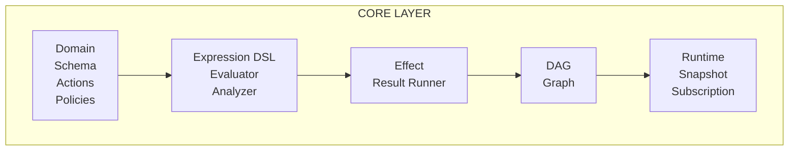

# @manifesto-ai/core Overview

## What is Manifesto Core?

Manifesto Core is an **AI Native Semantic Layer**. It declares SaaS application business logic in a form that AI can understand and safely manipulate.

Traditional frontend code is a "black box" to AI. Even if AI reads React components, event handlers, and state management code, it's difficult to understand "what happens when this button is pressed". Manifesto expresses business logic as **declarative data structures** so AI can directly read, understand, and manipulate it.

## Design Philosophy

### Consumer-Agnostic Principle

The Core package does not depend on any framework. Whether you use React, Vue, or Angular, Core's domain definitions and runtime work the same way. Framework-specific integration is handled by Bridge packages.

### Separation of "Meaning" and "Expression"

```typescript
// Meaning: What to calculate
const subtotal = defineDerived({
  deps: ['data.items'],
  expr: ['sum', ['map', ['get', 'data.items'], ['*', '$.price', '$.quantity']]],
  semantic: { type: 'currency', description: 'Order subtotal' }
});

// Expression: How to display in UI is handled by Projection
```

By separating business logic (meaning) from UI presentation, the same domain definition can be projected into various forms: web UI, mobile apps, GraphQL API, AI context, etc.

### Deterministic State Management

All state changes are predictable:
- **Derived values** are determined solely by their deps values
- **Actions** only execute when preconditions are satisfied
- **Effects** express "what will be done" as data before execution

```typescript
import { defineDomain, createRuntime, z } from '@manifesto-ai/core';

// Define order domain
const orderDomain = defineDomain({
  id: 'order',
  name: 'Order',
  description: 'E-commerce order management domain',

  dataSchema: z.object({
    items: z.array(z.object({
      id: z.string(),
      name: z.string(),
      price: z.number(),
      quantity: z.number()
    })),
    couponCode: z.string().optional()
  }),

  derived: {
    total: defineDerived({
      deps: ['data.items'],
      expr: ['sum', ['map', ['get', 'data.items'], ['*', '$.price', '$.quantity']]],
      semantic: { type: 'currency', description: 'Total Cost' }
    })
  },

  stateSchema: z.object({
    isSubmitting: z.boolean()
  }),

  initialState: { isSubmitting: false }
});

// Create and use runtime
const runtime = createRuntime({ domain: orderDomain });
runtime.set('data.items', [{ id: '1', name: 'Product A', price: 10000, quantity: 2 }]);
console.log(runtime.get('derived.total')); // 20000
```

## Problems Core Solves

### Black Box Problem: AI Cannot Understand UI

```typescript
// Traditional approach: Hard for AI to understand
const handleSubmit = async () => {
  if (items.length === 0) return;
  setLoading(true);
  await api.createOrder(items);
  setLoading(false);
};

// Manifesto approach: AI can structurally understand
const submitAction = defineAction({
  deps: ['data.items', 'state.isSubmitting'],
  preconditions: [
    { path: 'derived.hasItems', expect: 'true', reason: 'Cart must have items' }
  ],
  effect: sequence([
    setState('state.isSubmitting', true, 'Start submission'),
    apiCall({ method: 'POST', endpoint: '/api/orders', description: 'Create order' }),
    setState('state.isSubmitting', false, 'Complete submission')
  ]),
  semantic: { type: 'action', verb: 'submit', description: 'Submit the order' }
});
```

### Scattered and Duplicated Business Logic

A single domain definition becomes the Single Source of Truth. Frontend, backend, and AI all reference the same definition.

### Unpredictable State Changes

Dependencies are tracked through a DAG (Directed Acyclic Graph), and when values change, affected derived values are automatically recalculated in the correct order.

## Architecture Overview



- **Core Layer**: Framework-agnostic core business logic
- **Bridge Layer**: Integration with external state management systems (Zustand, React Hook Form, etc.)
- **Projection Layer**: State projection for specific consumers (UI, AI, API)

## Module Structure

| Module | Responsibility | Main Exports |
|--------|---------------|--------------|
| **Domain** | Domain structure definition | `defineDomain`, `defineSource`, `defineDerived`, `defineAsync`, `defineAction` |
| **Expression** | JSON-based DSL | `evaluate`, `analyzeExpression`, `extractPaths` |
| **Effect** | Side effect system | `setValue`, `setState`, `apiCall`, `sequence`, `parallel`, `runEffect` |
| **Result** | Functional error handling | `ok`, `err`, `isOk`, `isErr`, `map`, `flatMap` |
| **DAG** | Dependency graph | `buildDependencyGraph`, `propagate`, `topologicalSortWithCycleDetection` |
| **Runtime** | Execution engine | `createRuntime`, `createSnapshot`, `SubscriptionManager` |
| **Policy** | Policy evaluation | `evaluatePrecondition`, `evaluateFieldPolicy`, `checkActionAvailability` |
| **Schema** | Zod integration | `schemaToSource`, `validateValue`, `CommonSchemas` |

## Core Concepts Summary

| Concept | Purpose | Benefit for AI |
|---------|---------|----------------|
| **SemanticPath** | Assign unique address to every value | Can precisely reference specific values |
| **Expression DSL** | Express logic as JSON | Can read/write/analyze |
| **Effect** | Describe side effects as data | Can review before execution |
| **Action** | Operations with preconditions | Ensures safe execution |
| **FieldPolicy** | Dynamic rules per field | Automatic UI state determination |

## Next Steps

- [SemanticPath Deep Dive](02-semantic-path.md) - Address system and namespaces
- [Domain Definition](03-domain-definition.md) - defineDomain API details
- [Expression DSL](04-expression-dsl.md) - Expression syntax and evaluation
- [Effect System](05-effect-system.md) - Side effects and Result pattern
- [DAG & Change Propagation](06-dag-propagation.md) - Dependency tracking
- [Runtime API](07-runtime.md) - Runtime creation and usage
- [Policy Evaluation](08-policy.md) - Preconditions and field policies
- [Schema & Validation](09-schema-validation.md) - Zod integration
- [Migration Guide](10-migration-guide.md) - Version changes
