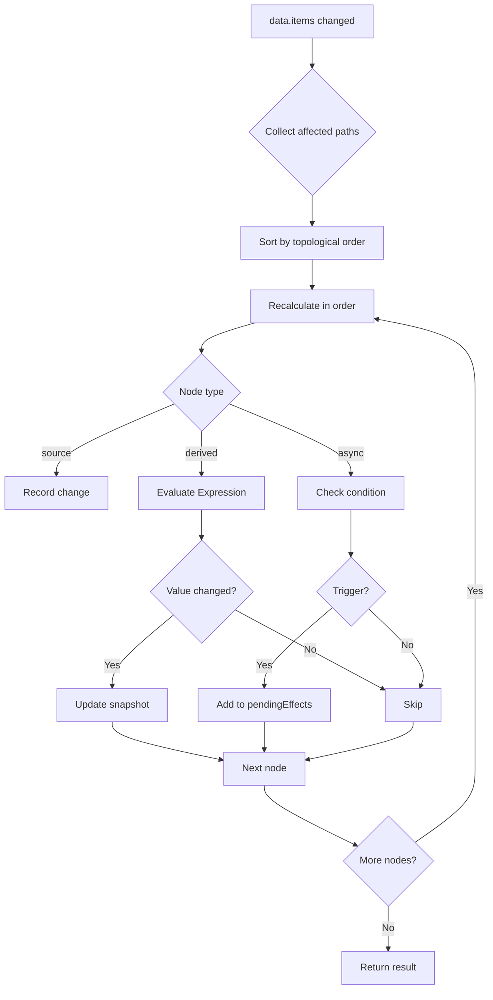
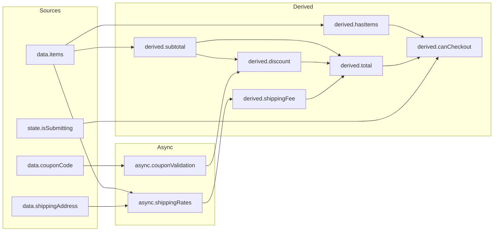

# DAG & Change Propagation

```typescript
import { createRuntime } from '@manifesto-ai/core';

const runtime = createRuntime({ domain: orderDomain });

// Change quantity → automatically recalculates subtotal, total
runtime.set('data.items.0.quantity', 3);

// Internally propagates through DAG:
// data.items.0.quantity change
//   → derived.subtotal recalculation
//   → derived.discount recalculation
//   → derived.total recalculation
//   → async.shippingRates re-fetch (conditional)
```

## Core Concept

### "Declare dependencies, propagation is automatic"

Manifesto manages relationships between values as a **DAG (Directed Acyclic Graph)**. When developers define `deps` and `expr`, the system automatically determines the change propagation order.

```typescript
// Dependency declaration
const subtotalDerived = defineDerived({
  deps: ['data.items'],
  expr: ['reduce', ['get', 'data.items'],
    ['fn', ['acc', 'item'],
      ['+', ['get', '$acc'], ['*', ['get', '$item.price'], ['get', '$item.quantity']]]
    ], 0],
  semantic: { type: 'currency', description: 'Subtotal' }
});

const totalDerived = defineDerived({
  deps: ['derived.subtotal', 'derived.discount', 'derived.shippingFee'],
  expr: ['+', ['-', ['get', 'derived.subtotal'], ['get', 'derived.discount']], ['get', 'derived.shippingFee']],
  semantic: { type: 'currency', description: 'Total' }
});

// System automatically determines calculation order:
// 1. data.items (source)
// 2. derived.subtotal (depends on data.items)
// 3. derived.discount (depends on derived.subtotal)
// 4. derived.total (depends on subtotal, discount, shippingFee)
```

---

## DependencyGraph

### Type Definition

```typescript
type DependencyGraph = {
  /** All nodes */
  nodes: Map<SemanticPath, DagNode>;

  /** Forward edges: path → paths this path depends on */
  dependencies: Map<SemanticPath, Set<SemanticPath>>;

  /** Reverse edges: path → paths that depend on this path */
  dependents: Map<SemanticPath, Set<SemanticPath>>;

  /** Topologically sorted order */
  topologicalOrder: SemanticPath[];
};
```

### DagNode Types

```typescript
type DagNode = SourceNode | DerivedNode | AsyncNode;

type SourceNode = {
  kind: 'source';
  path: SemanticPath;
  definition: SourceDefinition;
};

type DerivedNode = {
  kind: 'derived';
  path: SemanticPath;
  definition: DerivedDefinition;
};

type AsyncNode = {
  kind: 'async';
  path: SemanticPath;
  definition: AsyncDefinition;
};
```

### Building the Graph

```typescript
import { buildDependencyGraph } from '@manifesto-ai/core';

const graph = buildDependencyGraph(orderDomain);

// Query node
graph.nodes.get('derived.total');
// { kind: 'derived', path: 'derived.total', definition: { ... } }

// Forward dependencies (what total depends on)
graph.dependencies.get('derived.total');
// Set { 'derived.subtotal', 'derived.discount', 'derived.shippingFee' }

// Reverse dependencies (what depends on subtotal)
graph.dependents.get('derived.subtotal');
// Set { 'derived.total', 'derived.discount' }
```

---

## Dependency Query API

### Direct Dependencies

```typescript
import { getDirectDependencies, getDirectDependents } from '@manifesto-ai/core';

// Paths that derived.total directly depends on
getDirectDependencies(graph, 'derived.total');
// ['derived.subtotal', 'derived.discount', 'derived.shippingFee']

// Paths that directly depend on derived.subtotal
getDirectDependents(graph, 'derived.subtotal');
// ['derived.total', 'derived.discount']
```

### Transitive Dependencies

```typescript
import { getAllDependencies, getAllDependents } from '@manifesto-ai/core';

// All paths derived.total depends on (transitive)
getAllDependencies(graph, 'derived.total');
// ['derived.subtotal', 'derived.discount', 'derived.shippingFee',
//  'data.items', 'data.couponCode', 'async.shippingRates.result']

// All paths that depend on data.items (transitive)
getAllDependents(graph, 'data.items');
// ['derived.subtotal', 'derived.itemCount', 'derived.hasItems',
//  'derived.discount', 'derived.total', 'derived.canCheckout']
```

### Finding Path Between Two Nodes

```typescript
import { findPath } from '@manifesto-ai/core';

// Path from data.items to derived.total
findPath(graph, 'data.items', 'derived.total');
// ['data.items', 'derived.subtotal', 'derived.total']

// Returns null if no path exists
findPath(graph, 'data.couponCode', 'data.items');
// null
```

---

## Topological Sort

### Basic Topological Sort

Topological sort orders nodes by dependency. Dependencies always come before dependents.

```typescript
// Topologically sorted order
graph.topologicalOrder;
// [
//   'data.items',           // Source (no dependencies)
//   'data.couponCode',      // Source
//   'derived.itemCount',    // Depends only on data.items
//   'derived.hasItems',     // Depends on derived.itemCount
//   'derived.subtotal',     // Depends on data.items
//   'async.shippingRates',  // Depends on data.items
//   'derived.discount',     // Depends on subtotal, couponCode
//   'derived.shippingFee',  // Depends on async result
//   'derived.total',        // Depends on subtotal, discount, shippingFee
//   'derived.canCheckout'   // Depends on multiple derived
// ]
```

### Cycle Detection

```typescript
import { topologicalSortWithCycleDetection, hasCycle } from '@manifesto-ai/core';

// Check for cycles
hasCycle(graph);
// false (valid DAG)

// Detailed result
const result = topologicalSortWithCycleDetection(graph);
if (result.ok) {
  console.log('Sort successful:', result.order);
} else {
  console.error('Cycle detected:', result.cycle);
  // e.g.: ['derived.a', 'derived.b', 'derived.a']
}
```

### Level Order

Nodes at the same level can be processed in parallel.

```typescript
import { getLevelOrder } from '@manifesto-ai/core';

const levels = getLevelOrder(graph);
// [
//   ['data.items', 'data.couponCode', 'state.isSubmitting'],  // Level 0
//   ['derived.subtotal', 'derived.itemCount'],                 // Level 1
//   ['derived.hasItems', 'derived.discount'],                  // Level 2
//   ['derived.total'],                                         // Level 3
//   ['derived.canCheckout']                                    // Level 4
// ]

// subtotal and itemCount at Level 1 can be computed simultaneously
```

### Partial Topological Sort

```typescript
import { partialTopologicalSort, getAffectedOrder } from '@manifesto-ai/core';

// Topological sort of specific paths only
partialTopologicalSort(graph, ['derived.total', 'derived.subtotal']);
// ['derived.subtotal', 'derived.total'] (dependency order maintained)

// Affected paths from changed paths in topological order
getAffectedOrder(graph, ['data.items']);
// ['data.items', 'derived.subtotal', 'derived.itemCount',
//  'derived.hasItems', 'derived.discount', 'derived.total',
//  'derived.canCheckout']
```

---

## Change Propagation

### propagate Function

```typescript
import { propagate } from '@manifesto-ai/core';

// Execute propagation with changed paths and snapshot
const result = propagate(graph, ['data.items'], snapshot);

result.changes;
// Map {
//   'data.items' => [...],
//   'derived.subtotal' => 45000,
//   'derived.itemCount' => 3,
//   'derived.total' => 48000
// }

result.pendingEffects;
// [{ path: 'async.shippingRates', effect: { type: 'ApiCall', ... } }]

result.errors;
// [] (empty if no errors)
```

### PropagationResult Type

```typescript
type PropagationResult = {
  /** Changed paths and new values */
  changes: Map<SemanticPath, unknown>;

  /** Triggered Async Effects */
  pendingEffects: Array<{
    path: SemanticPath;
    effect: Effect;
  }>;

  /** Errors that occurred */
  errors: Array<{
    path: SemanticPath;
    error: string;
  }>;
};
```

### Propagation Process



### Async Result Propagation

Propagate results after async operation completes.

```typescript
import { propagateAsyncResult } from '@manifesto-ai/core';

// After API call completes
const asyncResult = propagateAsyncResult(
  graph,
  'async.shippingRates',
  { ok: true, value: [{ method: 'standard', price: 3000 }] },
  snapshot
);

// Result
asyncResult.changes;
// Map {
//   'async.shippingRates.loading' => false,
//   'async.shippingRates.result' => [{ method: 'standard', price: 3000 }],
//   'async.shippingRates.error' => null,
//   'derived.shippingFee' => 3000,
//   'derived.total' => 48000
// }
```

---

## Impact Analysis

### analyzeImpact

Analyze the impact scope when a specific path changes.

```typescript
import { analyzeImpact } from '@manifesto-ai/core';

const impact = analyzeImpact(graph, 'data.items.0.quantity');

impact.affectedPaths;
// ['data.items.0.quantity', 'derived.subtotal', 'derived.discount',
//  'derived.total', 'derived.canCheckout']

impact.affectedNodes;
// [{ kind: 'source', ... }, { kind: 'derived', ... }, ...]

impact.asyncTriggers;
// ['async.shippingRates'] (async that may be re-triggered)
```

### AI Usage Example

```typescript
// AI explains "What happens if I change the quantity?"
const impact = analyzeImpact(graph, 'data.items.0.quantity');

const explanation = {
  message: 'Changing quantity will recalculate the following values:',
  derived: impact.affectedPaths.filter(p => p.startsWith('derived.')),
  async: impact.asyncTriggers
};
// {
//   message: 'Changing quantity will recalculate the following values:',
//   derived: ['derived.subtotal', 'derived.discount', 'derived.total'],
//   async: ['async.shippingRates']
// }
```

---

## Debounced Propagation

Handle frequent changes efficiently.

```typescript
import { createDebouncedPropagator } from '@manifesto-ai/core';

const propagator = createDebouncedPropagator(graph, snapshot, 100);

// Rapid consecutive changes
propagator.queue(['data.items.0.quantity']);
propagator.queue(['data.items.1.quantity']);
propagator.queue(['data.couponCode']);

// Propagates all at once after 100ms

// If immediate execution needed
const result = propagator.flush();

// Cancel
propagator.cancel();
```

---

## Practical Example: Order Domain

### Domain Dependency Graph



### Quantity Change Propagation Flow

```typescript
// User changes first item quantity to 3
runtime.set('data.items.0.quantity', 3);

// 1. Detect change
const changedPaths = ['data.items.0.quantity'];

// 2. Collect affected paths (BFS)
const affected = new Set(['data.items.0.quantity']);
// → Add derived.subtotal
// → Add derived.discount (depends on subtotal)
// → Add derived.total (depends on subtotal, discount)
// → Add derived.canCheckout (depends on total)

// 3. Recalculate in topological order
// data.items.0.quantity (source) → record value
// derived.subtotal → evaluate(expr) → 45000
// derived.discount → evaluate(expr) → 5000
// derived.total → evaluate(expr) → 40000
// derived.canCheckout → evaluate(expr) → true

// 4. Notify subscribers
// onChange('derived.subtotal', 45000)
// onChange('derived.total', 40000)
// ...
```

---

## Performance Optimization

### Partial Recalculation

Recalculate only affected parts, not everything.

```typescript
// If only coupon code changes
runtime.set('data.couponCode', 'SAVE10');

// data.items related values are NOT recalculated
// Only derived.discount, derived.total are recalculated
```

### Value Comparison Optimization

```typescript
// Inside propagate, deepEqual checks if value actually changed
if (!deepEqual(oldValue, newValue)) {
  changes.set(path, newValue);
  snapshot.set(path, newValue);
}

// If value is same, don't propagate - prevents unnecessary recalculation
```

### Parallel Processing Hint

```typescript
// Nodes at same level can be processed in parallel
const levels = getLevelOrder(graph);

for (const level of levels) {
  // Nodes within a level don't depend on each other
  await Promise.all(level.map(path => evaluate(path)));
}
```

---

## Debugging

### Dependency Visualization

```typescript
function visualizeDependencies(graph: DependencyGraph): string {
  const lines: string[] = [];

  for (const [path, deps] of graph.dependencies) {
    if (deps.size > 0) {
      lines.push(`${path}:`);
      for (const dep of deps) {
        lines.push(`  ← ${dep}`);
      }
    }
  }

  return lines.join('\n');
}

// Output:
// derived.subtotal:
//   ← data.items
// derived.discount:
//   ← derived.subtotal
//   ← async.couponValidation.result
// derived.total:
//   ← derived.subtotal
//   ← derived.discount
//   ← derived.shippingFee
```

### Propagation Tracing

```typescript
const result = propagate(graph, ['data.items'], snapshot);

console.log('Changed paths:');
for (const [path, value] of result.changes) {
  console.log(`  ${path}: ${JSON.stringify(value)}`);
}

console.log('Pending Effects:');
for (const { path, effect } of result.pendingEffects) {
  console.log(`  ${path}: ${effect.type}`);
}

if (result.errors.length > 0) {
  console.error('Propagation errors:');
  for (const { path, error } of result.errors) {
    console.error(`  ${path}: ${error}`);
  }
}
```

---

## Next Steps

- [Runtime API](07-runtime.md) - How propagation is used in runtime
- [Policy Evaluation](08-policy.md) - Relationship between propagation and policy evaluation
- [Expression DSL](04-expression-dsl.md) - Expressions evaluated during propagation
