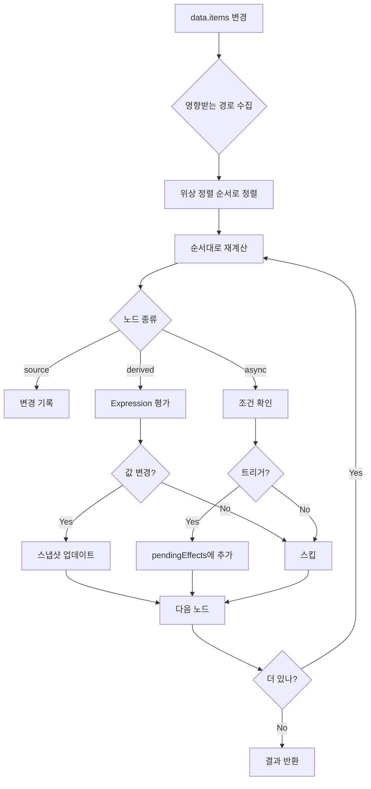
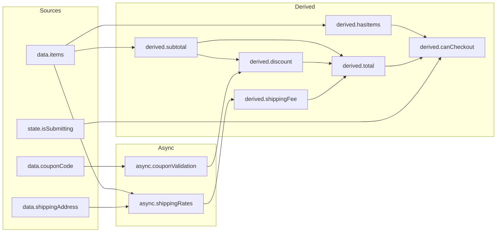

# DAG와 변경 전파

```typescript
import { createRuntime } from '@manifesto-ai/core';

const runtime = createRuntime({ domain: orderDomain });

// 수량 변경 → 자동으로 소계, 총액 재계산
runtime.set('data.items.0.quantity', 3);

// 내부적으로 DAG를 따라 전파:
// data.items.0.quantity 변경
//   → derived.subtotal 재계산
//   → derived.discount 재계산
//   → derived.total 재계산
//   → async.shippingRates 재호출 (조건부)
```

## 핵심 개념

### "의존성을 명시하면 전파는 자동"

Manifesto는 값들 간의 의존 관계를 **DAG(Directed Acyclic Graph)**로 관리한다. 개발자가 `deps`와 `expr`을 정의하면, 시스템이 자동으로 변경 전파 순서를 결정한다.

```typescript
// 의존성 선언
const subtotalDerived = defineDerived({
  deps: ['data.items'],
  expr: ['reduce', ['get', 'data.items'],
    ['fn', ['acc', 'item'],
      ['+', ['get', '$acc'], ['*', ['get', '$item.price'], ['get', '$item.quantity']]]
    ], 0],
  semantic: { type: 'currency', description: '소계' }
});

const totalDerived = defineDerived({
  deps: ['derived.subtotal', 'derived.discount', 'derived.shippingFee'],
  expr: ['+', ['-', ['get', 'derived.subtotal'], ['get', 'derived.discount']], ['get', 'derived.shippingFee']],
  semantic: { type: 'currency', description: '총액' }
});

// 시스템이 자동으로 계산 순서 결정:
// 1. data.items (source)
// 2. derived.subtotal (data.items에 의존)
// 3. derived.discount (derived.subtotal에 의존)
// 4. derived.total (subtotal, discount, shippingFee에 의존)
```

---

## DependencyGraph

### 타입 정의

```typescript
type DependencyGraph = {
  /** 모든 노드 */
  nodes: Map<SemanticPath, DagNode>;

  /** 정방향 엣지: path → 이 path가 의존하는 것들 */
  dependencies: Map<SemanticPath, Set<SemanticPath>>;

  /** 역방향 엣지: path → 이 path를 의존하는 것들 */
  dependents: Map<SemanticPath, Set<SemanticPath>>;

  /** 위상 정렬된 순서 */
  topologicalOrder: SemanticPath[];
};
```

### DagNode 종류

```typescript
type DagNode = SourceNode | DerivedNode | AsyncNode;

type SourceNode = {
  kind: 'source';
  path: SemanticPath;
  definition: SourceDefinition;
};

type DerivedNode = {
  kind: 'derived';
  path: SemanticPath;
  definition: DerivedDefinition;
};

type AsyncNode = {
  kind: 'async';
  path: SemanticPath;
  definition: AsyncDefinition;
};
```

### 그래프 구축

```typescript
import { buildDependencyGraph } from '@manifesto-ai/core';

const graph = buildDependencyGraph(orderDomain);

// 노드 조회
graph.nodes.get('derived.total');
// { kind: 'derived', path: 'derived.total', definition: { ... } }

// 정방향 의존성 (total이 의존하는 것들)
graph.dependencies.get('derived.total');
// Set { 'derived.subtotal', 'derived.discount', 'derived.shippingFee' }

// 역방향 의존성 (subtotal을 의존하는 것들)
graph.dependents.get('derived.subtotal');
// Set { 'derived.total', 'derived.discount' }
```

---

## 의존성 조회 API

### 직접 의존성

```typescript
import { getDirectDependencies, getDirectDependents } from '@manifesto-ai/core';

// derived.total이 직접 의존하는 경로들
getDirectDependencies(graph, 'derived.total');
// ['derived.subtotal', 'derived.discount', 'derived.shippingFee']

// derived.subtotal을 직접 의존하는 경로들
getDirectDependents(graph, 'derived.subtotal');
// ['derived.total', 'derived.discount']
```

### 전이적 의존성

```typescript
import { getAllDependencies, getAllDependents } from '@manifesto-ai/core';

// derived.total이 의존하는 모든 경로 (전이적)
getAllDependencies(graph, 'derived.total');
// ['derived.subtotal', 'derived.discount', 'derived.shippingFee',
//  'data.items', 'data.couponCode', 'async.shippingRates.result']

// data.items를 의존하는 모든 경로 (전이적)
getAllDependents(graph, 'data.items');
// ['derived.subtotal', 'derived.itemCount', 'derived.hasItems',
//  'derived.discount', 'derived.total', 'derived.canCheckout']
```

### 두 경로 간 경로 찾기

```typescript
import { findPath } from '@manifesto-ai/core';

// data.items에서 derived.total까지의 경로
findPath(graph, 'data.items', 'derived.total');
// ['data.items', 'derived.subtotal', 'derived.total']

// 경로가 없으면 null
findPath(graph, 'data.couponCode', 'data.items');
// null
```

---

## 위상 정렬

### 기본 위상 정렬

위상 정렬은 의존성 순서대로 노드를 정렬한다. 피의존자가 항상 의존자보다 먼저 나온다.

```typescript
// 위상 정렬된 순서
graph.topologicalOrder;
// [
//   'data.items',           // Source (의존성 없음)
//   'data.couponCode',      // Source
//   'derived.itemCount',    // data.items에만 의존
//   'derived.hasItems',     // derived.itemCount에 의존
//   'derived.subtotal',     // data.items에 의존
//   'async.shippingRates',  // data.items에 의존
//   'derived.discount',     // subtotal, couponCode에 의존
//   'derived.shippingFee',  // async 결과에 의존
//   'derived.total',        // subtotal, discount, shippingFee에 의존
//   'derived.canCheckout'   // 여러 derived에 의존
// ]
```

### 순환 탐지

```typescript
import { topologicalSortWithCycleDetection, hasCycle } from '@manifesto-ai/core';

// 순환 여부 확인
hasCycle(graph);
// false (정상적인 DAG)

// 상세 결과
const result = topologicalSortWithCycleDetection(graph);
if (result.ok) {
  console.log('정렬 성공:', result.order);
} else {
  console.error('순환 발견:', result.cycle);
  // 예: ['derived.a', 'derived.b', 'derived.a']
}
```

### 레벨별 정렬

같은 레벨의 노드들은 병렬 처리가 가능하다.

```typescript
import { getLevelOrder } from '@manifesto-ai/core';

const levels = getLevelOrder(graph);
// [
//   ['data.items', 'data.couponCode', 'state.isSubmitting'],  // Level 0
//   ['derived.subtotal', 'derived.itemCount'],                 // Level 1
//   ['derived.hasItems', 'derived.discount'],                  // Level 2
//   ['derived.total'],                                         // Level 3
//   ['derived.canCheckout']                                    // Level 4
// ]

// Level 1의 subtotal과 itemCount는 동시에 계산 가능
```

### 부분 위상 정렬

```typescript
import { partialTopologicalSort, getAffectedOrder } from '@manifesto-ai/core';

// 특정 경로들만 위상 정렬
partialTopologicalSort(graph, ['derived.total', 'derived.subtotal']);
// ['derived.subtotal', 'derived.total'] (의존 순서 유지)

// 변경된 경로의 영향받는 경로들을 위상 순서로
getAffectedOrder(graph, ['data.items']);
// ['data.items', 'derived.subtotal', 'derived.itemCount',
//  'derived.hasItems', 'derived.discount', 'derived.total',
//  'derived.canCheckout']
```

---

## 변경 전파 (Propagation)

### propagate 함수

```typescript
import { propagate } from '@manifesto-ai/core';

// 변경된 경로와 스냅샷으로 전파 실행
const result = propagate(graph, ['data.items'], snapshot);

result.changes;
// Map {
//   'data.items' => [...],
//   'derived.subtotal' => 45000,
//   'derived.itemCount' => 3,
//   'derived.total' => 48000
// }

result.pendingEffects;
// [{ path: 'async.shippingRates', effect: { type: 'ApiCall', ... } }]

result.errors;
// [] (에러가 없으면 빈 배열)
```

### PropagationResult 타입

```typescript
type PropagationResult = {
  /** 변경된 경로와 새 값 */
  changes: Map<SemanticPath, unknown>;

  /** 트리거된 Async Effect들 */
  pendingEffects: Array<{
    path: SemanticPath;
    effect: Effect;
  }>;

  /** 발생한 오류들 */
  errors: Array<{
    path: SemanticPath;
    error: string;
  }>;
};
```

### 전파 과정



### Async 결과 전파

비동기 작업 완료 후 결과를 전파한다.

```typescript
import { propagateAsyncResult } from '@manifesto-ai/core';

// API 호출 완료 후
const asyncResult = propagateAsyncResult(
  graph,
  'async.shippingRates',
  { ok: true, value: [{ method: 'standard', price: 3000 }] },
  snapshot
);

// 결과
asyncResult.changes;
// Map {
//   'async.shippingRates.loading' => false,
//   'async.shippingRates.result' => [{ method: 'standard', price: 3000 }],
//   'async.shippingRates.error' => null,
//   'derived.shippingFee' => 3000,
//   'derived.total' => 48000
// }
```

---

## 영향 분석

### analyzeImpact

특정 경로 변경 시 영향 범위를 분석한다.

```typescript
import { analyzeImpact } from '@manifesto-ai/core';

const impact = analyzeImpact(graph, 'data.items.0.quantity');

impact.affectedPaths;
// ['data.items.0.quantity', 'derived.subtotal', 'derived.discount',
//  'derived.total', 'derived.canCheckout']

impact.affectedNodes;
// [{ kind: 'source', ... }, { kind: 'derived', ... }, ...]

impact.asyncTriggers;
// ['async.shippingRates'] (재호출될 수 있는 async)
```

### AI 활용 예시

```typescript
// AI가 "수량을 바꾸면 어떻게 되나요?"를 설명
const impact = analyzeImpact(graph, 'data.items.0.quantity');

const explanation = {
  message: '수량 변경 시 다음 값들이 재계산됩니다:',
  derived: impact.affectedPaths.filter(p => p.startsWith('derived.')),
  async: impact.asyncTriggers
};
// {
//   message: '수량 변경 시 다음 값들이 재계산됩니다:',
//   derived: ['derived.subtotal', 'derived.discount', 'derived.total'],
//   async: ['async.shippingRates']
// }
```

---

## 디바운스된 전파

빈번한 변경을 효율적으로 처리한다.

```typescript
import { createDebouncedPropagator } from '@manifesto-ai/core';

const propagator = createDebouncedPropagator(graph, snapshot, 100);

// 빠른 연속 변경
propagator.queue(['data.items.0.quantity']);
propagator.queue(['data.items.1.quantity']);
propagator.queue(['data.couponCode']);

// 100ms 후 한 번에 전파됨

// 즉시 실행이 필요하면
const result = propagator.flush();

// 취소
propagator.cancel();
```

---

## 실전 예시: 주문 도메인

### 도메인 의존성 그래프



### 수량 변경 전파 흐름

```typescript
// 사용자가 첫 번째 상품 수량을 3으로 변경
runtime.set('data.items.0.quantity', 3);

// 1. 변경 감지
const changedPaths = ['data.items.0.quantity'];

// 2. 영향받는 경로 수집 (BFS)
const affected = new Set(['data.items.0.quantity']);
// → derived.subtotal 추가
// → derived.discount 추가 (subtotal에 의존)
// → derived.total 추가 (subtotal, discount에 의존)
// → derived.canCheckout 추가 (total에 의존)

// 3. 위상 정렬 순서로 재계산
// data.items.0.quantity (source) → 값 기록
// derived.subtotal → evaluate(expr) → 45000
// derived.discount → evaluate(expr) → 5000
// derived.total → evaluate(expr) → 40000
// derived.canCheckout → evaluate(expr) → true

// 4. 구독자에게 알림
// onChange('derived.subtotal', 45000)
// onChange('derived.total', 40000)
// ...
```

---

## 성능 최적화

### 부분 재계산

전체가 아닌 영향받는 부분만 재계산한다.

```typescript
// 쿠폰 코드만 변경하면
runtime.set('data.couponCode', 'SAVE10');

// data.items 관련은 재계산하지 않음
// derived.discount, derived.total만 재계산
```

### 값 비교 최적화

```typescript
// propagate 내부에서 deepEqual로 실제 변경 여부 확인
if (!deepEqual(oldValue, newValue)) {
  changes.set(path, newValue);
  snapshot.set(path, newValue);
}

// 값이 같으면 전파하지 않아 불필요한 재계산 방지
```

### 병렬 처리 힌트

```typescript
// 같은 레벨의 노드들은 병렬 처리 가능
const levels = getLevelOrder(graph);

for (const level of levels) {
  // level 내의 노드들은 서로 의존하지 않음
  await Promise.all(level.map(path => evaluate(path)));
}
```

---

## 디버깅

### 의존성 시각화

```typescript
function visualizeDependencies(graph: DependencyGraph): string {
  const lines: string[] = [];

  for (const [path, deps] of graph.dependencies) {
    if (deps.size > 0) {
      lines.push(`${path}:`);
      for (const dep of deps) {
        lines.push(`  ← ${dep}`);
      }
    }
  }

  return lines.join('\n');
}

// 출력:
// derived.subtotal:
//   ← data.items
// derived.discount:
//   ← derived.subtotal
//   ← async.couponValidation.result
// derived.total:
//   ← derived.subtotal
//   ← derived.discount
//   ← derived.shippingFee
```

### 전파 추적

```typescript
const result = propagate(graph, ['data.items'], snapshot);

console.log('변경된 경로들:');
for (const [path, value] of result.changes) {
  console.log(`  ${path}: ${JSON.stringify(value)}`);
}

console.log('대기 중인 Effect:');
for (const { path, effect } of result.pendingEffects) {
  console.log(`  ${path}: ${effect.type}`);
}

if (result.errors.length > 0) {
  console.error('전파 중 오류:');
  for (const { path, error } of result.errors) {
    console.error(`  ${path}: ${error}`);
  }
}
```

---

## 다음 단계

- [Runtime API](07-runtime.md) - 전파가 런타임에서 어떻게 사용되는지
- [Policy 평가](08-policy.md) - 전파와 정책 평가의 관계
- [Expression DSL](04-expression-dsl.md) - 전파 시 평가되는 표현식
