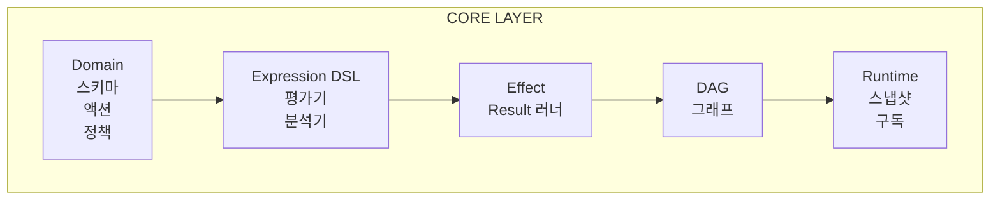

# @manifesto-ai/core 개요

```typescript
import { defineDomain, createRuntime, z } from '@manifesto-ai/core';

// 주문 도메인 정의
const orderDomain = defineDomain({
  id: 'order',
  name: '주문',
  description: '이커머스 주문 관리 도메인',

  dataSchema: z.object({
    items: z.array(z.object({
      id: z.string(),
      name: z.string(),
      price: z.number(),
      quantity: z.number()
    })),
    couponCode: z.string().optional()
  }),

  stateSchema: z.object({
    isSubmitting: z.boolean()
  }),

  initialState: { isSubmitting: false }
});

// 런타임 생성 및 사용
const runtime = createRuntime({ domain: orderDomain });
runtime.set('data.items', [{ id: '1', name: '상품A', price: 10000, quantity: 2 }]);
console.log(runtime.get('derived.total')); // 20000
```

## Manifesto Core란?

Manifesto Core는 **AI Native Semantic Layer**이다. SaaS 애플리케이션의 비즈니스 로직을 AI가 이해하고 안전하게 조작할 수 있는 형태로 선언한다.

기존 프론트엔드 코드는 AI에게 "블랙박스"다. React 컴포넌트, 이벤트 핸들러, 상태 관리 코드를 AI가 읽어도 "이 버튼을 누르면 무슨 일이 일어나는지"를 파악하기 어렵다. Manifesto는 비즈니스 로직을 **선언적 데이터 구조**로 표현하여 AI가 직접 읽고, 이해하고, 조작할 수 있게 한다.

## 설계 철학

### Consumer-Agnostic 원칙

Core 패키지는 프레임워크에 의존하지 않는다. React, Vue, Angular 어떤 프레임워크를 사용하든 Core의 도메인 정의와 런타임은 동일하게 동작한다. 프레임워크별 연동은 Bridge 패키지가 담당한다.

### "의미(Meaning)"와 "표현(Expression)"의 분리

```typescript
// 의미: 무엇을 계산하는가
const subtotal = defineDerived({
  deps: ['data.items'],
  expr: ['sum', ['map', ['get', 'data.items'], ['*', '$.price', '$.quantity']]],
  semantic: { type: 'currency', description: '주문 소계' }
});

// 표현: UI에서 어떻게 보여줄 것인가는 Projection이 담당
```

비즈니스 로직(의미)과 UI 표현을 분리하면, 같은 도메인 정의로 웹 UI, 모바일 앱, GraphQL API, AI 컨텍스트 등 다양한 형태로 투영(Projection)할 수 있다.

### 결정론적 상태 관리

모든 상태 변경은 예측 가능하다:
- **Derived 값**은 deps의 값만으로 결정된다
- **Action**은 precondition이 충족되어야만 실행된다
- **Effect**는 실행 전 "무엇을 할 것인지"를 데이터로 표현한다

## Core가 해결하는 문제

### AI가 UI를 이해하지 못하는 블랙박스 문제

```typescript
// 기존 방식: AI가 이해하기 어려움
const handleSubmit = async () => {
  if (items.length === 0) return;
  setLoading(true);
  await api.createOrder(items);
  setLoading(false);
};

// Manifesto 방식: AI가 구조적으로 이해 가능
const submitAction = defineAction({
  deps: ['data.items', 'state.isSubmitting'],
  preconditions: [
    { path: 'derived.hasItems', expect: 'true', reason: '장바구니에 상품이 있어야 한다' }
  ],
  effect: sequence([
    setState('state.isSubmitting', true, '제출 시작'),
    apiCall({ method: 'POST', endpoint: '/api/orders', description: '주문 생성' }),
    setState('state.isSubmitting', false, '제출 완료')
  ]),
  semantic: { type: 'action', verb: 'submit', description: '주문을 제출한다' }
});
```

### 비즈니스 로직의 분산과 중복

하나의 도메인 정의가 단일 진실 공급원(Single Source of Truth)이 된다. 프론트엔드, 백엔드, AI 모두 같은 정의를 참조한다.

### 상태 변경의 예측 불가능성

DAG(Directed Acyclic Graph)를 통해 의존성을 추적하고, 값이 변경되면 영향받는 derived 값들이 올바른 순서로 자동 재계산된다.

## 아키텍처 개요



- **Core Layer**: 프레임워크 무관한 핵심 비즈니스 로직
- **Bridge Layer**: 외부 상태 관리 시스템(Zustand, React Hook Form 등)과 연동
- **Projection Layer**: 특정 소비자(UI, AI, API)를 위한 상태 투영

## 모듈 구성

| 모듈 | 책임 | 주요 Export |
|------|------|-------------|
| **Domain** | 도메인 구조 정의 | `defineDomain`, `defineSource`, `defineDerived`, `defineAsync`, `defineAction` |
| **Expression** | JSON 기반 DSL | `evaluate`, `analyzeExpression`, `extractPaths` |
| **Effect** | 부수효과 시스템 | `setValue`, `setState`, `apiCall`, `sequence`, `parallel`, `runEffect` |
| **Result** | 함수형 에러 처리 | `ok`, `err`, `isOk`, `isErr`, `map`, `flatMap` |
| **DAG** | 의존성 그래프 | `buildDependencyGraph`, `propagate`, `topologicalSortWithCycleDetection` |
| **Runtime** | 실행 엔진 | `createRuntime`, `createSnapshot`, `SubscriptionManager` |
| **Policy** | 정책 평가 | `evaluatePrecondition`, `evaluateFieldPolicy`, `checkActionAvailability` |
| **Schema** | Zod 통합 | `schemaToSource`, `validateValue`, `CommonSchemas` |

## 핵심 개념 요약

| 개념 | 목적 | AI에게 주는 이점 |
|------|------|-----------------|
| **SemanticPath** | 모든 값에 고유한 주소 부여 | 특정 값을 정확히 참조 가능 |
| **Expression DSL** | 로직을 JSON으로 표현 | 읽기/쓰기/분석 가능 |
| **Effect** | 부수효과를 데이터로 기술 | 실행 전 검토 가능 |
| **Action** | 전제조건이 있는 작업 | 안전한 실행 보장 |
| **FieldPolicy** | 필드별 동적 규칙 | UI 상태 자동 결정 |

## 다음 단계

- [SemanticPath 심층 해설](02-semantic-path.md) - 주소 체계와 네임스페이스
- [도메인 정의](03-domain-definition.md) - defineDomain API 상세
- [Expression DSL](04-expression-dsl.md) - 표현식 문법과 평가
- [Effect 시스템](05-effect-system.md) - 부수효과와 Result 패턴
- [DAG와 변경 전파](06-dag-propagation.md) - 의존성 추적
- [Runtime API](07-runtime.md) - 런타임 생성과 사용
- [Policy 평가](08-policy.md) - 전제조건과 필드 정책
- [Schema & Validation](09-schema-validation.md) - Zod 통합
- [마이그레이션 가이드](10-migration-guide.md) - 버전 변경 사항
