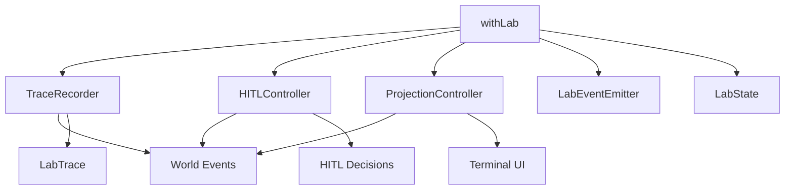

# @manifesto-ai/lab

> **Deep Documentation** — Understanding Lab's mental model, architecture, and design principles

---

## Table of Contents

1. [Introduction](#introduction)
2. [Mental Model](#mental-model)
3. [Necessity Levels](#necessity-levels)
4. [Architecture](#architecture)
5. [Observer Pattern](#observer-pattern)
6. [Trace Model](#trace-model)
7. [HITL Model](#hitl-model)
8. [Authority by Level](#authority-by-level)
9. [Projection System](#projection-system)
10. [Failure Explainability](#failure-explainability)
11. [Advanced Features (v1.1)](#advanced-features-v11)
12. [Design Principles](#design-principles)

---

## Introduction

### What is Lab?

Lab is Manifesto's **observation and governance layer**. It wraps World Protocol to provide:

1. **LLM Governance** — Justify and verify LLM usage through Necessity Levels
2. **Tracing** — Record all events for replay and analysis
3. **HITL** — Enable human intervention through Authority
4. **Projection** — Visualize execution with domain-specific renderers
5. **Explainability** — Generate structured reports and failure explanations

### Why Lab Exists

Manifesto systems operate under a core constraint: **"If it's not in Snapshot, it doesn't exist."**

Lab extends this to: **"If it's not in Trace, it didn't happen."**

This creates a foundation for:
- Deterministic replay
- Explainable failures
- Reproducible experiments
- Accountable LLM usage

### Three Questions Lab Answers

1. **When is an LLM structurally necessary?** → Necessity Levels
2. **What actually happened during execution?** → Trace
3. **Why did it fail (or succeed)?** → Failure Explanation

---

## Mental Model

### Lab is NOT

Before understanding what Lab is, understand what it is **NOT**:

| Lab is NOT | Why Not |
|------------|---------|
| A workflow engine | Lab doesn't execute; it observes |
| An agent framework | LLMs are Actors, not special components |
| A state management system | State lives in Snapshot, not Lab |
| A plugin for World | Lab wraps World externally via events |
| An execution controller | Host controls execution; Lab watches |

### Lab IS

Lab is a **higher-order function** that wraps World:

```typescript
withLab: (World, LabOptions) → LabWorld
```

**LabWorld** extends **World** with observation capabilities:

```
World Interface:
  - submitProposal()
  - getCurrentSnapshot()
  - subscribe()

LabWorld Interface (extends World):
  - submitProposal()      // Inherited
  - getCurrentSnapshot()  // Inherited
  - subscribe()           // Inherited
  + labMeta               // Lab metadata
  + state                 // Lab state (running/waiting_hitl/completed/aborted)
  + hitl                  // HITL controller
  + projection            // Projection controller
  + trace()               // Get trace artifact
  + report()              // Generate report
```

### The Observer Principle

**Lab observes but never modifies World state.**

```
┌─────────────────────────────────────────────┐
│                   World                     │
│                                             │
│  Actor → Proposal → Authority → Execution  │
│            │            │           │       │
│            └────events──┴───────────┘       │
│                     │                       │
└─────────────────────┼───────────────────────┘
                      │
                      │ subscribe()
                      ▼
           ┌──────────────────┐
           │       Lab        │
           │                  │
           │  Record trace    │ ← Pure observation
           │  Update UI       │
           │  Check HITL      │
           │                  │
           └──────────────────┘
```

**Critical invariant:**

> Lab observation MUST NOT affect World state.
> If removing Lab changes behavior, something is wrong.

This is enforced by:
- Lab subscribes to events (read-only)
- HITL decisions go through Authority (not direct modification)
- Projection is display-only

---

## Necessity Levels

### Core Philosophy

**Structural Necessity Principle:**

> An LLM is justified only when no deterministic function exists
> that can solve the task correctly for all valid instances.

LLM usage is **not a convenience choice**. It's a **structural property of the problem**.

### The Four Levels

| Level | Name | When Needed | LLM Role | Example |
|-------|------|-------------|----------|---------|
| **0** | Deterministic Full Observation | Never | `none` | Chess with visible board |
| **1** | Partial Observation | Hidden state | `belief_proposer` | Poker with hidden cards |
| **2** | Open-Ended Rules | Goal interpretation | `rule_interpreter` | "Make this better" |
| **3** | Natural Language | Intent grounding | `intent_parser` | "Send to my usual contact" |

### Level Inheritance

Higher levels inherit requirements from lower levels:

```
Level 3 ⊃ Level 2 ⊃ Level 1 ⊃ Level 0
```

A Level 3 system must handle:
- Natural language grounding (L3)
- Goal interpretation (L2)
- Belief formation (L1)
- Deterministic computation (L0)

### Level Detection

Level is a **computed value**, not a configuration:

```typescript
type LevelDetection = {
  observation: 0 | 1;   // Can observe all state?
  rules: 0 | 2;         // Are rules formal?
  language: 0 | 3;      // Is input natural language?
  detectedAt: number;
};

// Effective level = max of detected dimensions
function computeEffectiveLevel(detection: LevelDetection): NecessityLevel {
  return Math.max(detection.observation, detection.rules, detection.language);
}
```

### Level State Extensions

Each level extends Snapshot with specific fields:

#### Level 0: NecessityBase

```typescript
{
  level: 0 | 1 | 2 | 3,
  levelDetection: { observation, rules, language, detectedAt },
  llmTrace: [{
    step: number,
    role: LLMRole,
    proposalId?: string,
    verified: boolean,
    verificationMethod: VerificationMethod,
  }],
}
```

#### Level 1: + BeliefState

```typescript
{
  hypotheses: [{
    id: string,
    hiddenState: Record<string, unknown>,
    confidence: number,
    supportingObservations: string[],
    refutingConditions: [{ observation, reason }],
  }],
  observations: [{ id, content, observedAt }],
  beliefUpdatedAt: number | null,
}
```

#### Level 2: + InterpretedRule

```typescript
{
  originalGoal: string,
  formalizedGoal: unknown,
  inferredConstraints: unknown[],
  assumptions: [{ id, description, impact, alternative }],
  confidence: 'high' | 'medium' | 'low',
  clarifyingQuestions: string[],
  validation: {
    validated: boolean,
    by?: 'human' | 'assumed',
    at?: number,
  },
}
```

#### Level 3: + GroundingState

```typescript
{
  originalUtterance: string,
  parsedIntent: unknown,
  referenceResolutions: [{
    span: string,
    resolvedTo: unknown,
    method: 'context' | 'default' | 'user_confirmed' | 'inferred',
    confidence: number,
  }],
  ambiguities: [{
    span: string,
    interpretations: unknown[],
    resolved: unknown | null,
    resolutionMethod: 'context' | 'default' | 'user_confirmed' | 'unresolved',
  }],
  confirmation: {
    required: boolean,
    level?: 'passive' | 'active' | 'critical',
    status?: 'pending' | 'confirmed' | 'rejected',
  },
}
```

---

## Architecture

### Component Overview



### withLab Flow

```typescript
function withLab(world: ManifestoWorld, options: LabOptions): LabWorld {
  // 1. Initialize components
  const traceRecorder = createTraceRecorder(options);
  const hitlController = createHITLController(options.hitl, world);
  const projectionController = createProjectionController(options.projection);

  // 2. Subscribe to World events
  world.subscribe((event) => {
    // Record to trace (mandatory)
    traceRecorder.record(mapWorldEventToTraceEvent(event));

    // Update lab state
    currentLabState = updateLabState(currentLabState, event);

    // Update projection (if enabled)
    if (options.projection?.enabled) {
      projectionController.update(event);
    }

    // Handle HITL (if pending)
    if (event.type === 'proposal:decided' && event.decision === 'pending') {
      hitlController.handlePending(event);
    }
  });

  // 3. Return wrapped world
  return Object.create(world, { /* lab extensions */ });
}
```

### Data Flow

```
Event Flow (World → Lab):
  proposal:submitted → record trace + update UI
  proposal:decided   → record trace + check HITL
  execution:started  → record trace + update UI
  execution:patches  → record trace
  snapshot:changed   → record trace + update projection
  execution:completed → record trace + finalize

HITL Flow (Lab → World):
  Authority returns 'pending'
    → Lab shows HITL UI
    → Human decides (approve/reject)
    → HITLController calls world.submitDecision()
    → Authority receives decision
    → World proceeds
```

---

## Observer Pattern

### Why Observer Pattern?

Three design options were considered:

| Approach | Description | Chosen? |
|----------|-------------|---------|
| Plugin system | World accepts plugins at construction | ❌ No |
| Internal hooks | Lab accesses World internals | ❌ No |
| **Event subscription** | Lab subscribes to World events | ✅ Yes |

**Event subscription wins because:**

1. **Decoupling**: World doesn't know about Lab
2. **No modification**: Can wrap existing Worlds
3. **Clean separation**: Lab can't access internals
4. **Composability**: Multiple observers possible

### Observer Constraints

Lab observation is subject to strict constraints:

| Constraint | Description | Enforcement |
|------------|-------------|-------------|
| **Observation-Only** | Lab MUST NOT modify World state | No direct World API access |
| **Trace Completeness** | Lab MUST record ALL events | Subscribe to all event types |
| **HITL via Authority** | HITL decisions go through Authority | No direct state modification |
| **Non-Interference** | Projection MUST NOT affect timing | Async updates |
| **Deterministic Replay** | Trace MUST suffice for replay | All decisions recorded |

### Anti-Pattern: Intelligent Observer

```typescript
// ❌ FORBIDDEN - Lab making decisions
world.subscribe((event) => {
  if (shouldSkipThisEvent(event)) {  // Lab deciding!
    return; // Don't record
  }
  trace.record(event);
});

// ✅ CORRECT - Lab records everything
world.subscribe((event) => {
  trace.record(event);  // Always record
});
```

---

## Trace Model

### Trace Structure

```typescript
type LabTrace = {
  header: {
    specVersion: 'lab/1.1',
    runId: string,
    necessityLevel: NecessityLevel,
    schemaHash: string,
    createdAt: string,
    completedAt?: string,
    durationMs?: number,
    environment?: Record<string, unknown>,
  },
  events: LabTraceEvent[],
  outcome?: 'success' | 'failure' | 'aborted',
  failureExplanation?: FailureExplanation,
};
```

### Trace Event Types

```typescript
type LabTraceEvent =
  | { type: 'proposal'; proposalId, intentType, actorId }
  | { type: 'authority.decision'; proposalId, decision, authorityId, verificationMethod? }
  | { type: 'apply'; intentId, patchCount, source }
  | { type: 'effect'; intentId, effectType }
  | { type: 'effect.result'; intentId, effectType, success, patchCount, error? }
  | { type: 'hitl'; proposalId, action, decidedBy?, decisionTimeMs?, note? }
  | { type: 'termination'; outcome, proposalId?, error? }
  | { type: 'world.created'; worldId, parentWorldId, proposalId }
  | { type: 'failure.explanation'; explanation };
```

### Trace Guarantees

**Three guarantees every trace provides:**

1. **Completeness**: Contains all World events
2. **Determinism**: Same trace replay produces same outcome
3. **Explainability**: Sufficient information to answer "why?"

### Trace Lifecycle

```
1. Created: withLab() creates TraceRecorder
2. Recording: Events mapped and recorded
3. Outcome Set: success/failure/aborted
4. Finalized: completedAt and durationMs set
5. Saved: Persisted to file
6. Analyzed: Summary/diff/replay
```

---

## HITL Model

### HITL Flow

```
┌────────────────────────────────────────────────────────┐
│                    Authority                           │
│                                                        │
│  evaluate(proposal) → {                                │
│    decision: 'pending',                                │
│    reason: PendingReason,                              │
│  }                                                     │
└────────────────────────────┬───────────────────────────┘
                             │
                             ▼
               ┌─────────────────────────┐
               │  World emits event:     │
               │  proposal:decided       │
               │  { decision: 'pending' }│
               └────────────┬────────────┘
                            │
                            ▼
               ┌─────────────────────────┐
               │    Lab observes event   │
               │  hitlController.        │
               │  handlePending(event)   │
               └────────────┬────────────┘
                            │
                            ▼
               ┌─────────────────────────┐
               │  Lab shows HITL UI      │
               │  or calls onPending()   │
               └────────────┬────────────┘
                            │
                            ▼
               ┌─────────────────────────┐
               │  Human/Agent decides:   │
               │  - approve()            │
               │  - reject()             │
               │  - approveWithMod()     │
               └────────────┬────────────┘
                            │
                            ▼
               ┌─────────────────────────┐
               │  HITLController         │
               │  notifies Authority     │
               └────────────┬────────────┘
                            │
                            ▼
               ┌─────────────────────────┐
               │  Authority makes        │
               │  final decision         │
               └────────────┬────────────┘
                            │
                            ▼
                      World proceeds
```

### PendingReason vs FailureReason

| Aspect | PendingReason | FailureReason |
|--------|---------------|---------------|
| **When** | Before final decision | After final rejection |
| **Purpose** | Enable retry/modification | Explain failure |
| **Recoverable** | Yes (retry/modify) | No (terminal) |
| **Used by** | HITL prompt to Agent | Failure Explanation |
| **Codes** | LOW_CONFIDENCE, AMBIGUOUS_INTENT, REQUIRES_CONFIRMATION, SCOPE_EXCEEDED, RESOURCE_LIMIT | NO_EXECUTABLE_ACTION, GOAL_UNREACHABLE, AUTHORITY_REJECTION, UNRESOLVED_AMBIGUITY, HUMAN_REQUIRED, TIMEOUT, RESOURCE_EXHAUSTED |

### HITL Context (v1.1)

```typescript
interface HITLContextV1 {
  snapshot: Snapshot;
  proposal: Proposal;
  pendingReason: PendingReason;
  availableActions: HITLAction[];
  renderContext: RenderContext;
  decisionRecord: DecisionRecord;

  toPrompt(options?: HITLPromptOptions): HITLPrompt;
}
```

**Key insight:** HITL context provides structured information for **autonomous agent resolution**, not just human intervention.

---

## Authority by Level

### Verification Methods

| Level | Method | Guarantee | Can Prove Correct? | Can Prove Incorrect? |
|-------|--------|-----------|-------------------|---------------------|
| **0** | `deterministic` | `certain` | ✅ Yes | ✅ Yes |
| **1** | `posterior_consistency` | `consistent` | ❌ No | ✅ Yes |
| **2** | `semantic_audit` | `plausible` | ❌ No | ⚠️ Partially |
| **3** | `user_confirmation` | `confirmed` | ❌ No | ⚠️ Partially |

### Authority Implementations

```typescript
function createLevelAuthority(
  level: NecessityLevel,
  options?: LevelAuthorityOptions
): LevelAuthorityHandler {
  switch (level) {
    case 0:
      // Deterministic verification
      // Can compute and verify exactly
      return createDeterministicAuthority();

    case 1:
      // Posterior consistency check
      // Can refute beliefs that contradict observations
      return createConsistencyAuthority();

    case 2:
      // Semantic audit
      // HITL when confidence < threshold
      return createSemanticAuditAuthority(options);

    case 3:
      // User confirmation
      // Always require HITL for natural language
      return createConfirmationAuthority(options);
  }
}
```

### Authority Handler Interface

```typescript
interface LevelAuthorityHandler extends AuthorityHandler {
  readonly level: NecessityLevel;
  readonly verificationMethod: VerificationMethod;
  readonly guarantee: VerificationGuarantee;

  // From AuthorityHandler
  evaluate(proposal: Proposal, context: AuthorityContext): Promise<Decision>;
}
```

---

## Projection System

### Projection Modes

| Mode | Progress | Proposals | HITL | Snapshots | LLM Calls |
|------|----------|-----------|------|-----------|-----------|
| `silent` | ❌ | ❌ | ❌ | ❌ | ❌ |
| `watch` | ✅ | ✅ | View only | ❌ | Summary |
| `interactive` | ✅ | ✅ | ✅ Interact | Optional | Detail |
| `debug` | ✅ | ✅ | ✅ Interact | ✅ Full | ✅ Full |

**Mode spectrum:**

```
silent ⊂ watch ⊂ interactive ⊂ debug
```

Each mode adds capabilities without removing previous ones.

### Projection Components (v1.1)

Lab provides **injectable renderers** for domain-specific visualization:

```typescript
type ProjectionComponents = {
  renderSnapshot?: (snapshot, context) => string;
  renderAction?: (intent, before, after, context) => string;
  renderProposal?: (proposal, context) => string;
  renderReasoning?: (reasoning, confidence, context) => string;
  header?: (context) => string;
  footer?: (context) => string;
  layout?: (sections) => string;
};
```

**Inversion of Control:**

- **Lab knows WHEN** to render (event-driven)
- **Domain knows WHAT** to render (domain logic)

**Renderer constraints:**

- MUST be pure functions (no side effects)
- MUST return quickly (< 16ms for 60fps)
- MUST NOT modify snapshot or context
- MAY return string (terminal) or ReactNode (Ink)

### Example: Custom Renderer

```typescript
const labWorld = withLab(world, {
  projection: {
    enabled: true,
    mode: 'watch',
    components: {
      renderSnapshot: (snapshot, ctx) => {
        const { board, agent, goal } = snapshot.data;
        let output = '';

        for (let y = 0; y < board.height; y++) {
          for (let x = 0; x < board.width; x++) {
            if (agent.x === x && agent.y === y) {
              output += '🤖';
            } else if (goal.x === x && goal.y === y) {
              output += '★ ';
            } else if (board.walls[y][x]) {
              output += '▓▓';
            } else {
              output += '  ';
            }
          }
          output += '\n';
        }

        return output;
      },
    },
  },
});
```

---

## Failure Explainability

### Failure Explanation Structure

```typescript
type FailureExplanation = {
  kind: 'structural' | 'informational' | 'governance' | 'human_required' | 'resource';
  title: string;
  description: string;
  evidence: ExplanationEvidence[];
  counterfactual?: Counterfactual;
};

type Counterfactual = {
  change: CounterfactualChange;
  expectedOutcome: 'success' | 'different_failure';
  confidence: 'high' | 'medium' | 'low';
};
```

### Explanation vs Blame

**Bad (Blame):**

> "The model failed to produce a valid response."

**Good (Explanation):**

```typescript
{
  reason: 'NO_EXECUTABLE_ACTION',
  kind: 'structural',
  title: 'No valid action available',
  description: 'All possible actions violate constraint C1',
  evidence: [
    { type: 'constraint_violation', constraint: 'C1', data: { ... } }
  ],
  counterfactual: {
    change: { type: 'relax_constraint', constraint: 'C1' },
    expectedOutcome: 'success',
    confidence: 'high',
  },
}
```

### Counterfactual Reasoning

**Minimal change principle:**

> Identify the **smallest change** that would lead to success.

```
Bad: "If everything were different, it would work"
Good: "If confidence were 0.80 instead of 0.65, it would work"
```

**Use cases:**

- **Debugging**: What would fix this?
- **Learning**: What should change?
- **Evaluation**: Is the system broken or just needs X?

---

## Advanced Features (v1.1)

### Trace I/O

```typescript
// Save
await labWorld.trace().save('./traces/exp-001.trace.json');
await labWorld.trace().save('./traces/exp-001.trace.json.gz', {
  format: 'json.gz',
  pretty: false,
  includeSnapshots: false,
});

// Load
const trace = await loadTrace('./traces/exp-001.trace.json');
const traces = await loadAllTraces('./traces/*.trace.json');
const traces = await loadDirTraces('./traces');
```

### Trace Summary

```typescript
const traces = await loadAllTraces('./traces/*.json');
const summary = summarize(traces);

console.log(`Runs: ${summary.runs}`);
console.log(`Success Rate: ${(summary.successRate * 100).toFixed(1)}%`);
console.log(`Avg Steps: ${summary.avgSteps}`);
console.log(`HITL Rate: ${(summary.hitl.hitlRate * 100).toFixed(1)}%`);

// By level
for (const [level, stats] of Object.entries(summary.byLevel)) {
  console.log(`Level ${level}: ${stats.runs} runs, ${(stats.successRate * 100).toFixed(1)}% success`);
}
```

### Trace Diff

```typescript
const diff = diffTraces(successTrace, failTrace);

if (!diff.identical) {
  console.log(`Diverged at event ${diff.divergedAtSeq}`);
  console.log(`Cause: ${diff.cause?.type}`);
  console.log(`Description: ${diff.cause?.description}`);

  console.log('\nOriginal event:', diff.eventA);
  console.log('Replay event:', diff.eventB);
}
```

**Use cases:**

- Model comparison ("Why did GPT-4 succeed but Claude fail?")
- Regression analysis ("Why did this test pass before but fail now?")
- HITL impact ("How did human intervention change the outcome?")
- Parameter sensitivity ("How does threshold X affect results?")

### Trace Replay

```typescript
const result = await replay(originalTrace, {
  world: withLab(newWorld, { runId: 'replay-001', ... }),
  actorOverride: 'llm-claude',
  mode: 'compare',
});

if (!result.success) {
  console.log('Divergences:');
  for (const d of result.divergences) {
    console.log(`  Seq ${d.seq}: ${d.cause.description}`);
  }
}
```

**Use cases:**

- Model A/B testing (same scenario, different models)
- Regression testing (same model, different versions)
- Parameter tuning (same run, different authority thresholds)
- Debugging (step through execution)

---

## Design Principles

### 1. Observation Over Intervention

Lab **observes** World behavior. It never modifies state through observation.

**Why:** Ensures traces accurately reflect World behavior without interference.

### 2. Trace as Evidence

> "A run without a trace is not an experiment."

**Why:** Without traces, you can't reproduce bugs, analyze failures, or learn from runs.

### 3. Necessity as Justification

LLM usage must be **structurally necessary**, not convenient.

**Why:** Forces explicit reasoning about where LLMs add value vs. waste resources.

### 4. Failure as Structure

Failures have structure. Capture it.

**Why:** Structured failures enable learning, debugging, and counterfactual reasoning.

### 5. Authority as Governance

All decisions (including HITL) go through Authority.

**Why:** Maintains accountability, traceability, and consistent governance.

### 6. Projection as Pure Rendering

Renderers are pure functions with no side effects.

**Why:** Enables testing, caching, and prevents projection from affecting execution.

### 7. Explainability by Default

Every failure must have a structured explanation.

**Why:** "It failed" is not enough. We need "why it failed" and "what would fix it."

---

## Summary

Lab is Manifesto's observation and governance layer. It wraps World to provide:

1. **Necessity Levels** — Justify LLM usage structurally (L0-L3)
2. **Tracing** — Record all events for replay and analysis
3. **HITL** — Enable human intervention through Authority
4. **Projection** — Visualize with domain-specific renderers
5. **Explainability** — Generate structured failure reports

**Core mental model:**

- Lab is a **pure observer** (never modifies state)
- HITL goes through **Authority** (not direct modification)
- Traces are **evidence** (sufficient for replay)
- Failures are **structure** (not blame)
- Projection is **inversion of control** (Lab knows when, domain knows what)

For practical usage, see [GUIDE.md](./GUIDE.md).

For normative specification, see [SPEC.md](./SPEC.md).

For design rationale, see [FDR.md](./FDR.md).
